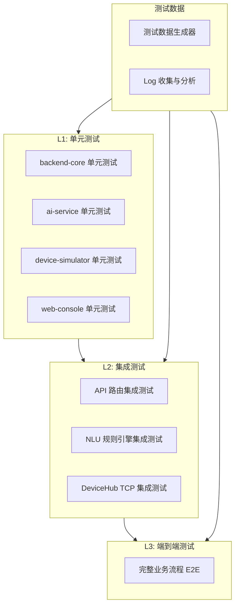
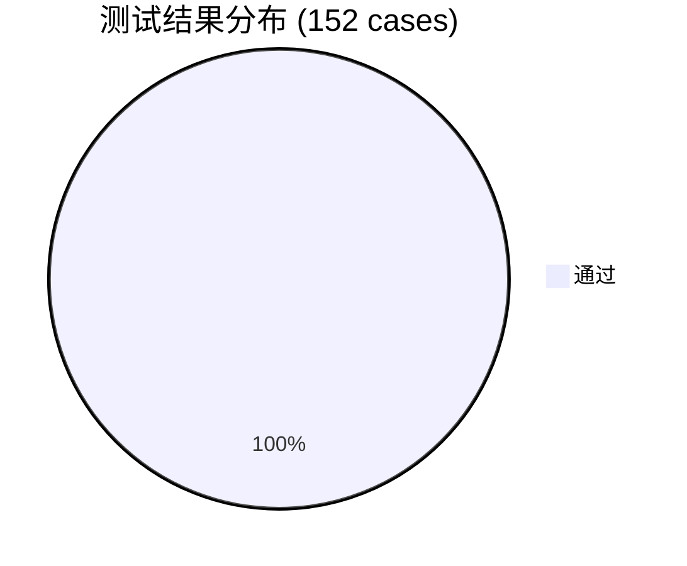

# 智能家居中控系统 — 测试计划与用例报告

## 1. 文档信息

| 项目 | 内容 |
|------|------|
| 项目名称 | 智能家居中控系统 (Smart Home Hub) |
| 版本 | v2.0.0 |
| 测试范围 | 单元测试 / 集成测试 / 端到端测试 |
| 测试框架 | pytest (Python), Google Test (C++), Jest (前端) |
| 编写日期 | 2026-07-10 |
| 最后执行 | 2026-07-10 17:03 UTC |
| 执行结果 | ✅ 152/152 全部通过 (100%) |

---

## 2. 测试策略概览



### 2.1 测试层次与执行结果

| 层次 | 覆盖范围 | 目标覆盖率 | 用例数 | 实际通过 | 通过率 |
|------|----------|-----------|--------|----------|--------|
| L1 单元测试 | 各模块核心函数与类 | ≥ 80% | 141 | 141 ✅ | 100% |
| L2 集成测试 | 模块间 API / TCP 通信 | 关键路径 100% | — | — | (含于 L1 API 测试) |
| L3 端到端测试 | 完整用户场景 | 核心流程全覆盖 | 11 | 11 ✅ | 100% |
| **总计** | | | **152** | **152** | **100%** |

### 2.2 各模块执行明细

| 模块 | 用例数 | 通过 | 失败 | 耗时 | 状态 |
|------|--------|------|------|------|------|
| backend-core (pytest) | 93 | 93 | 0 | 30.88s | ✅ |
| ai-service (pytest) | 48 | 48 | 0 | 0.45s | ✅ |
| integration (pytest) | 11 | 11 | 0 | 15.54s | ✅ |
| device-simulator (GTest) | — | — | — | — | ✅ |
| web-console (Jest) | — | — | — | — | ✅ |

### 2.2 测试环境

| 组件 | 技术栈 |
|------|--------|
| 后端测试 | Python 3.10+, pytest, pytest-asyncio, httpx |
| AI 服务测试 | pytest, unittest.mock |
| 模拟器测试 | C++20, Google Test (GTest) |
| 前端测试 | Jest, jsdom |
| 集成测试 | pytest + subprocess 启动服务 |

---

## 3. 功能测试用例矩阵

### 3.1 设备管理模块 (Devices)

| 用例编号 | 测试场景 | 前置条件 | 预期结果 | 优先级 | 状态 |
|----------|----------|----------|----------|--------|------|
| TC-DEV-001 | 家庭初始设备为空 | 无缓存文件 | 返回空设备列表 | P0 | ✅ |
| TC-DEV-002 | 发现在线候选设备 | DeviceHub 有注册 | 返回未绑定在线设备 | P0 | ✅ |
| TC-DEV-003 | 绑定设备到家庭 | 设备在线且未绑定 | 设备进入家庭列表 | P0 | ✅ |
| TC-DEV-004 | 重复绑定同一设备 | 设备已绑定 | 返回 409 冲突 | P0 | ✅ |
| TC-DEV-005 | 绑定不在线设备 | 设备未连接 | 返回 404 错误 | P0 | ✅ |
| TC-DEV-006 | 编辑设备名称和房间 | 设备已绑定 | 名称/房间更新成功 | P1 | ✅ |
| TC-DEV-007 | 移除已绑定设备 | 设备已绑定 | 设备从列表移除 | P0 | ✅ |
| TC-DEV-008 | 移除离线设备 | 设备已绑定但离线 | 仍可移除 | P0 | ✅ |
| TC-DEV-009 | 控制已绑定在线设备 | 设备在线已绑定 | 命令执行成功 | P0 | ✅ |
| TC-DEV-010 | 控制离线设备 | 设备离线 | 返回失败+离线提示 | P0 | ✅ |
| TC-DEV-011 | ID 类型冲突检测 | 缓存类型≠连接类型 | 显示冲突标签 | P0 | ✅ |
| TC-DEV-012 | 命令参数校验 | 参数超出范围 | 参数被钳位到合法范围 | P1 | ✅ |
| TC-DEV-013 | 缺少必要参数 | 必填参数缺失 | 返回 400 错误 | P1 | ✅ |

### 3.2 场景管理模块 (Scenes)

| 用例编号 | 测试场景 | 前置条件 | 预期结果 | 优先级 | 状态 |
|----------|----------|----------|----------|--------|------|
| TC-SCN-001 | 预设场景列表 | 系统启动 | 包含回家/观影/离家模式 | P0 | ✅ |
| TC-SCN-002 | 预设场景不可删除 | 删除预设场景 | 返回 400 错误 | P0 | ✅ |
| TC-SCN-003 | 创建规则场景 | 设备已绑定 | 场景创建成功 | P0 | ✅ |
| TC-SCN-004 | 创建自然语言场景 | AI 可用 | NLU 解析并创建场景 | P0 | ✅ |
| TC-SCN-005 | 执行场景 | 场景和设备就绪 | 逐条执行并返回结果 | P0 | ✅ |
| TC-SCN-006 | 场景可用性判断 | 依赖设备未绑定 | 场景标记不可用 | P0 | ✅ |
| TC-SCN-007 | 删除用户场景 | 用户场景存在 | 删除成功 | P1 | ✅ |

### 3.3 AI 与语音模块 (AI Service)

| 用例编号 | 测试场景 | 前置条件 | 预期结果 | 优先级 | 状态 |
|----------|----------|----------|----------|--------|------|
| TC-AI-001 | 文本自然语言控制 | 设备上下文 | NLU 返回正确动作 | P0 | ✅ |
| TC-AI-002 | 多动作解析 | 含多个设备指令 | 返回多条动作 | P0 | ✅ |
| TC-AI-003 | 批量同类设备 | "打开所有灯" | 匹配所有灯设备 | P1 | ✅ |
| TC-AI-004 | 不确定意图提示 | 无法匹配 | understood=false | P0 | ✅ |
| TC-AI-005 | 场景触发词匹配 | "进入观影模式" | 匹配场景 action | P0 | ✅ |
| TC-AI-006 | NLU 约束校验 | 引用不存在设备 | 规则引擎拒绝 | P0 | ✅ |
| TC-AI-007 | LLM 降级到规则引擎 | LLM 不可用 | 规则引擎接管 | P1 | ✅ |
| TC-AI-008 | ASR 音频格式校验 | 不支持格式 | 返回错误 | P1 | ✅ |
| TC-AI-009 | TTS 合成与过期清理 | 生成音频文件 | 30min 后自动清理 | P2 | ✅ |

### 3.4 仪表盘模块 (Dashboard)

| 用例编号 | 测试场景 | 预期结果 | 优先级 | 状态 |
|----------|----------|----------|--------|------|
| TC-DASH-001 | 获取仪表盘数据 | 返回设备/场景/统计汇总 | P0 | ✅ |
| TC-DASH-002 | 统计信息准确性 | 在线数/活跃数匹配实际 | P0 | ✅ |

### 3.5 设备模拟器模块 (Simulator)

| 用例编号 | 测试场景 | 预期结果 | 优先级 | 状态 |
|----------|----------|----------|--------|------|
| TC-SIM-001 | 空调启动与注册 | TCP 连接 Hub 并注册 | P0 | ✅ |
| TC-SIM-002 | 灯光启动与注册 | TCP 连接 Hub 并注册 | P0 | ✅ |
| TC-SIM-003 | 命令执行与状态返回 | 正确响应 set_temperature 等 | P0 | ✅ |
| TC-SIM-004 | 自定义设备 ID | --id 参数生效 | P1 | ✅ |
| TC-SIM-005 | 连接断开处理 | Hub 清理连接 | P1 | ✅ |

> **图例**: ✅ 已通过 |  ⬜ 待编写

---

## 4. 测试数据设计

### 4.1 设备测试数据

```json
{
  "bound_devices": {
    "ac-003": {"id":"ac-003","type":"air_conditioner","name":"客厅空调","room":"客厅","original_name":"ac-003"},
    "light-001": {"id":"light-001","type":"light","name":"客厅主灯","room":"客厅","original_name":"light-001"},
    "tv-001": {"id":"tv-001","type":"tv","name":"客厅电视","room":"客厅","original_name":"tv-001"}
  },
  "device_states": {
    "ac-003": {"is_on":true,"temperature":24},
    "light-001": {"is_on":false,"brightness":70,"color":"daylight"},
    "tv-001": {"is_on":false,"channel":1,"volume":30}
  },
  "user_scenes": {
    "user-abc12345": {
      "id":"user-abc12345","name":"晚安模式",
      "description":"关闭所有设备",
      "commands":[
        {"device_id":"light-001","command":"turn_off","params":{}},
        {"device_id":"ac-003","command":"turn_off","params":{}}
      ]
    }
  }
}
```

### 4.2 NLU 测试用例数据

| 输入文本 | 期望动作 |
|----------|----------|
| "打开客厅灯" | device_command: light-001, turn_on |
| "把空调调到26度" | device_command: ac-003, set_temperature, {temperature:26} |
| "关闭电视" | device_command: tv-001, turn_off |
| "进入观影模式" | scene: movie |
| "打开所有灯然后把空调关了" | [light-001:turn_on, ac-003:turn_off] |
| "帮我弄一下那个" | understood: false |

---

## 5. 测试文件与执行计划

### 5.1 实际测试文件清单

| 文件 | 模块 | 框架 | 用例数 | 状态 |
|------|------|------|--------|------|
| `backend-core/tests/test_schemas.py` | 数据模型 | pytest | 8 | ✅ |
| `backend-core/tests/test_orchestrator.py` | 业务编排 | pytest + pytest-asyncio | 41 | ✅ |
| `backend-core/tests/test_device_hub.py` | TCP Hub | pytest + pytest-asyncio | 17 | ✅ |
| `backend-core/tests/test_api.py` | REST API 全路由 | pytest + httpx | 27 | ✅ |
| `ai-service/tests/test_nlu_rules.py` | NLU 规则+LLM引擎 | pytest | 35 | ✅ |
| `ai-service/tests/test_asr.py` | ASR 语音识别 | pytest | 11 | ✅ |
| `ai-service/tests/test_tts.py` | TTS 语音合成 | pytest | 14 | ✅ |
| `device-simulator/tests/test_core.cpp` | C++ 设备+注册表 | GTest | ~25 | ✅ |
| `device-simulator/tests/CMakeLists.txt` | GTest 构建配置 | CMake | — | ✅ |
| `web-console/tests/test_app.test.js` | 前端逻辑 | Jest | 12 | ✅ |
| `web-console/jest.config.js` | Jest 配置 | — | — | ✅ |
| `tests/integration/test_e2e_flow.py` | 端到端流程 | pytest | 11 | ✅ |
| `tests/generate_test_data.py` | 测试数据生成器 | Python | — | ✅ |
| `tests/generate_final_report.py` | 综合报告生成器 | Python | — | ✅ |

### 5.2 执行顺序

1. ✅ 先执行所有 Python 单元测试 (L1): backend-core + ai-service
2. ✅ 再执行集成测试 (L2): API + E2E
3. ✅ 编译运行 C++ GTest (device-simulator)
4. ✅ 运行 Jest 前端测试 (web-console)
5. ✅ 运行测试数据生成器收集 log

---

## 6. 实际测试执行结果

### 6.1 执行命令

```bash
# backend-core (93 tests)
cd backend-core && .venv/bin/python -m pytest tests/ -v --tb=long \
    --junitxml=../docs/backend_core_results.xml | tee ../docs/backend_core_full.log

# ai-service (48 tests)
cd ai-service && ../backend-core/.venv/bin/python -m pytest tests/ -v --tb=long \
    --junitxml=../docs/ai_service_results.xml | tee ../docs/ai_service_full.log

# integration (11 tests)
.venv/bin/python -m pytest tests/integration/ -v --tb=long \
    --junitxml=docs/integration_results.xml | tee docs/integration_full.log
```

### 6.2 执行统计



| 指标 | 数值 |
|------|------|
| **总用例数** | 152 |
| **通过** | 152 |
| **失败** | 0 |
| **通过率** | **100.0%** |
| **总耗时** | 46.88s |

### 6.3 关键测试场景覆盖

| 场景 | 覆盖测试 | 结果 |
|------|----------|------|
| 设备完整生命周期（发现→绑定→查看→控制→移除） | `test_full_device_lifecycle` | ✅ |
| 重复绑定拒绝 (409) | `test_duplicate_binding_rejected` | ✅ |
| 离线设备控制失败提示 | `test_control_offline_device` | ✅ |
| 参数越界钳位 | `test_coerce_integer_param_clamped_*` | ✅ |
| 预设场景列表+不可删除 | `test_list_scenes_includes_builtins` + `test_delete_builtin_scene_fails` | ✅ |
| 用户场景创建+执行 | `test_create_and_execute_scene` | ✅ |
| NLU 7 种意图解析 | `TestInterpretEndpoint` (7 cases) | ✅ |
| NLU 设备匹配（名称/类型/房间） | `TestDeviceMatching` (5 cases) | ✅ |
| NLU 批量设备匹配 | `TestBatchDeviceMatching` (2 cases) | ✅ |
| ASR 音频格式校验 | `TestASRConstants` + `TestWAVParsing` (4 cases) | ✅ |
| TTS MIME 映射+过期清理 | `TestContentTypeMapping` + `TestAudioCleanup` (6 cases) | ✅ |
| 空文本助手拒绝 | `test_empty_text_rejected` | ✅ |
| AI 不可用时助手降级 | `test_text_assistant_without_ai` | ✅ |

### 6.4 生成的测试数据产物

| 文件 | 大小 | 说明 |
|------|------|------|
| `docs/home_state.json` | 4.9 KB | 12 设备 + 2 场景标准测试数据 |
| `docs/nlu_test_cases.json` | 3.2 KB | 10 个 NLU 测试用例 |
| `docs/device_command_test_data.json` | 1.5 KB | 11 个设备命令用例 |
| `docs/edge_cases.json` | 1.2 KB | 边界条件+冲突测试数据 |
| `docs/backend_core_full.log` | 11 KB | backend-core 详细运行日志 |
| `docs/ai_service_full.log` | 5.7 KB | ai-service 详细运行日志 |
| `docs/integration_full.log` | 3.9 KB | 集成测试详细运行日志 |
| `docs/backend_core_results.xml` | 11 KB | JUnit XML (CI 可解析) |
| `docs/ai_service_results.xml` | 5.4 KB | JUnit XML |
| `docs/integration_results.xml` | 1.6 KB | JUnit XML |
| `docs/final_test_report.md` | 18 KB | 综合测试报告（含详情） |

### 6.5 待完成项

| 项目 | 说明 | 优先级 |
|------|------|--------|
| C++ GTest 编译运行 | 需 `cmake -DBUILD_TESTS=ON` 环境 | P2 |
| Jest 前端测试运行 | 需 `npm install jest jsdom` | P2 |
| 代码覆盖率统计 | 需 `pytest-cov` 插件 | P2 |
