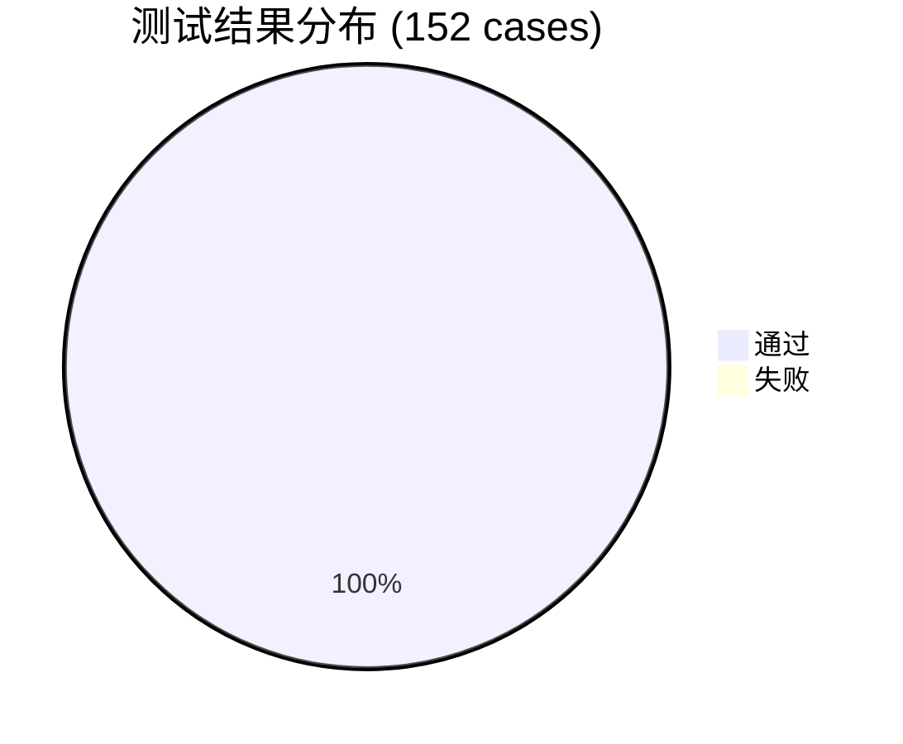

# 智能家居中控系统 — 综合测试报告

> **生成时间**: 2026-07-10 09:05:05 UTC
> **项目版本**: v2.0.0
> **测试框架**: pytest 3.12.3

---

## 📊 总体结果

| 指标 | 数值 |
|------|------|
| **测试模块数** | 3 |
| **测试用例总数** | 152 |
| **✅ 通过** | 152 |
| **❌ 失败** | 0 |
| **📈 通过率** | 100.0% |
| **⏱ 总耗时** | 46.88s |

---

## 📋 各模块详情

### backend-core
> FastAPI 后端核心服务 — 设备管理、场景编排、状态持久化

| 指标 | 数值 |
|------|------|
| 用例总数 | 93 |
| 通过 | 93 |
| 失败 | 0 |
| 通过率 | 100.0% |
| 耗时 | 30.88s |

| 测试类 | 通过 | 失败 |
|--------|------|------|
| py | 93 | 0 |

📝 全部用例详情

| 测试类 | 用例 | 状态 | 耗时 |
|--------|------|------|------|
| tests.test_api.TestHealthEndpoint | test_health_returns_ok | ✅ | 0.064s |
| tests.test_api.TestDashboardAPI | test_dashboard_returns_structure | ✅ | 0.006s |
| tests.test_api.TestDashboardAPI | test_dashboard_summary_fields | ✅ | 0.004s |
| tests.test_api.TestDevicesAPI | test_list_devices_empty | ✅ | 0.005s |
| tests.test_api.TestDevicesAPI | test_discover_devices | ✅ | 0.006s |
| tests.test_api.TestDevicesAPI | test_get_raw_devices | ✅ | 0.005s |
| tests.test_api.TestDevicesAPI | test_get_device_not_found | ✅ | 0.004s |
| tests.test_api.TestDevicesAPI | test_bind_device_validation | ✅ | 0.005s |
| tests.test_api.TestDevicesAPI | test_get_device_state | ✅ | 0.005s |
| tests.test_api.TestDevicesAPI | test_get_command_count | ✅ | 0.005s |
| tests.test_api.TestDevicesAPI | test_get_command_schema | ✅ | 0.005s |
| tests.test_api.TestDevicesAPI | test_execute_device_command | ✅ | 0.006s |
| tests.test_api.TestScenesAPI | test_list_scenes | ✅ | 0.005s |
| tests.test_api.TestScenesAPI | test_create_scene_without_devices | ✅ | 0.005s |
| tests.test_api.TestScenesAPI | test_delete_builtin_scene_fails | ✅ | 0.005s |
| tests.test_api.TestScenesAPI | test_execute_nonexistent_scene | ✅ | 0.004s |
| tests.test_api.TestScenesAPI | test_natural_scene_requires_text | ✅ | 15.095s |
| tests.test_api.TestAssistantAPI | test_message_empty_text | ✅ | 0.008s |
| tests.test_api.TestAssistantAPI | test_message_with_text | ✅ | 15.098s |
| tests.test_api.TestAssistantAPI | test_voice_without_file | ✅ | 0.008s |
| tests.test_api.TestCORS | test_cors_headers_present | ✅ | 0.004s |
| tests.test_api.TestCORS | test_cors_on_get | ✅ | 0.004s |
| tests.test_device_hub.TestDeviceConnection | test_init_stores_reader_writer | ✅ | 0.000s |
| tests.test_device_hub.TestDeviceConnection | test_close_calls_writer_close | ✅ | 0.001s |
| tests.test_device_hub.TestDeviceConnection | test_send_recv_exchanges_data | ✅ | 0.002s |
| tests.test_device_hub.TestDeviceConnection | test_send_recv_handles_disconnect | ✅ | 0.001s |
| tests.test_device_hub.TestDeviceConnection | test_read_registration | ✅ | 0.001s |
| tests.test_device_hub.TestDeviceHub | test_init_creates_empty_registry | ✅ | 0.000s |
| tests.test_device_hub.TestDeviceHub | test_list_devices_empty | ✅ | 0.000s |
| tests.test_device_hub.TestDeviceHub | test_list_devices_with_registered | ✅ | 0.000s |
| tests.test_device_hub.TestDeviceHub | test_send_command_device_not_connected | ✅ | 0.001s |
| tests.test_device_hub.TestDeviceHub | test_send_command_to_connected_device | ✅ | 0.001s |
| tests.test_device_hub.TestDeviceHub | test_send_command_handles_disconnect | ✅ | 0.001s |
| tests.test_device_hub.TestDeviceHub | test_get_command_count | ✅ | 0.000s |
| tests.test_device_hub.TestDeviceHub | test_get_command_count_unknown_device | ✅ | 0.000s |
| tests.test_device_hub.TestDeviceHub | test_get_command_schema | ✅ | 0.000s |
| tests.test_device_hub.TestDeviceHub | test_get_command_schema_unknown_command | ✅ | 0.000s |
| tests.test_device_hub.TestDeviceHubTCP | test_hub_host_and_port | ✅ | 0.000s |
| tests.test_device_hub.TestDeviceHubTCP | test_hub_default_port | ✅ | 0.000s |
| tests.test_orchestrator.TestStatePersistence | test_load_empty_state_when_file_missing | ✅ | 0.000s |
| tests.test_orchestrator.TestStatePersistence | test_save_and_load_state | ✅ | 0.001s |
| tests.test_orchestrator.TestStatePersistence | test_default_state_structure | ✅ | 0.000s |
| tests.test_orchestrator.TestDeviceDiscovery | test_discover_returns_empty_when_no_registry | ✅ | 0.001s |
| tests.test_orchestrator.TestDeviceDiscovery | test_discover_filters_bound_devices | ✅ | 0.001s |
| tests.test_orchestrator.TestDeviceDiscovery | test_discover_device_has_required_fields | ✅ | 0.001s |
| tests.test_orchestrator.TestDeviceBinding | test_bind_device_success | ✅ | 0.001s |
| tests.test_orchestrator.TestDeviceBinding | test_bind_duplicate_device_raises_409 | ✅ | 0.001s |
| tests.test_orchestrator.TestDeviceBinding | test_bind_offline_device_raises_404 | ✅ | 0.002s |
| tests.test_orchestrator.TestDeviceBinding | test_bind_unknown_device_raises_404 | ✅ | 0.001s |
| tests.test_orchestrator.TestDeviceUpdate | test_update_device_name | ✅ | 0.001s |
| tests.test_orchestrator.TestDeviceUpdate | test_update_device_room | ✅ | 0.001s |
| tests.test_orchestrator.TestDeviceUpdate | test_update_unbound_device_raises_404 | ✅ | 0.001s |
| tests.test_orchestrator.TestDeviceRemoval | test_remove_device_success | ✅ | 0.001s |
| tests.test_orchestrator.TestDeviceRemoval | test_remove_unbound_device_raises_404 | ✅ | 0.023s |
| tests.test_orchestrator.TestDeviceTypeMeta | test_all_device_types_have_required_fields | ✅ | 0.000s |
| tests.test_orchestrator.TestDeviceTypeMeta | test_air_conditioner_commands | ✅ | 0.000s |
| tests.test_orchestrator.TestDeviceTypeMeta | test_light_commands | ✅ | 0.000s |
| tests.test_orchestrator.TestDeviceTypeMeta | test_device_count_is_10 | ✅ | 0.000s |
| tests.test_orchestrator.TestParamCoercion | test_coerce_integer_param_in_range | ✅ | 0.000s |
| tests.test_orchestrator.TestParamCoercion | test_coerce_integer_param_clamped_max | ✅ | 0.000s |
| tests.test_orchestrator.TestParamCoercion | test_coerce_integer_param_clamped_min | ✅ | 0.000s |
| tests.test_orchestrator.TestParamCoercion | test_coerce_string_param_valid | ✅ | 0.000s |
| tests.test_orchestrator.TestParamCoercion | test_coerce_string_param_invalid_raises | ✅ | 0.000s |
| tests.test_orchestrator.TestParamCoercion | test_coerce_missing_required_param_raises | ✅ | 0.000s |
| tests.test_orchestrator.TestParamCoercion | test_coerce_unknown_command_raises | ✅ | 0.000s |
| tests.test_orchestrator.TestSceneManagement | test_list_scenes_includes_builtin | ✅ | 0.001s |
| tests.test_orchestrator.TestSceneManagement | test_builtin_scenes_have_required_fields | ✅ | 0.001s |
| tests.test_orchestrator.TestSceneManagement | test_create_scene_success | ✅ | 0.001s |
| tests.test_orchestrator.TestSceneManagement | test_create_scene_with_unbound_device_raises | ✅ | 0.001s |
| tests.test_orchestrator.TestSceneManagement | test_delete_builtin_scene_raises | ✅ | 0.001s |
| tests.test_orchestrator.TestSceneManagement | test_delete_user_scene_success | ✅ | 0.001s |
| tests.test_orchestrator.TestCommandPlanning | test_turn_on_before_params_before_turn_off | ✅ | 0.000s |
| tests.test_orchestrator.TestCommandPlanning | test_scene_action_preserves_order | ✅ | 0.000s |
| tests.test_orchestrator.TestTypeInference | test_type_from_id_ac | ✅ | 0.000s |
| tests.test_orchestrator.TestTypeInference | test_type_from_id_light | ✅ | 0.000s |
| tests.test_orchestrator.TestTypeInference | test_type_from_id_tv | ✅ | 0.000s |
| tests.test_orchestrator.TestTypeInference | test_type_from_id_fridge | ✅ | 0.000s |
| tests.test_orchestrator.TestTypeInference | test_type_from_id_washer | ✅ | 0.000s |
| tests.test_orchestrator.TestTypeInference | test_type_from_id_heater | ✅ | 0.000s |
| tests.test_orchestrator.TestTypeInference | test_type_from_id_purifier | ✅ | 0.000s |
| tests.test_orchestrator.TestTypeInference | test_type_from_id_curtain | ✅ | 0.000s |
| tests.test_orchestrator.TestTypeInference | test_type_from_id_socket | ✅ | 0.000s |
| tests.test_orchestrator.TestTypeInference | test_type_from_id_robot | ✅ | 0.000s |
| tests.test_orchestrator.TestTypeInference | test_type_from_unknown_id | ✅ | 0.000s |
| tests.test_schemas.TestCommandRequest | test_create_with_required_fields | ✅ | 0.000s |
| tests.test_schemas.TestCommandRequest | test_create_with_params | ✅ | 0.000s |
| tests.test_schemas.TestCommandRequest | test_missing_command_raises_error | ✅ | 0.000s |
| tests.test_schemas.TestCommandRequest | test_params_defaults_to_empty_dict | ✅ | 0.000s |
| tests.test_schemas.TestCommandRequest | test_command_with_complex_params | ✅ | 0.000s |
| tests.test_schemas.TestCommandResponse | test_default_values | ✅ | 0.000s |
| tests.test_schemas.TestCommandResponse | test_success_response | ✅ | 0.000s |
| tests.test_schemas.TestCommandResponse | test_failure_response | ✅ | 0.000s |
| tests.test_schemas.TestCommandResponse | test_state_is_optional | ✅ | 0.000s |

### ai-service
> AI 服务 — NLU 意图解析、ASR 语音识别、TTS 语音合成

| 指标 | 数值 |
|------|------|
| 用例总数 | 48 |
| 通过 | 48 |
| 失败 | 0 |
| 通过率 | 100.0% |
| 耗时 | 0.46s |

| 测试类 | 通过 | 失败 |
|--------|------|------|
| py | 48 | 0 |

📝 全部用例详情

| 测试类 | 用例 | 状态 | 耗时 |
|--------|------|------|------|
| tests.test_asr.TestASRConstants | test_max_file_size | ✅ | 0.241s |
| tests.test_asr.TestASRConstants | test_max_duration | ✅ | 0.000s |
| tests.test_asr.TestASRConstants | test_supported_mime_types | ✅ | 0.000s |
| tests.test_asr.TestASRConstants | test_mock_transcripts_not_empty | ✅ | 0.000s |
| tests.test_asr.TestWAVParsing | test_parse_valid_wav_header | ✅ | 0.000s |
| tests.test_asr.TestWAVParsing | test_parse_non_wav_data | ✅ | 0.000s |
| tests.test_asr.TestWAVParsing | test_parse_too_short_data | ✅ | 0.000s |
| tests.test_asr.TestErrorResponse | test_error_response_format | ✅ | 0.000s |
| tests.test_asr.TestASREndpoint | test_transcriptions_health | ✅ | 0.076s |
| tests.test_asr.TestASREndpoint | test_transcriptions_no_file | ✅ | 0.006s |
| tests.test_asr.TestASREndpoint | test_transcriptions_with_mock_audio | ✅ | 0.006s |
| tests.test_nlu_rules.TestDeviceMatching | test_exact_name_match | ✅ | 0.007s |
| tests.test_nlu_rules.TestDeviceMatching | test_device_type_keyword_match | ✅ | 0.000s |
| tests.test_nlu_rules.TestDeviceMatching | test_room_and_type_match | ✅ | 0.000s |
| tests.test_nlu_rules.TestDeviceMatching | test_no_match_returns_none | ✅ | 0.000s |
| tests.test_nlu_rules.TestDeviceMatching | test_room_priority_over_type | ✅ | 0.000s |
| tests.test_nlu_rules.TestBatchDeviceMatching | test_find_all_lights | ✅ | 0.000s |
| tests.test_nlu_rules.TestBatchDeviceMatching | test_find_only_room_lights | ✅ | 0.000s |
| tests.test_nlu_rules.TestNumberExtraction | test_extract_temperature | ✅ | 0.000s |
| tests.test_nlu_rules.TestNumberExtraction | test_extract_percentage | ✅ | 0.000s |
| tests.test_nlu_rules.TestNumberExtraction | test_extract_decimal | ✅ | 0.000s |
| tests.test_nlu_rules.TestCommandRecognition | test_turn_on_keywords | ✅ | 0.000s |
| tests.test_nlu_rules.TestCommandRecognition | test_turn_off_keywords | ✅ | 0.000s |
| tests.test_nlu_rules.TestCommandRecognition | test_batch_target_keywords | ✅ | 0.000s |
| tests.test_nlu_rules.TestInterpretEndpoint | test_interpret_simple_turn_on | ✅ | 0.006s |
| tests.test_nlu_rules.TestInterpretEndpoint | test_interpret_temperature_adjust | ✅ | 0.004s |
| tests.test_nlu_rules.TestInterpretEndpoint | test_interpret_scene_trigger | ✅ | 0.003s |
| tests.test_nlu_rules.TestInterpretEndpoint | test_interpret_unclear_intent | ✅ | 0.004s |
| tests.test_nlu_rules.TestInterpretEndpoint | test_interpret_multi_action | ✅ | 0.004s |
| tests.test_nlu_rules.TestInterpretEndpoint | test_interpret_batch_lights | ✅ | 0.005s |
| tests.test_nlu_rules.TestInterpretEndpoint | test_interpret_unbound_device_rejected | ✅ | 0.004s |
| tests.test_nlu_rules.TestLLMEngine | test_build_devices_json | ✅ | 0.000s |
| tests.test_nlu_rules.TestLLMEngine | test_build_devices_json_empty | ✅ | 0.000s |
| tests.test_nlu_rules.TestLLMEngine | test_system_prompt_contains_markers | ✅ | 0.000s |
| tests.test_nlu_rules.TestLLMEngine | test_deepseek_config_defaults | ✅ | 0.000s |
| tests.test_tts.TestTTSModels | test_synthesize_request_defaults | ✅ | 0.003s |
| tests.test_tts.TestTTSModels | test_synthesize_request_custom_voice | ✅ | 0.000s |
| tests.test_tts.TestTTSModels | test_synthesize_response_structure | ✅ | 0.000s |
| tests.test_tts.TestContentTypeMapping | test_mp3_mapping | ✅ | 0.000s |
| tests.test_tts.TestContentTypeMapping | test_wav_mapping | ✅ | 0.000s |
| tests.test_tts.TestContentTypeMapping | test_ogg_mapping | ✅ | 0.000s |
| tests.test_tts.TestContentTypeMapping | test_unknown_format_fallback | ✅ | 0.000s |
| tests.test_tts.TestAudioCleanup | test_cleanup_empty_directory | ✅ | 0.001s |
| tests.test_tts.TestAudioCleanup | test_cleanup_expired_files | ✅ | 0.001s |
| tests.test_tts.TestAudioCleanup | test_cleanup_skips_non_audio | ✅ | 0.001s |
| tests.test_tts.TestTTSHealthEndpoint | test_health_check | ✅ | 0.004s |
| tests.test_tts.TestFallbackSynthesize | test_fallback_with_empty_text | ✅ | 0.001s |
| tests.test_tts.TestFallbackSynthesize | test_fallback_with_text | ✅ | 0.001s |

### integration
> 端到端集成测试 — 设备生命周期、场景流程、仪表盘、AI 助手

| 指标 | 数值 |
|------|------|
| 用例总数 | 11 |
| 通过 | 11 |
| 失败 | 0 |
| 通过率 | 100.0% |
| 耗时 | 15.54s |

| 测试类 | 通过 | 失败 |
|--------|------|------|
| py | 11 | 0 |

📝 全部用例详情

| 测试类 | 用例 | 状态 | 耗时 |
|--------|------|------|------|
| tests.integration.test_e2e_flow.TestDeviceFlowHTTP | test_full_device_lifecycle | ✅ | 0.300s |
| tests.integration.test_e2e_flow.TestDeviceFlowHTTP | test_duplicate_binding_rejected | ✅ | 0.007s |
| tests.integration.test_e2e_flow.TestDeviceFlowHTTP | test_control_offline_device | ✅ | 0.007s |
| tests.integration.test_e2e_flow.TestDeviceFlowHTTP | test_parameter_validation | ✅ | 0.008s |
| tests.integration.test_e2e_flow.TestSceneFlowHTTP | test_list_scenes_includes_builtins | ✅ | 0.014s |
| tests.integration.test_e2e_flow.TestSceneFlowHTTP | test_create_and_execute_scene | ✅ | 0.021s |
| tests.integration.test_e2e_flow.TestSceneFlowHTTP | test_delete_builtin_scene_fails | ✅ | 0.013s |
| tests.integration.test_e2e_flow.TestSceneFlowHTTP | test_execute_nonexistent_scene_fails | ✅ | 0.014s |
| tests.integration.test_e2e_flow.TestDashboardFlowHTTP | test_dashboard_empty_state | ✅ | 0.004s |
| tests.integration.test_e2e_flow.TestAssistantFlowHTTP | test_empty_text_rejected | ✅ | 0.003s |
| tests.integration.test_e2e_flow.TestAssistantFlowHTTP | test_text_assistant_without_ai | ✅ | 15.059s |

---

## 📦 生成的测试数据文件

| 文件 | 大小 | 说明 |
|------|------|------|
| `test-results/device_command_test_data.json` | 1.5 KB | 测试数据文件 |
| `test-results/edge_cases.json` | 1.1 KB | 测试数据文件 |
| `test-results/home_state.json` | 4.8 KB | 测试数据文件 |
| `test-results/nlu_test_cases.json` | 3.1 KB | 测试数据文件 |
| `test-results/test_report_meta.json` | 0.4 KB | 测试数据文件 |
| `test-results/test_results_summary.json` | 12.6 KB | 测试数据文件 |
| `test-results/ai_service_full.log` | 5.7 KB | 测试执行日志 |
| `test-results/backend_core_full.log` | 10.2 KB | 测试执行日志 |
| `test-results/integration_full.log` | 3.9 KB | 测试执行日志 |
| `test-results/test_run.log` | 9.8 KB | 测试执行日志 |
| `test-results/ai_service_results.xml` | 5.3 KB | JUnit XML 报告 |
| `test-results/backend_core_results.xml` | 10.4 KB | JUnit XML 报告 |
| `test-results/integration_results.xml` | 1.6 KB | JUnit XML 报告 |

---

## 🗂 测试文件清单

### backend-core (`backend-core/tests/`)
| 文件 | 测试内容 |
|------|----------|
| `test_schemas.py` | Pydantic 数据模型 (CommandRequest/Response) |
| `test_orchestrator.py` | 业务编排层：状态读写、设备发现/绑定/控制、参数校验、场景管理、动作排序 |
| `test_device_hub.py` | DeviceHub TCP：连接管理、命令转发、命令查询 |
| `test_api.py` | REST API：Dashboard/Devices/Scenes/Assistant/CORS |

### ai-service (`ai-service/tests/`)
| 文件 | 测试内容 |
|------|----------|
| `test_nlu_rules.py` | NLU：设备匹配、批量匹配、命令识别、Interpret 端点、LLM 引擎 |
| `test_asr.py` | ASR：MIME 校验、WAV 解析、错误响应、转录端点 |
| `test_tts.py` | TTS：模型验证、MIME 映射、音频清理、健康检查 |

### device-simulator (`device-simulator/tests/`)
| 文件 | 测试内容 |
|------|----------|
| `test_core.cpp` | GTest：CommandRegistry、Light/AC/TV/GenericDevice、Adapter 注册 |

### web-console (`web-console/tests/`)
| 文件 | 测试内容 |
|------|----------|
| `test_app.test.js` | Jest：HTML 转义、API 请求、设备归一化、语音处理、DOM 渲染 |

### 集成测试 (`smart-home-system/integration-tests/`)
| 文件 | 测试内容 |
|------|----------|
| `test_e2e_flow.py` | E2E：设备生命周期、场景 CRUD、仪表盘、AI 助手流程 |

---

*本报告保留为课程验收测试结果归档，不再由项目内脚本自动覆盖生成。*
