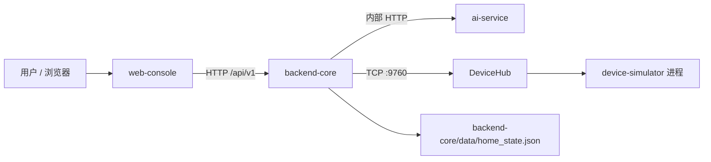

# 智能家居中控系统需求分析文档

## 1. 项目概述

本项目是一个面向课程演示的智能家居中控系统，目标是把 Web 控制台、主后端、AI 服务和 C++ 家电模拟器串成可运行的闭环。用户可以发现当前在线的模拟家电，将家电绑定到家庭，查看和控制已绑定家电，创建和执行场景，并通过文本或语音让 AI 后端解析自然语言指令。

系统当前采用四个主要模块：

| 模块 | 目录 | 职责 |
| --- | --- | --- |
| Web 控制台 | `smart-home-system/web-console` | 展示设备、场景、助手对话、添加家电弹窗和设备详情抽屉 |
| 主后端 | `smart-home-system/backend-core` | 提供 `/api/v1` API，维护家庭状态，编排设备、场景和 AI 调用 |
| AI 服务 | `smart-home-system/ai-service` | 提供内部 ASR、NLU、TTS 接口，返回结构化动作计划 |
| 家电模拟器 | `smart-home-system/device-simulator` | C++ 独立进程，通过 TCP 注册到 DeviceHub 并执行命令 |

浏览器只访问 `backend-core`。AI 服务只作为内部服务被主后端调用，模型密钥配置在 `ai-service/.env` 中。

## 2. 用户与业务目标

### 2.1 目标用户

| 用户类型 | 主要诉求 |
| --- | --- |
| 家庭用户 | 能看到家中已添加的设备，快速控制家电，执行常用场景 |
| 演示人员 | 能稳定展示设备发现、绑定、控制、场景和 AI 指令闭环 |
| 开发人员 | 能通过模拟器启动不同类型设备，验证后端和前端行为 |
| AI 调试人员 | 能验证自然语言能否正确映射到已绑定设备与可执行命令 |

### 2.2 核心目标

1. 家庭初始状态为空，用户主动添加设备后才进入家庭设备列表。
2. 设备发现只展示当前 DeviceHub 捕获到且尚未绑定的设备。
3. 已绑定设备、显示名称、房间、状态缓存和用户场景刷新后可恢复。
4. 设备离线或 ID 类型冲突时，系统明确提示并阻止错误控制。
5. 场景支持预设场景和用户自定义场景，场景可以控制多个设备。
6. 自然语言控制由 AI 服务解析，主后端负责二次校验和执行。

## 3. 系统边界



系统当前边界如下：

| 范围 | 说明 |
| --- | --- |
| 包含 | 家电发现、绑定、控制、离线提示、冲突提示、场景管理、文本助手、语音助手 |
| 包含 | C++ 模拟器多设备类型和自定义设备编号 |
| 包含 | 本地轻量状态文件保存家庭设备与用户场景 |
| 后续扩展 | 多用户账号、正式数据库、跨家庭权限、生产级实时推送、移动端完整实现 |

## 4. 主要业务流程

### 4.1 家电发现与绑定

1. 用户点击前端“添加家电”。
2. 前端请求 `GET /api/v1/devices/discover`。
3. 主后端从 DeviceHub 当前注册表读取在线模拟器。
4. 后端过滤已绑定设备，只返回候选设备。
5. 前端在弹窗中展示候选项，例如 `AC / ac-001`。
6. 用户选择设备并绑定。
7. 后端写入 `home_state.json`，设备进入家庭设备列表。

### 4.2 已绑定家电控制

1. 前端加载 `GET /api/v1/dashboard`。
2. 后端返回已绑定设备、候选设备、场景和统计信息。
3. 用户在设备卡片或详情抽屉中操作开关、温度、亮度等控制项。
4. 后端校验设备已绑定、在线、类型未冲突、命令和参数合法。
5. 后端通过 DeviceHub 把命令转发给对应 C++ 模拟器。
6. 模拟器返回执行结果和最新状态，后端更新缓存并返回前端。

### 4.3 场景创建与执行

1. 系统保留回家模式、观影模式、离家模式等预设场景。
2. 用户可以在场景弹窗中通过规则选择设备、命令和参数创建场景。
3. 用户也可以用自然语言描述场景。
4. 后端调用 AI NLU，把自然语言转换成动作列表。
5. 后端验证动作只引用已绑定设备和可支持命令。
6. 场景执行时，后端按动作顺序逐条执行设备命令并返回每条结果。

### 4.4 自然语言助手

1. 用户输入文本或录音。
2. 文本请求进入 `POST /api/v1/assistant/messages`。
3. 语音请求先由 `POST /api/v1/assistant/voice` 上传音频，再调用 AI ASR。
4. 后端把当前已绑定设备和可用场景作为上下文传给 AI NLU。
5. NLU 返回结构化动作计划。
6. 后端执行动作并调用 TTS 生成语音回复链接。
7. 前端刷新设备和场景状态，并展示助手回复。

## 5. 功能性需求

### 5.1 家庭与设备需求

| 编号 | 需求 | 优先级 | 验收标准 |
| --- | --- | --- | --- |
| FR-DEV-01 | 家庭初始设备为空 | P0 | 无绑定缓存时首页显示空状态，不展示预设设备卡片 |
| FR-DEV-02 | 发现当前可连接设备 | P0 | `/devices/discover` 返回 DeviceHub 中在线且未绑定的设备 |
| FR-DEV-03 | 候选设备展示类型和原始名 | P0 | 前端候选列表显示类似 `AC / ac-001` 的信息 |
| FR-DEV-04 | 绑定设备到家庭 | P0 | `POST /devices/{id}/bind` 成功后设备进入家庭列表并写入缓存 |
| FR-DEV-05 | 阻止重复绑定 | P0 | 已绑定设备不再出现在候选列表，重复绑定返回冲突 |
| FR-DEV-06 | 编辑设备显示名称和房间 | P1 | `PATCH /devices/{id}` 保存 `name` 和 `room`，刷新后仍存在 |
| FR-DEV-07 | 移除已绑定设备 | P0 | `DELETE /devices/{id}` 离线时也可执行，并同步移除相关用户场景动作 |
| FR-DEV-08 | 控制已绑定设备 | P0 | 开关和参数控制通过 `/devices/{id}/commands` 执行 |
| FR-DEV-09 | 离线状态提示 | P0 | 设备进程断开后卡片显示离线，控制按钮禁用 |
| FR-DEV-10 | ID 类型冲突提示 | P0 | 缓存设备类型与当前注册类型不一致时显示冲突并拒绝命令 |

### 5.2 支持的设备类型

| 类型 | 原始编号示例 | 控制能力 |
| --- | --- | --- |
| 空调 | `ac-001` | 开关、设置温度 |
| 灯 | `light-001` | 开关、设置亮度、设置色温 |
| 电视 | `tv-001` | 开关、频道、音量 |
| 冰箱 | `fridge-001` | 开关、冷藏温度 |
| 洗衣机 | `washer-001` | 开关、洗涤进度 |
| 热水器 | `heater-001` | 开关、水温 |
| 空气净化器 | `purifier-001` | 开关、风速 |
| 窗帘 | `curtain-001` | 开关、开合百分比 |
| 插座 | `socket-001` | 开关 |
| 扫地机器人 | `robot-001` | 开关、电量模拟 |

C++ 模拟器需要支持 `--device` 和 `--id` 参数，例如 `simulator --device ac --id ac-003`。

### 5.3 场景需求

| 编号 | 需求 | 优先级 | 验收标准 |
| --- | --- | --- | --- |
| FR-SCN-01 | 保留预设场景 | P0 | 回家模式、观影模式、离家模式存在且不可删除 |
| FR-SCN-02 | 创建规则场景 | P0 | 用户可选择已绑定设备、命令和参数生成场景 |
| FR-SCN-03 | 创建自然语言场景 | P0 | `/scenes/natural` 调用 AI NLU 并保存可执行场景 |
| FR-SCN-04 | 执行场景 | P0 | `/scenes/{id}/execute` 批量执行动作并返回每条结果 |
| FR-SCN-05 | 删除用户场景 | P1 | 用户创建的场景可删除，预设场景不可删除 |
| FR-SCN-06 | 场景可用性判断 | P0 | 依赖设备未绑定或类型冲突时，场景显示不可用 |
| FR-SCN-07 | 动作顺序规划 | P1 | 同一设备动作按开机、参数设置、关机的合理顺序执行 |

### 5.4 AI 与语音需求

| 编号 | 需求 | 优先级 | 验收标准 |
| --- | --- | --- | --- |
| FR-AI-01 | 文本自然语言控制 | P0 | 输入“关闭客厅的空调”时只匹配客厅对应空调 |
| FR-AI-02 | 多动作解析 | P0 | 一句话包含多个动作时返回多条动作计划 |
| FR-AI-03 | 批量同类设备解析 | P1 | “打开全部空调”可生成多台空调的动作 |
| FR-AI-04 | 语音识别 | P1 | 前端录音上传后，后端调用 AI ASR 获取文本 |
| FR-AI-05 | 语音回复 | P1 | 后端把助手回复传给 TTS，前端提供播放入口 |
| FR-AI-06 | AI 输出约束 | P0 | NLU 只能引用请求上下文中的设备 ID、场景 ID 和命令 |
| FR-AI-07 | 不确定时提示用户 | P0 | 无法匹配设备或动作时返回可读错误，不静默失败 |

### 5.5 前端需求

| 编号 | 需求 | 优先级 | 验收标准 |
| --- | --- | --- | --- |
| FR-UI-01 | 首页设备列表 | P0 | 只展示已绑定家庭设备，候选设备不在首页直接展示 |
| FR-UI-02 | 添加家电弹窗 | P0 | 点击“添加家电”后打开弹窗并展示检索结果 |
| FR-UI-03 | 设备详情抽屉 | P0 | 支持控制、编辑名称和房间、移除设备 |
| FR-UI-04 | 离线和冲突标签 | P0 | 卡片和抽屉中清晰展示离线或冲突状态 |
| FR-UI-05 | 场景管理弹窗 | P0 | 点击创建场景按钮后填写规则或自然语言描述 |
| FR-UI-06 | 助手聊天面板 | P1 | 支持文本输入、语音录制、回复展示和语音播放 |
| FR-UI-07 | 错误提示 | P0 | 接口失败、AI 不可用、设备离线等情况通过 toast 或消息展示 |

## 6. 数据需求

### 6.1 设备数据

已绑定设备至少包含：

| 字段 | 含义 |
| --- | --- |
| `id` | 设备唯一编号，例如 `ac-003` |
| `type` | 设备类型，例如 `air_conditioner` |
| `name` | 用户显示名称 |
| `room` | 所属房间 |
| `original_name` | 模拟器原始名称 |
| `state` | 当前或缓存状态 |
| `online` | 是否有对应在线模拟器连接 |
| `conflict` | 是否存在 ID 与类型冲突 |
| `capabilities` | 当前设备支持的命令及参数约束 |

### 6.2 候选设备数据

候选设备来自 DeviceHub 当前注册表，未绑定时进入候选列表。候选设备至少包含 `id`、`type`、`type_code`、`type_label`、`original_name`、`room`、`display`、`online`、`bound`。

### 6.3 场景数据

场景至少包含：

| 字段 | 含义 |
| --- | --- |
| `id` | 场景 ID，用户场景使用 `user-` 前缀 |
| `name` | 场景名称 |
| `description` | 场景描述或自然语言原文 |
| `commands` | 设备动作列表 |
| `builtin` | 是否为预设场景 |
| `available` | 当前是否满足执行条件 |

动作结构为：

```json
{
  "device_id": "ac-003",
  "command": "set_temperature",
  "params": { "temperature": 26 }
}
```

### 6.4 持久化数据

当前家庭状态保存到 `backend-core/data/home_state.json`，内容至少包含：

| 字段 | 说明 |
| --- | --- |
| `bound_devices` | 用户已绑定设备 |
| `device_states` | 设备状态缓存 |
| `user_scenes` | 用户创建的场景 |

## 7. 非功能性需求

| 编号 | 类型 | 需求 |
| --- | --- | --- |
| NFR-01 | 可用性 | AI 服务不可用时，后端向前端返回明确错误信息 |
| NFR-02 | 一致性 | 前端展示的在线状态必须以 DeviceHub 当前连接为准 |
| NFR-03 | 安全性 | 浏览器不直接调用 AI 服务，不暴露模型密钥 |
| NFR-04 | 可维护性 | 设备能力由后端和模拟器模型描述，前端不硬编码候选设备 |
| NFR-05 | 可测试性 | 关键 API 可通过 pytest、curl 或 Swagger 手动验证 |
| NFR-06 | 可扩展性 | 新设备类型应通过设备元数据和模拟器适配补充 |
| NFR-07 | 易用性 | 添加设备和创建场景在弹窗中完成，不在首页长期堆放表单 |

## 8. 验收标准

| 编号 | 验收项 | 验收方式 |
| --- | --- | --- |
| AC-01 | 初始家庭为空 | 清空 `home_state.json` 后访问首页，只出现空状态 |
| AC-02 | 发现设备 | 启动 `simulator --device ac --id ac-003` 后，添加弹窗显示 `AC / ac-003` |
| AC-03 | 绑定并缓存 | 绑定设备后刷新页面，设备仍在家庭列表 |
| AC-04 | 不重复添加 | 已绑定设备不再出现在候选列表 |
| AC-05 | 控制设备 | 点击开关或滑块后模拟器状态变化，前端刷新 |
| AC-06 | 离线处理 | 关闭模拟器后设备显示离线，控制按钮不可用，仍可移除 |
| AC-07 | 类型冲突处理 | 同 ID 不同类型连接时显示冲突并拒绝命令 |
| AC-08 | 预设场景 | 回家模式、观影模式、离家模式保留并能在条件满足时执行 |
| AC-09 | 用户场景 | 创建规则场景后刷新仍存在，可执行、可删除 |
| AC-10 | 自然语言场景 | 输入“睡觉模式：关闭电视，卧室空调调到 27 度”后生成场景或提示未匹配设备 |
| AC-11 | 文本助手 | 输入“关闭客厅的空调”时只操作匹配房间和类型的设备 |
| AC-12 | 多任务指令 | 输入包含多个动作的句子时，后端按动作计划逐条执行 |

## 9. 风险与约束

| 风险 | 影响 | 应对 |
| --- | --- | --- |
| AI 解析不稳定 | 自然语言指令可能无法生成正确动作 | 规则优先，LLM 兜底，并由后端二次校验 |
| 设备断线 | 缓存状态可能滞后 | 在线状态以 DeviceHub 连接为准，离线设备禁止控制 |
| 同 ID 不同类型设备连接 | 场景或 AI 可能控制错误设备 | 记录缓存类型，发现冲突后拒绝控制和场景执行 |
| 本地状态文件损坏 | 家庭数据无法恢复 | 读取失败时回退为空状态，运行时重新写入合法结构 |
| Windows 编译环境差异 | C++ 模拟器无法启动 | 使用 CMake 和 MSYS2/Linux 类环境编译运行 |

## 10. 需求追溯

| 需求组 | 对应模块 |
| --- | --- |
| 家电发现与绑定 | `backend-core/app/api/v1/devices.py`，`home_orchestrator.py`，`web-console/app.js` |
| 家电模拟与控制 | `device-simulator/src/main.cpp`，`GenericDeviceAdapter.h`，`DeviceHub` |
| 家庭缓存 | `home_orchestrator.py`，`backend-core/data/home_state.json` |
| 场景管理 | `backend-core/app/api/v1/scenes.py`，`web-console/app.js` |
| 自然语言控制 | `ai-service/src/nlu/routes.py`，`llm_engine.py`，`assistant.py` |
| 语音链路 | `ai-service/src/asr`，`ai-service/src/tts`，`backend-core/app/api/v1/audio.py` |
