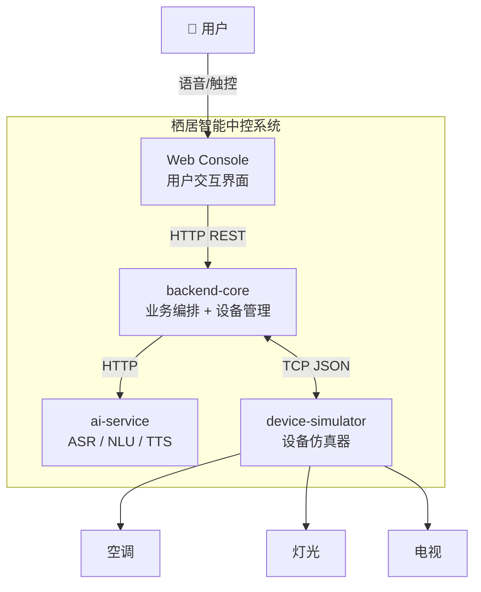
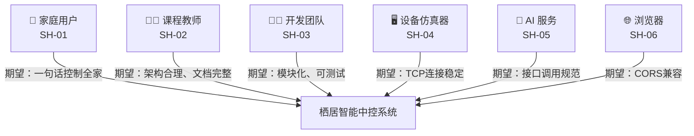
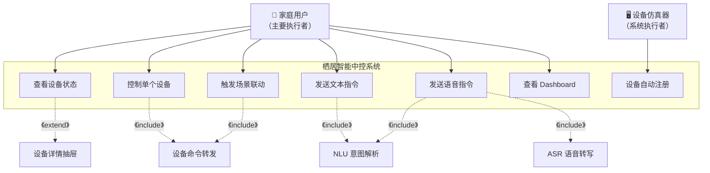

# 智能家居中控系统 — 需求分析文档

> **项目名称**：栖居 · 全屋智能中控系统 (Smart Home Control System)  
> **版本**：v2.0.0  
> **日期**：2026-07-09  
> **文档状态**：终稿  

---

## 1. 引言

### 1.1 编写目的

本文档运用软件需求工程的方法学，对"栖居 · 全屋智能中控系统"进行系统化的需求分析。文档将明确软件欲解决的问题、识别利益相关方、导出与构思软件需求，并以自然语言与 UML 建模相结合的方式描述功能性与非功能性需求，为后续软件设计、开发与测试提供依据与验收标准。

### 1.2 文档结构

本文档遵循需求工程的一般性过程组织：

| 章节 | 内容 | 对应需求工程阶段 |
|------|------|-----------------|
| 第1章 | 引言与术语 | 文档概述 |
| 第2章 | 明确问题与软件解决方案 | 问题定义与分析 |
| 第3章 | 利益相关方分析 | 识别利益相关方 |
| 第4章 | 获取软件需求的方法 | 需求导出与构思 |
| 第5章 | 功能性需求（含用例模型） | 功能性需求描述 |
| 第6章 | 非功能性需求 | 质量需求 + 约束性需求 |
| 第7章 | 初步软件需求描述 | 需求汇总 |
| 第8章 | 可行性分析 | 可行性评估 |
| 第9章 | 需求确认与验证 | 需求评审与验收 |

### 1.3 术语表

| 术语 | 说明 |
|------|------|
| ASR | Automatic Speech Recognition，自动语音识别 |
| NLU | Natural Language Understanding，自然语言理解 |
| TTS | Text-to-Speech，文本转语音 |
| DeviceHub | 后端 TCP 设备管理中心，接收设备注册与转发命令 |
| Device Simulator | C++ 编写的设备仿真器，模拟真实家电行为 |
| Actor（执行者） | UML 用例模型中的系统外部使用者，与系统存在交互 |
| Use Case（用例） | 执行者为达成业务目标而要求系统完成的功能 |
| Stakeholder（利益相关方） | 从软件系统中受益或与软件系统相关的人、组织或系统 |

---

## 2. 明确问题与软件解决方案

> *"每一个软件都试图去解决特定领域中的问题，并提供基于软件的问题解决方案。软件需求必须服从和服务于软件欲解决的问题。"* —— 教材第9章 §2.1

### 2.1 软件欲解决的问题

当前智能家居领域存在以下核心痛点：

| 问题编号 | 问题描述 | 问题类型 |
|---------|---------|---------|
| P-01 | **多品牌 App 碎片化**：不同品牌智能设备需各自 App 控制，用户需在多个应用间切换，操作繁琐、体验割裂 | 业务效率问题 |
| P-02 | **交互方式落后**：传统智能家居依赖手机触控操作，在双手被占用或距离较远时不便使用 | 交互体验问题 |
| P-03 | **缺乏统一入口**：灯光、空调、电视等设备缺乏统一的中控界面和语音交互入口 | 系统整合问题 |
| P-04 | **场景联动困难**：用户难以便捷地配置"一键触发多设备联动"的场景模式 | 自动化不足 |

### 2.2 基于软件的问题解决方案

本软件系统通过以下方式解决上述问题：

| 方案要点 | 解决的问题 | 软件如何发挥作用 |
|---------|-----------|----------------|
| **全屋统一中控** | P-01, P-03 | 通过 Web Console 和 REST API 提供统一的设备管理界面，聚合不同设备类型的控制能力 |
| **语音交互** | P-02 | 集成 ASR 语音识别 + NLU 意图解析，用户可通过自然语言"即说即得"控制设备 |
| **设备自动发现** | P-01, P-03 | 设备仿真器通过 TCP 协议自动注册，后端动态生成 API，零配置接入 |
| **场景联动** | P-04 | 预设"回家/观影/离家"场景，一键触发多设备协同动作 |

### 2.3 软件系统边界



---

## 3. 利益相关方分析

> *"软件需求来自于软件的利益相关方，要获取软件需求，首先要搞清楚软件系统有哪些利益相关方。"* —— 教材第9章 §3.1

### 3.1 利益相关方识别

根据利益相关方的定义（从软件系统中受益或与软件系统相关的人、组织或系统），本系统的利益相关方如下：

| 编号 | 利益相关方 | 类别 | 受益/相关方式 | 核心关注点 |
|------|-----------|------|-------------|-----------|
| SH-01 | **家庭用户（居民）** | 用户 | 使用系统控制家中设备、获取舒适居住体验 | 操作便捷、响应快速、语音识别准确 |
| SH-02 | **课程教师/助教** | 客户 | 评估项目完成质量与演示效果 | 架构合理、文档完整、演示闭环可验证 |
| SH-03 | **软件开发团队（6人）** | 开发者 | 负责系统设计、编码、测试与交付 | 模块化架构、技术可行、进度可控 |
| SH-04 | **设备仿真器（C++进程）** | 系统 | 作为被控对象与后端进行 TCP 通信 | 协议稳定、连接可靠、命令格式标准 |
| SH-05 | **AI 服务** | 系统 | 作为内部服务为后端提供 ASR/NLU/TTS 能力 | 接口稳定、降级可用、延迟可控 |
| SH-06 | **Web 浏览器** | 系统 | 运行前端控制台、承载用户交互 | 兼容性好、CORS 配置正确 |

### 3.2 利益相关方诉求分析



---

## 4. 获取软件需求的方法

> *"获取软件需求是指得到或产生软件需求，是需求分析的基础，是软件开发的首要工作。"* —— 教材第9章 §1.1

### 4.1 本项目的需求获取方式

由于本项目为课程教学项目，软件开发者同时充当了软件的利益相关方角色（教材第9章 §1.1："许多软件系统的需求来自软件工程师，而非最终的用户"），因此需求获取综合运用了以下方法：

| 方法 | 具体实践 | 对应教材方法 |
|------|---------|------------|
| **分析业务资料** | 分析课程选题说明（选题三：全屋智能控制）、`Plan.md` 中的系统构思和架构设计 | §1.3 分析业务资料 |
| **软件原型** | 基于 `web-console` 前端原型和 Swagger API 文档，直观展示系统功能边界 | §1.3 软件原型 |
| **构思与创作** | 开发团队站在用户视角，结合智能家居领域知识，构思核心功能需求 | §3.2 构思软件功能性需求 |
| **参考相似产品** | 参考米家 APP、美的美居 APP 等现有智能家居产品的功能设计 | 教材案例 |
| **群体化讨论** | 6 人团队分工协作，各自从 AI/后端/前端/设备等视角提出需求 | §1.3 群体化方法 |

### 4.2 需求导出与构思的过程

```
问题定义 → 利益相关方识别 → 需求导出与构思 → 需求描述 → 确认与验证

P-01~P-04     SH-01~SH-06      构思用户故事       用例图+自然语言    评审验收标准
                                参考同类产品       质量+约束需求
```

---

## 5. 功能性需求

> *"功能性需求是指软件能够完成的功能及在某些场景下可展现的外部可见行为或效果。"* —— 教材第8章 §1.3

### 5.1 用例模型（Use Case Diagram）

根据教材第9章 §4.2 描述的 UML 用例图建模方法，绘制本系统的用例图如下：



### 5.2 用例详述

#### 用例 1：控制单个设备 (UC-ControlDevice)

| 属性 | 描述 |
|------|------|
| **用例标识** | UC-ControlDevice |
| **用例名称** | 控制单个设备 |
| **主要执行者** | 家庭用户 |
| **目标** | 通过 Web Console 调整指定设备的工作参数（温度/亮度/频道等） |
| **前置条件** | backend-core 已启动，目标设备仿真器已通过 TCP 注册 |
| **后置条件** | 设备状态发生变化，前端页面同步刷新 |

**主成功场景**：

| 步骤 | 执行者动作 | 系统响应 |
|------|-----------|---------|
| 1 | 用户在设备卡片上点击目标设备 | 系统展开设备详情抽屉面板（UC-DeviceDetail 扩展点） |
| 2 | 用户调整控制参数（如温度滑块） | — |
| 3 | 用户点击"执行"按钮 | — |
| 4 | — | 系统校验参数合法性（`_coerce_params`） |
| 5 | — | 系统通过 DeviceHub TCP 转发命令到设备仿真器（UC-ForwardCommand 包含点） |
| 6 | — | 设备仿真器执行命令，返回新状态 |
| 7 | — | 系统更新前端设备卡片显示（状态读数、更新时间） |

**替代场景**：

| 场景 | 条件 | 系统行为 |
|------|------|---------|
| 3a | 设备仿真器未连接 | 系统返回 `success:false`，提示"simulator is not connected"，参数仍做范围约束 |
| 5a | 命令参数非法（如温度设为 99°C） | 系统自动将参数约束至合法范围（max=30），并执行命令 |
| 5b | 设备不支持该命令 | 系统返回 `400 Bad Request`，提示不支持的命令名 |

#### 用例 2：发送语音指令 (UC-VoiceCommand)

| 属性 | 描述 |
|------|------|
| **用例标识** | UC-VoiceCommand |
| **用例名称** | 发送语音指令 |
| **主要执行者** | 家庭用户 |
| **目标** | 通过语音说出设备控制意图，经 ASR→NLU 后自动执行 |
| **前置条件** | backend-core + ai-service 均已启动，浏览器已授权麦克风权限 |
| **后置条件** | 设备执行成功，前端展示 NLU 回复文本和 TTS 语音 |

**主成功场景**：

| 步骤 | 执行者动作 | 系统响应 |
|------|-----------|---------|
| 1 | 用户点击麦克风按钮，说出指令（如"打开客厅灯"） | — |
| 2 | 用户再次点击麦克风，停止录音 | — |
| 3 | — | 浏览器将录音封装为 multipart/form-data (audio/webm)，POST 到 `/api/v1/assistant/voice` |
| 4 | — | backend-core 转发音频到 ai-service ASR 引擎（UC-ASRTranscribe 包含点） |
| 5 | — | ASR 引擎返回转写文本 `{"text":"打开客厅灯"}` |
| 6 | — | backend-core 调用 NLU 引擎解析意图（UC-NLUInterpret 包含点） |
| 7 | — | NLU 返回 `{actions: [{device_id:"light-001", command:"turn_on"}]}` |
| 8 | — | 系统执行 NLU 返回的设备命令（同 UC-ControlDevice） |
| 9 | — | 系统调用 TTS 合成 NLU 回复语音（如"好的，客厅主灯已打开。"） |
| 10 | — | 前端展示对话消息，提供 TTS 语音播放按钮，自动刷新设备状态 |

**替代场景**：

| 场景 | 条件 | 系统行为 |
|------|------|---------|
| 3a | 浏览器拒绝麦克风权限 | 语音链路无法执行，提示用户授权麦克风 |
| 5a | ASR 引擎不可用（无 AI Key） | 降级为 Mock 引擎，返回确定性预定义转写文本 |
| 5b | 音频文件过大（>10MB） | ASR 返回 413 `AUDIO_TOO_LARGE` 错误 |
| 7a | NLU 无法理解用户意图 | 返回 `understood:false`，前端提示"未能理解您的指令" |
| 9a | TTS 合成失败 | 不阻断主流程，前端仅展示 NLU 回复文本，不提供语音播放 |

#### 用例 3：触发场景联动 (UC-SceneExecute)

| 属性 | 描述 |
|------|------|
| **用例标识** | UC-SceneExecute |
| **用例名称** | 触发场景联动 |
| **主要执行者** | 家庭用户 |
| **目标** | 一键触发预设场景，批量执行多设备命令 |
| **前置条件** | 场景关联的设备仿真器均已在线 |
| **后置条件** | 所有设备状态按场景定义变更 |

**主成功场景**：

| 步骤 | 执行者动作 | 系统响应 |
|------|-----------|---------|
| 1 | 用户点击"观影模式"场景按钮 | — |
| 2 | — | 系统查找场景定义，解析出 6 条设备命令 |
| 3 | — | 系统依次执行：电视打开(音量28) + 灯光暗(亮度18%) + 空调(24°C) |
| 4 | — | 系统汇总所有命令执行结果，刷新所有设备卡片 |

### 5.3 功能需求清单

| 编号 | 功能名称 | 对应用例 | 优先级 | 描述 |
|------|---------|---------|--------|------|
| FR-DEV-01 | 设备列表查询 | UC-01 | P0 | 获取所有已注册设备的统一状态模型 |
| FR-DEV-02 | 单设备详情 | UC-01 (extend) | P0 | 查询设备完整信息：元数据 + 实时状态 + 支持的命令 |
| FR-DEV-03 | 设备命令执行 | UC-02 | P0 | 通过命令名+参数形式控制设备，含参数类型校验与范围约束 |
| FR-DEV-04 | 设备自动注册 | UC-07 | P0 | C++ 仿真器进程通过 TCP 连接自动发送注册 JSON，后端记录 |
| FR-DEV-05 | 设备原始状态查询 | UC-01 | P1 | 透传查询设备仿真器当前原始状态 |
| FR-ASR-01 | 语音转文字 | UC-05 (include) | P0 | 接收 WAV/WebM/OGG 音频文件，返回转写文本（双引擎：讯飞/Mock） |
| FR-NLU-01 | 意图解析 | UC-04/05 (include) | P0 | 将自然语言文本解析为设备命令或场景触发动作（双引擎：规则/LLM） |
| FR-TTS-01 | 文本转语音 | UC-05 (include) | P1 | 将系统回复文本合成为可播放音频 URL（双引擎：DashScope/pyttsx3） |
| FR-SCN-01 | 场景列表查询 | UC-03 | P1 | 获取所有预设场景及其包含的设备命令 |
| FR-SCN-02 | 场景一键执行 | UC-03 | P1 | 批量执行场景中的多设备命令，返回汇总结果 |
| FR-ASST-01 | 文本指令 | UC-04 | P0 | 输入自然语言文本，经 NLU 解析后执行设备命令 |
| FR-ASST-02 | 语音指令 | UC-05 | P0 | 上传录音文件，经 ASR→NLU→设备命令全链路闭环执行 |
| FR-UI-01 | 设备卡片展示 | UC-01 | P0 | 以卡片网格展示设备图标、名称、状态读数、开关状态 |
| FR-UI-02 | 设备抽屉详情 | UC-01 (extend) | P0 | 点击设备卡片展开详情面板，支持参数调整与命令发送 |
| FR-UI-03 | 场景快捷按钮 | UC-03 | P1 | 提供"回家/观影/离家"三个场景的一键触发按钮 |
| FR-UI-04 | 智能助手对话面板 | UC-04/05 | P0 | 支持文本输入和语音录音，展示 NLU 回复和 TTS 音频播放 |
| FR-UI-05 | Dashboard 仪表盘 | UC-06 | P1 | 展示设备在线统计、活跃设备数和当日能耗概览 |

### 5.4 设备类型与支持的命令

| 设备 | device_id | 设备类型 | 支持的命令 |
|------|-----------|---------|-----------|
| 中央空调 | `ac-001` | `air_conditioner` | `turn_on`（打开）、`turn_off`（关闭）、`set_temperature {16-30}`（设置温度）、`get_state`（查询状态） |
| 客厅主灯 | `light-001` | `light` | `turn_on`（打开）、`turn_off`（关闭）、`set_brightness {0-100}`（设置亮度）、`set_color {warm/cool/daylight}`（设置色温）、`get_state` |
| 智能电视 | `tv-001` | `tv` | `turn_on`（打开）、`turn_off`（关闭）、`set_channel {1-999}`（切换频道）、`set_volume {0-100}`（设置音量）、`get_state` |

### 5.5 场景联动定义

| 场景 ID | 场景名 | 触发条件 | 执行动作序列 |
|---------|--------|---------|------------|
| `home` | 回家模式 | 用户点击场景按钮或语音"开启回家模式" | ① 打开客厅主灯(亮度70%) ② 打开空调(24°C) |
| `movie` | 观影模式 | 用户点击场景按钮或语音"设置观影模式" | ① 打开电视(音量28) ② 灯光暗(亮度18%) ③ 空调(24°C) |
| `away` | 离家模式 | 用户点击场景按钮或语音"离家模式" | ① 关闭电视 ② 关闭灯光 ③ 关闭空调 |

---

## 6. 非功能性需求

> *"非功能性需求包括软件质量要求和软件开发的约束性要求。"* —— 教材第9章 §3.3

### 6.1 软件质量需求（外部质量属性）

外部质量属性是用户和客户直接关心的质量维度：

#### 6.1.1 性能需求

| 编号 | 需求项 | 指标 | 度量方式 |
|------|--------|------|---------|
| QR-Perf-01 | 语音端到端延迟 | < 1.5 秒（从录音结束到设备开始执行） | 端到端计时测试 |
| QR-Perf-02 | API 响应时间 | P99 < 200ms | 压力测试工具 |
| QR-Perf-03 | 设备命令响应 | TCP 往返 < 100ms | 日志打点统计 |
| QR-Perf-04 | 并发设备连接 | ≥ 10 台独立设备进程 | 多进程并发连接测试 |

#### 6.1.2 可靠性需求

| 编号 | 需求项 | 指标 | 度量方式 |
|------|--------|------|---------|
| QR-Reliability-01 | AI 服务降级 | 无云端 API Key 时自动降级为 Mock 模式，核心功能不中断 | 移除 API Key 后验证 |
| QR-Reliability-02 | 设备断线恢复 | 设备进程重启后可自动重新注册并恢复通信 | 手动断线重连测试 |
| QR-Reliability-03 | TTS 失败不阻断 | TTS 合成失败时不影响主流程（NLU 回复文本正常返回） | 模拟 TTS 异常测试 |

#### 6.1.3 易用性需求

| 编号 | 需求项 | 指标 |
|------|--------|------|
| QR-EasyUse-01 | Web Console 零安装 | 浏览器直接访问 `http://localhost:8000` 即可使用，无需安装任何客户端 |
| QR-EasyUse-02 | 设备零配置接入 | C++ 仿真器进程启动即自动注册，无需手动配置设备信息 |
| QR-EasyUse-03 | 自然语言交互 | 用户可用日常中文表达控制意图（如"把空调调到26度"） |

#### 6.1.4 安全性需求

| 编号 | 需求项 | 描述 |
|------|--------|------|
| QR-Safety-01 | 音频上传限制 | 单个音频文件 ≤ 10 MB，防止资源耗尽 |
| QR-Safety-02 | API 参数校验 | 所有设备命令参数在后端做类型、范围和允许值校验 |
| QR-Safety-03 | AI Key 隔离 | API Key 仅可配置在 `ai-service/.env` 中，仓库仅保留 `.env.example`，不提交密钥 |
| QR-Safety-04 | TTS 音频过期清理 | 合成音频 30 分钟后自动删除 |

### 6.2 软件质量需求（内部质量属性）

内部质量属性是开发者关心的质量维度：

| 编号 | 需求项 | 描述 |
|------|--------|------|
| QR-Maintain-01 | 模块化架构 | 四大子模块（backend-core / ai-service / device-simulator / web-console）独立开发、独立部署 |
| QR-Maintain-02 | 设备插件式扩展 | 通过 `CommandRegistry` 注册新设备类型，无需修改协议层和 API 层代码 |
| QR-Maintain-03 | 传输层可替换 | 当前 TCP 协议，后续仅需替换 `HubClient` 即可升级为 MQTT/WiFi |
| QR-Maintain-04 | 代码规范 | Python 遵循 PEP 8 + `black` 格式化，C++ 遵循 Google C++ Style Guide + `clang-format` |
| QR-Maintain-05 | 测试覆盖 | 核心业务逻辑行覆盖率 ≥ 80%（目标），使用 `pytest` |

### 6.3 软件开发约束性需求

| 编号 | 约束维度 | 约束内容 |
|------|---------|---------|
| CR-Tech-01 | 开发语言 | Python 3.10+（后端与AI）、C++20（设备仿真器）、HTML5/ES6（前端） |
| CR-Tech-02 | API 框架 | FastAPI，自动生成 OpenAPI (Swagger) 文档 |
| CR-Tech-03 | 通信协议 | 后端与设备间：TCP JSON 行协议；后端与 AI 服务间：HTTP REST |
| CR-Tech-04 | 前后端部署 | 同源部署，浏览器仅访问 backend-core 一个端口 (8000) |
| CR-Schedule-01 | 开发周期 | 4 个 Sprint，每 Sprint 1-2 周 |
| CR-Schedule-02 | 交付范围 | MVP 仅含空调、灯、电视三类设备；冰箱、风扇不进入课程交付 MVP |
| CR-Scope-01 | 不包含项 | 用户系统、数据库持久化、WebSocket 实时推送不在本次闭环范围 |
| CR-Standard-01 | 命名规范 | API 路径：kebab-case（`/api/v1/device-control`）；Commit：Conventional Commits 规范 |
| CR-Standard-02 | 注释规范 | C++ 头文件：Doxygen 格式；Python 核心逻辑：Doxygen 风格注释 |

---

## 7. 初步软件需求描述

> *"初步的软件需求虽然粗略，只是一个初步的需求轮廓，但需要记录下来、描述清楚，形成相关的软件文档，以便于交流和讨论。"* —— 教材第9章 §4.1

### 7.1 软件背景介绍

"栖居"是一个面向课程演示的智能家居中控系统。系统通过模块化架构整合了语音识别、自然语言处理、设备仿真和 Web 前端四大能力，实现从"用户说话"到"设备响应"的端到端闭环。

### 7.2 核心用户故事

| 编号 | 用户故事 | 验收条件 |
|------|---------|---------|
| US-01 | 作为家庭用户，我希望在 Web 页面上一眼看到所有设备的状态，以便快速了解家中设备运行情况 | Dashboard 展示 3 张设备卡片，含开关状态和实时读数 |
| US-02 | 作为家庭用户，我希望点击设备卡片后能调节温度/亮度等参数，以便精细控制设备 | 点击卡片展开抽屉，支持参数调整并发送命令 |
| US-03 | 作为家庭用户，我希望能对系统说"把空调调到26度"，系统就能自动执行，以便在双手不便时控制设备 | 语音→ASR→NLU→执行→TTS 播报全链路可验证 |
| US-04 | 作为家庭用户，我希望一键触发"观影模式"，让电视、灯光和空调自动调整到合适的参数 | 点击观影按钮后，电视开、灯光暗、空调维持舒适温度 |
| US-05 | 作为开发者，我希望新增一种设备类型时不需要修改核心代码，以便快速扩展系统 | 新设备只需实现 Adapter + Device 类并注册即可 |

### 7.3 需求优先级说明

| 优先级 | 含义 | 交付标准 |
|--------|------|---------|
| **P0** | 核心需求，必须实现 | Sprint 1-3 内完成，影响演示闭环 |
| **P1** | 重要需求，尽力实现 | Sprint 4 内完成，增强演示效果 |
| **P2** | 可选需求，未来迭代 | 不在本次课程交付范围内 |

---

## 8. 可行性分析

> *"从技术、进度、成本、商业和社会等方面评估软件需求是否可行。"* —— 教材第9章 §5.3

### 8.1 技术可行性

| 评估维度 | 分析 | 结论 |
|---------|------|------|
| **关键技术** | Python FastAPI（成熟框架）、C++20 POSIX Socket（标准库）、HTML5 MediaRecorder API（主流浏览器支持）、TCP 通信（无需额外中间件） | ✅ 可行 |
| **技术成熟度** | 所有用到的技术栈均为主流成熟技术，有大量社区支持和文档 | ✅ 可行 |
| **团队能力** | 团队具备 Python 和 C++ 编程基础，经 Sprint 1 环境搭建验证 | ✅ 可行 |
| **降级策略** | AI 服务支持无 Key 时的 Mock 降级，即使云端 API 不可用也能正常运行演示 | ✅ 可行 |

### 8.2 进度可行性

| 阶段 | 时间 | 交付物 | 与需求的关系 |
|------|------|--------|------------|
| Sprint 1 | 第1-2周 | 后端骨架 + API 框架 + 设备协议 | 完成 FR-DEV-01/03/04 基础 |
| Sprint 2 | 第3-4周 | AI 服务集成（ASR/NLU/TTS） | 完成 FR-ASR-01 / FR-NLU-01 / FR-TTS-01 |
| Sprint 3 | 第5-6周 | 业务逻辑 + Web Console | 完成 FR-SCN-01/02, FR-ASST-01/02, FR-UI-01~05 |
| Sprint 4 | 第7-8周 | 测试 + 文档 + 部署 | 完成所有需求验证 |

团队 6 人，各 Sprint 任务量可控，进度风险低。✅

### 8.3 设备与资源可行性

| 资源 | 需求 | 现状 |
|------|------|------|
| 开发环境 | Linux/macOS/Windows 均可 | 全员具备 |
| 编译工具 | GCC 11+ / CMake 3.16+ | 已配置 |
| AI API Key | 讯飞 / DashScope（可选） | 无 Key 时 Mock 模式可用 |
| 浏览器 | Chrome/Edge/Firefox（需 MediaRecorder） | 全员具备 |

### 8.4 风险分析与应对

| 风险 | 影响 | 概率 | 应对措施 |
|------|------|------|---------|
| AI 云端 API 不可用 | ASR/TTS 功能受阻 | 中 | Mock 降级引擎，保证演示不中断 |
| 浏览器不支持录音 | 语音功能不可用 | 低 | 提供文本指令作为备选交互方式 |
| C++ 编译环境不一致 | 设备仿真器无法编译 | 中 | 提供 CMake 统一构建，Sprint 1 提前验证 |
| 团队成员进度差异 | 集成测试延期 | 低 | Sprint 规划合理，每日站会同步进度 |

---

## 9. 需求确认与验证

> *"站在用户和客户的角度，确保软件需求的正确性；判断软件需求文档和模型是否准确地刻画了用户和客户的要求。"* —— 教材第8章 §3.2

### 9.1 需求质量评审检查表

依据教材提出的"中肯性、合理性、完整性、必要性、溯源性、准确性、正确性、一致性"八项评审标准：

| 评审维度 | 检查项 | 状态 |
|---------|--------|------|
| **中肯性（Value）** | 需求是否解决实际问题（P-01~P-04）？ | ✅ 对应 §2.1 |
| **合理性（Rationality）** | 基于软件的解决方案是否科学合理？ | ✅ 对应 §2.2 |
| **完整性（Completeness）** | 是否覆盖所有利益相关方的期望？ | ✅ 覆盖 SH-01~SH-06 |
| **必要性（Necessity）** | 每项需求是否都有其存在的价值？ | ✅ P0/P1 分级明确 |
| **溯源性（Traceability）** | 每项需求是否可以追溯到来源？ | ✅ FR 编号可追踪到用例和利益相关方 |
| **准确性（Precision）** | 需求描述是否清晰、无二义？ | ✅ 采用表格化和量化指标 |
| **正确性（Correctness）** | 是否正确反映利益相关方的真实想法？ | ✅ 基于课程选题和 Plan.md |
| **一致性（Consistency）** | 用例图、功能列表、场景定义是否一致？ | ✅ §5.1 用例图与 §5.2-5.5 一致 |

### 9.2 验收标准

| 编号 | 验收项 | 对应需求 | 验证方式 |
|------|--------|---------|---------|
| AC-01 | 后端启动健康检查 | FR-DEV-01 | `curl /health` 返回 `{"status":"ok"}` |
| AC-02 | 设备自动注册 | FR-DEV-04 | C++ 仿真器启动后出现在 `GET /api/v1/devices` |
| AC-03 | 设备命令执行 | FR-DEV-03 | POST 命令后设备状态变化 |
| AC-04 | 场景联动执行 | FR-SCN-02 | POST `/scenes/movie/execute` 后 3 台设备状态同步更新 |
| AC-05 | 文本指令闭环 | FR-ASST-01 | 输入"把空调调到26度" → NLU 返回正确动作 → 空调温度变为 26°C |
| AC-06 | 语音指令闭环 | FR-ASST-02 | 录音 → ASR 转写 → NLU 解析 → 设备执行 → TTS 播报全链路可验证 |
| AC-07 | TTS 语音合成 | FR-TTS-01 | NLU 回复文本可合成为音频文件并播放 |
| AC-08 | AI 降级可用性 | QR-Reliability-01 | 无 AI Key 时 Mock 模式可正常运行 |
| AC-09 | Dashboard 展示 | FR-UI-05 | 展示 3 台设备、3 个场景、在线/活跃统计 |

### 9.3 需求变更管理

- 所有需求变更需记录在 `Plan.md` 或对应 Sprint 文档中
- 变更需经 Scrum Master 确认并同步更新本需求文档
- 需求变更的评估需考虑对进度（CR-Schedule-01/02）和交付范围（CR-Scope-01）的影响

---

## 附录：需求追溯矩阵（部分）

| 需求编号 | 来源 | 利益相关方 | 用例 |
|---------|------|-----------|------|
| FR-DEV-01~03 | 业务资料分析 + 原型构思 | SH-01 家庭用户 | UC-01, UC-02 |
| FR-DEV-04 | 架构设计约束 | SH-04 设备仿真器 | UC-07 |
| FR-ASR-01 | 参考同类产品 | SH-01 家庭用户 | UC-05 (include) |
| FR-NLU-01 | 构思创作 | SH-01 家庭用户, SH-05 AI 服务 | UC-04/05 (include) |
| FR-TTS-01 | 参考同类产品 | SH-01 家庭用户 | UC-05 (include) |
| FR-SCN-01~02 | 构思创作 | SH-01 家庭用户 | UC-03 |
| FR-ASST-01~02 | 原型构思 | SH-01 家庭用户 | UC-04, UC-05 |
| QR-Perf-01~04 | 质量分析 | SH-01 家庭用户, SH-02 教师 | — |
| QR-Reliability-01~03 | 质量分析 | SH-03 开发团队 | — |
| CR-Tech-01~04 | 课程选题约束 | SH-02 教师 | — |
| CR-Schedule-01~02 | 课程进度约束 | SH-02 教师, SH-03 开发团队 | — |
