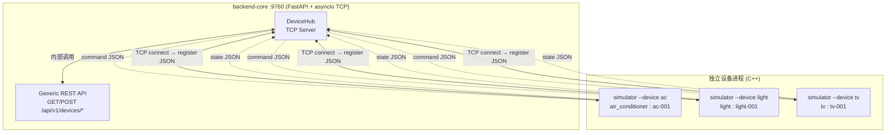
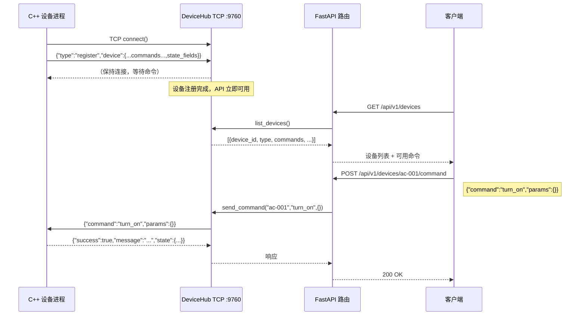
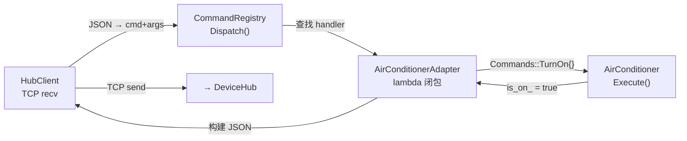

# 智能家居系统 — 架构文档

> 本文档描述 `backend-core`（FastAPI）与 `device-simulator`（C++）之间基于 **TCP 自动注册** 的设备通信机制。

---

## 一、文件结构总览

```
smart-home-system/
├── backend-core/                    # FastAPI 后端
│   └── app/
│       ├── main.py                  # ★ 入口 + lifespan 启动 DeviceHub
│       ├── core/
│       │   └── device_simulator.py  # ★ DeviceHub — TCP 服务器
│       ├── schemas/
│       │   └── device.py            # 通用 CommandRequest / CommandResponse
│       └── api/v1/
│           └── devices.py           # 通用路由（3 个端点）
│
└── device-simulator/                # C++ 设备仿真器
    ├── CMakeLists.txt
    ├── include/
    │   ├── core/
    │   │   ├── HubClient.h          # ★ TCP 客户端（自动注册）
    │   │   ├── CommandRegistry.h    # 命令注册表
    │   │   ├── Protocol.h           # JSON 协议层
    │   │   └── Logger.h             # 日志系统
    │   └── devices/
    │       ├── AirConditioner.h     # 空调（纯设备逻辑）
    │       ├── AirConditionerAdapter.h
    │       ├── Light.h              # 灯光
    │       ├── LightAdapter.h
    │       ├── TV.h                 # 电视
    │       └── TVAdapter.h
    └── src/
        └── main.cpp                 # ★ 入口（--device 启动独立进程）
```

---

## 二、架构总览



---

## 三、设备自动注册流程



---

## 四、C++ 内部调用链（以空调为例）



---

## 五、通用 API 端点

> 所有设备通过 TCP 注册后，**无需修改 Python 代码**即可获得完整 API。

| 方法 | 路径 | 请求体 | 说明 |
|------|------|--------|------|
| `GET` | `/api/v1/devices` | — | 列出所有已注册设备及命令 |
| `GET` | `/api/v1/devices/{device_id}/state` | — | 查询设备当前状态 |
| `POST` | `/api/v1/devices/{device_id}/command` | `{"command":"turn_on","params":{}}` | 向设备发送命令 |

### 响应示例

```json
// GET /api/v1/devices
{
  "devices": [{
    "device_id": "ac-001",
    "device_type": "air_conditioner",
    "commands": [
      {"name": "turn_on", "description": "打开空调", "params": []},
      {"name": "set_temperature", "description": "设置温度 16-30°C",
       "params": [{"name": "temperature", "type": "int"}]}
    ],
    "state_fields": {"is_on": "bool", "temperature": "int"}
  }]
}

// POST /api/v1/devices/ac-001/command → 响应
{
  "success": true,
  "message": "AC turned on. Temp: 24°C",
  "state": {"device_id":"ac-001","device_type":"air_conditioner",
            "is_on":true,"temperature":24}
}
```

---

## 六、协议规范（TCP JSON 行协议）

```
请求:  {"command":"<cmd>","params":{"k":"v",...}}\n
响应:  {"success":bool,"message":"...","state":{...}}\n
注册:  {"type":"register","device":{"id":"...","type":"...","commands":[...],"state_fields":{...}}}\n
```

### 已支持设备

| 设备 | device_id | 命令 |
|------|-----------|------|
| 空调 | `ac-001` | `turn_on`, `turn_off`, `set_temperature {int}`, `get_state` |
| 灯光 | `light-001` | `turn_on`, `turn_off`, `set_brightness {int}`, `set_color {str}`, `get_state` |
| 电视 | `tv-001` | `turn_on`, `turn_off`, `set_channel {int}`, `set_volume {int}`, `get_state` |

---

## 七、运行命令

### 7.1 编译 C++

**MSYS2 (Windows)：**

```bash
cd smart-home-system/device-simulator

# 确保用 MSYS2 原生 g++（非 MinGW）
export PATH=/usr/bin:$PATH
which g++                      # 应输出 /usr/bin/g++

rm -rf build
cmake -B build -G "MSYS Makefiles" \
  -DCMAKE_EXPORT_COMPILE_COMMANDS=ON
cmake --build build

# 链接到项目根目录供 clangd 使用
ln -sf build/compile_commands.json .
```

**Linux / macOS：**

```bash
cd smart-home-system/device-simulator

rm -rf build
cmake -B build \
  -DCMAKE_EXPORT_COMPILE_COMMANDS=ON
cmake --build build

# 链接到项目根目录供 clangd 使用
ln -sf build/compile_commands.json .
```

编译产物在 `build/simulator`。

### 7.2 启动后端（先启动）

```bash
cd smart-home-system/backend-core

# MSYS2
source venv/Scripts/activate
# Linux/macOS: source venv/bin/activate

uvicorn app.main:app --reload --host 0.0.0.0 --port 8000
```

后端启动后，DeviceHub 自动监听 `0.0.0.0:9760`，等待设备连接。

### 7.3 启动设备进程（各开一个终端）

```bash
cd smart-home-system/device-simulator

# 终端 1 — 空调
./simulator --device ac

# 终端 2 — 灯光
./simulator --device light

# 终端 3 — 电视
./simulator --device tv
```

每个进程启动后自动 TCP `connect("127.0.0.1", 9760)` 并发送注册 JSON。

### 7.4 验证 API

```bash
# 查看所有已注册设备及可用命令
curl http://localhost:8000/api/v1/devices

# ── 空调 ──
curl -X POST http://localhost:8000/api/v1/devices/ac-001/command \
  -H "Content-Type: application/json" \
  -d '{"command":"turn_on","params":{}}'

curl -X POST http://localhost:8000/api/v1/devices/ac-001/command \
  -H "Content-Type: application/json" \
  -d '{"command":"set_temperature","params":{"temperature":"26"}}'

curl http://localhost:8000/api/v1/devices/ac-001/state

# ── 灯光 ──
curl -X POST http://localhost:8000/api/v1/devices/light-001/command \
  -H "Content-Type: application/json" \
  -d '{"command":"turn_on","params":{}}'

curl -X POST http://localhost:8000/api/v1/devices/light-001/command \
  -H "Content-Type: application/json" \
  -d '{"command":"set_brightness","params":{"brightness":"80"}}'

# ── 电视 ──
curl -X POST http://localhost:8000/api/v1/devices/tv-001/command \
  -H "Content-Type: application/json" \
  -d '{"command":"set_channel","params":{"channel":"5"}}'
```

或访问 **Swagger UI**: `http://localhost:8000/docs`

---

## 八、设计原则

1. **设备自动发现** — C++ 进程启动即注册，FastAPI 动态生成 API，零 Python 代码改动
2. **独立进程** — 每个设备是独立 C++ 进程，模拟真实家电独立运行
3. **关注点分离** — `AirConditioner` 只含设备逻辑，`Adapter` 做命令注册，`HubClient` 管通信
4. **TCP 传输层** — 当前用 TCP，后续只需替换 `HubClient` 即可升级为 WiFi / MQTT
5. **通用 API** — 所有设备共用 3 个端点，命令和状态格式由注册信息动态决定
