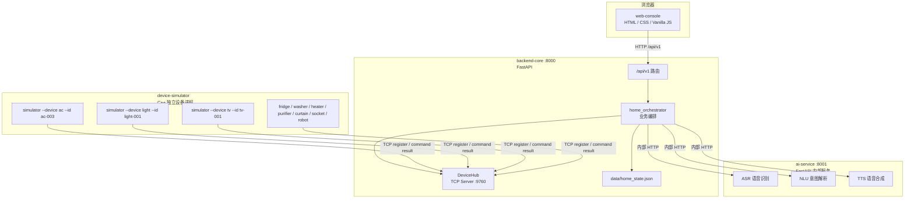
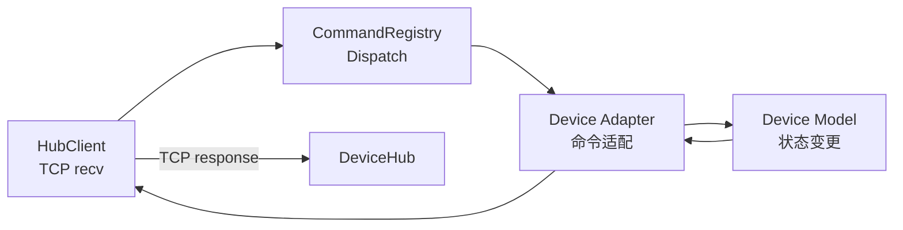
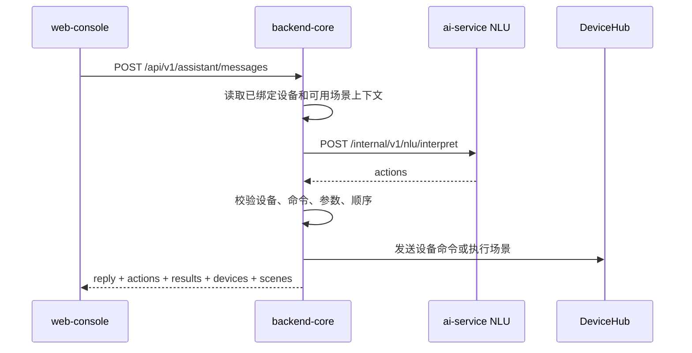

# 智能家居系统架构文档

本文档描述当前项目中 `web-console`、`backend-core`、`ai-service` 与 `device-simulator` 的实际组织方式。系统以 `backend-core` 作为统一入口，前端不直接访问 AI 服务或设备模拟器；设备模拟器通过 TCP 注册到 DeviceHub，家庭绑定关系、设备状态缓存和用户场景由主后端维护。

## 一、系统总览



核心边界：

1. 浏览器只访问 `backend-core` 的 `/api/v1`。
2. `ai-service` 是内部服务，只处理 ASR、NLU、TTS，不直接控制设备。
3. `device-simulator` 是独立 C++ 进程，通过 TCP 长连接注册到 DeviceHub。
4. 家庭设备绑定、显示名称、房间、设备状态缓存和用户场景保存到 `backend-core/data/home_state.json`。
5. 设备是否在线以 DeviceHub 当前连接为准，不以缓存为准。

## 二、文件结构总览

```text
smart-home-system/
├── backend-core/
│   ├── app/
│   │   ├── main.py                         # FastAPI 入口，lifespan 启动 DeviceHub
│   │   ├── api/v1/
│   │   │   ├── dashboard.py                # 首页数据聚合
│   │   │   ├── devices.py                  # 设备发现、绑定、编辑、移除、控制
│   │   │   ├── scenes.py                   # 场景列表、创建、自然语言创建、执行、删除
│   │   │   ├── assistant.py                # 文本助手和语音助手
│   │   │   ├── audio.py                    # TTS 音频代理
│   │   │   └── commands.py                 # 兼容命令入口
│   │   ├── core/
│   │   │   └── device_simulator.py         # DeviceHub TCP 服务器
│   │   ├── schemas/
│   │   │   └── device.py                   # 通用命令请求/响应模型
│   │   └── services/
│   │       └── home_orchestrator.py        # 家庭状态、设备、场景、AI 编排
│   ├── data/
│   │   └── home_state.json                 # 运行时状态文件
│   └── tests/
│
├── ai-service/
│   ├── src/main.py                         # AI 服务入口
│   ├── src/asr/                            # 语音识别
│   ├── src/nlu/                            # 规则优先 + LLM 兜底意图解析
│   └── src/tts/                            # 语音合成
│
├── device-simulator/
│   ├── CMakeLists.txt
│   ├── src/main.cpp                        # --device / --id 启动入口
│   └── include/
│       ├── core/
│       │   ├── HubClient.h                 # TCP 客户端
│       │   ├── CommandRegistry.h           # 命令注册表
│       │   ├── Protocol.h                  # JSON 协议辅助
│       │   └── Logger.h
│       └── devices/
│           ├── AirConditioner.h / Adapter
│           ├── Light.h / Adapter
│           ├── TV.h / Adapter
│           └── GenericDevice.h / Adapter   # 通用设备
│
└── web-console/
    ├── index.html
    ├── app.js                              # 前端状态和接口调用
    └── styles.css
```

## 三、后端核心架构

### 3.1 FastAPI 应用入口

`backend-core/app/main.py` 负责：

1. 创建 FastAPI 应用。
2. 挂载 `/api/v1` 路由。
3. 配置 CORS。
4. 在 lifespan 中启动 DeviceHub TCP 服务。
5. 托管 `web-console` 静态资源。

### 3.2 API 路由

| 模块 | 路径 | 作用 |
| --- | --- | --- |
| Dashboard | `GET /api/v1/dashboard` | 返回已绑定设备、候选设备、场景和统计信息 |
| Devices | `/api/v1/devices` | 设备发现、绑定、编辑、移除、状态和控制 |
| Scenes | `/api/v1/scenes` | 场景列表、创建、自然语言创建、执行和删除 |
| Assistant | `/api/v1/assistant` | 文本助手和语音助手 |
| Audio | `/api/v1/audio` | 代理 AI TTS 生成的音频文件 |
| Commands | `/api/v1/commands` | 兼容旧命令入口 |

### 3.3 业务编排层

`home_orchestrator.py` 是当前系统的核心业务层，负责把前端请求、AI 输出、DeviceHub 命令和本地缓存串起来。

| 能力 | 主要函数 |
| --- | --- |
| 状态文件读写 | `_load_state()`，`_save_state()` |
| 设备发现 | `discover_devices()` |
| 设备绑定 | `bind_device()` |
| 设备编辑和移除 | `update_bound_device()`，`remove_device()` |
| 设备展示模型 | `get_device()`，`list_devices()` |
| 设备控制 | `execute_device_command()`，`execute_batch()` |
| 场景管理 | `list_scenes()`，`create_scene()`，`delete_scene()`，`execute_scene()` |
| 自然语言场景 | `create_scene_from_text()` |
| AI 服务调用 | `call_nlu()`，`transcribe_audio()`，`synthesize_reply_speech()` |

## 四、设备发现、绑定与缓存

### 4.1 设备候选来源

设备模拟器启动后会连接 DeviceHub 并发送注册信息。主后端的 `/api/v1/devices/discover` 从 DeviceHub 当前注册表中读取在线设备，再过滤已经绑定到家庭的设备，返回候选列表。

候选设备示例：

```json
{
  "id": "ac-003",
  "type": "air_conditioner",
  "type_code": "AC",
  "type_label": "空调",
  "original_name": "ac-003",
  "display": "AC / ac-003",
  "online": true,
  "bound": false
}
```

候选设备只在“添加家电”弹窗中展示，不直接出现在首页设备列表。

### 4.2 绑定设备

绑定请求：

```http
POST /api/v1/devices/ac-003/bind
Content-Type: application/json

{
  "name": "客厅空调",
  "room": "客厅"
}
```

绑定成功后，后端写入 `home_state.json`：

```json
{
  "bound_devices": {
    "ac-003": {
      "id": "ac-003",
      "type": "air_conditioner",
      "name": "客厅空调",
      "room": "客厅",
      "original_name": "ac-003"
    }
  },
  "device_states": {},
  "user_scenes": {}
}
```

### 4.3 离线与冲突

设备展示时，后端会同时读取缓存和 DeviceHub 当前连接状态：

1. 缓存中存在但 DeviceHub 没有连接：设备显示离线，控制被拒绝，仍允许编辑和移除。
2. 缓存类型与当前同 ID 注册类型不同：设备显示冲突，控制和相关场景执行被拒绝。
3. 在线且类型一致：允许读取真实状态和发送控制命令。

## 五、DeviceHub 与 C++ 模拟器

### 5.1 注册协议

模拟器启动后向 DeviceHub 发送注册 JSON：

```json
{
  "type": "register",
  "device": {
    "id": "ac-003",
    "type": "air_conditioner",
    "commands": [
      { "name": "turn_on", "description": "turn on", "params": {} }
    ],
    "state_fields": {
      "is_on": "bool",
      "temperature": "int"
    }
  }
}
```

### 5.2 命令协议

后端发送给模拟器：

```json
{
  "command": "set_temperature",
  "params": { "temperature": 26 }
}
```

模拟器返回：

```json
{
  "success": true,
  "message": "ok",
  "state": {
    "device_id": "ac-003",
    "device_type": "air_conditioner",
    "is_on": true,
    "temperature": 26
  }
}
```

### 5.3 C++ 内部调用链



## 六、支持的模拟设备

`device-simulator/src/main.cpp` 支持以下启动参数：

| `--device` | 注册类型 | 默认 ID | 主要能力 |
| --- | --- | --- | --- |
| `ac` | `air_conditioner` | `ac-001` | 开关、温度 |
| `light` | `light` | `light-001` | 开关、亮度、色温 |
| `tv` | `tv` | `tv-001` | 开关、频道、音量 |
| `fridge` | `fridge` | `fridge-001` | 开关、冷藏温度 |
| `washer` | `washer` | `washer-001` | 开关、洗涤进度 |
| `heater` | `water_heater` | `heater-001` | 开关、水温 |
| `purifier` | `air_purifier` | `purifier-001` | 开关、风速、空气质量 |
| `curtain` | `curtain` | `curtain-001` | 开关、开合百分比 |
| `socket` | `socket` | `socket-001` | 开关 |
| `robot` | `robot_vacuum` | `robot-001` | 开关、电量模拟 |

示例：

```bash
./build/simulator --device ac --id ac-003
./build/simulator --device ac --id ac-004
./build/simulator --device purifier --id purifier-001
```

## 七、场景系统

### 7.1 预设场景

预设场景定义在 `home_orchestrator.BUILTIN_SCENES`：

| 场景 ID | 名称 | 行为 |
| --- | --- | --- |
| `home` | 回家模式 | 打开灯和空调，设置舒适温度 |
| `movie` | 观影模式 | 打开电视，调暗灯光，打开空调 |
| `away` | 离家模式 | 关闭演示相关设备 |

预设场景不可删除。若依赖设备未绑定或类型冲突，场景会返回 `available: false`。

### 7.2 用户场景

用户场景保存在 `home_state.json` 的 `user_scenes` 中。创建方式有两种：

1. 规则创建：前端在弹窗中选择设备、命令和参数，调用 `POST /api/v1/scenes`。
2. 自然语言创建：前端提交文本，调用 `POST /api/v1/scenes/natural`，后端调用 AI NLU 生成动作计划。

场景执行入口：

```http
POST /api/v1/scenes/{scene_id}/execute
```

执行前后端会校验：

1. 设备必须已绑定。
2. 设备不能离线或类型冲突。
3. 命令必须在设备能力中存在。
4. 参数必须满足命令约束。

## 八、AI 服务链路

### 8.1 文本助手



NLU 返回动作示例：

```json
{
  "understood": true,
  "reply": "好的，正在处理空调。",
  "actions": [
    {
      "kind": "device_command",
      "device_id": "ac-003",
      "command": "turn_off",
      "params": {}
    }
  ]
}
```

### 8.2 语音助手

语音助手入口为：

```http
POST /api/v1/assistant/voice
```

流程：

1. 前端用浏览器麦克风录音并编码为 WAV。
2. 主后端把音频转发给 `ai-service` ASR。
3. ASR 返回文本。
4. 主后端复用文本助手流程调用 NLU 并执行动作。
5. 主后端调用 TTS 生成回复音频，并通过 `/api/v1/audio/tts/{filename}` 代理给前端播放。

## 九、前端结构

`web-console/app.js` 维护轻量状态：

| 状态 | 说明 |
| --- | --- |
| `devices` | 已绑定设备，按设备 ID 索引 |
| `scenes` | 预设场景和用户场景 |
| `candidates` | 添加家电弹窗中的候选设备 |
| `sceneRules` | 正在编辑的规则场景动作 |
| `activeDeviceId` | 当前打开详情抽屉的设备 |

主要界面：

1. 首页设备网格：只显示已绑定设备。
2. 添加家电弹窗：检索和绑定候选设备。
3. 设备详情抽屉：控制、编辑名称和房间、移除设备。
4. 场景列表：执行预设和用户场景。
5. 创建场景弹窗：规则创建或自然语言创建。
6. 助手面板：文本输入、语音录制、TTS 播放。

## 十、主要 API

### Dashboard

| 方法 | 路径 | 说明 |
| --- | --- | --- |
| `GET` | `/api/v1/dashboard` | 返回设备、候选、场景和统计 |

### Devices

| 方法 | 路径 | 说明 |
| --- | --- | --- |
| `GET` | `/api/v1/devices` | 获取已绑定设备 |
| `GET` | `/api/v1/devices/discover` | 获取当前可添加候选设备 |
| `GET` | `/api/v1/devices/raw` | 获取 DeviceHub 原始注册设备 |
| `POST` | `/api/v1/devices/{device_id}/bind` | 绑定设备 |
| `PATCH` | `/api/v1/devices/{device_id}` | 修改显示名称和房间 |
| `DELETE` | `/api/v1/devices/{device_id}` | 移除设备 |
| `POST` | `/api/v1/devices/{device_id}/commands` | 产品层设备控制 |
| `POST` | `/api/v1/devices/{device_id}/command` | 原始命令兼容入口 |

### Scenes

| 方法 | 路径 | 说明 |
| --- | --- | --- |
| `GET` | `/api/v1/scenes` | 获取场景 |
| `POST` | `/api/v1/scenes` | 创建规则场景 |
| `POST` | `/api/v1/scenes/natural` | 创建自然语言场景 |
| `POST` | `/api/v1/scenes/{scene_id}/execute` | 执行场景 |
| `DELETE` | `/api/v1/scenes/{scene_id}` | 删除用户场景 |

### Assistant

| 方法 | 路径 | 说明 |
| --- | --- | --- |
| `POST` | `/api/v1/assistant/messages` | 文本自然语言控制 |
| `POST` | `/api/v1/assistant/voice` | 语音自然语言控制 |
| `GET` | `/api/v1/audio/tts/{filename}` | TTS 音频代理 |

## 十一、运行方式

### 11.1 启动 AI 服务

```bash
cd smart-home-system/ai-service
python -m pip install -r requirements.txt
uvicorn src.main:app --reload --port 8001
```

健康检查：

```bash
curl http://127.0.0.1:8001/internal/health
```

### 11.2 启动主后端

```bash
cd smart-home-system/backend-core
python -m pip install -r requirements.txt
uvicorn app.main:app --reload --host 0.0.0.0 --port 8000
```

健康检查：

```bash
curl http://127.0.0.1:8000/health
curl http://127.0.0.1:8000/api/v1/dashboard
```

### 11.3 编译模拟器

Windows 推荐使用 MSYS2 环境编译运行，因为模拟器使用 POSIX socket 头文件。

```bash
cd smart-home-system/device-simulator
cmake -B build -DCMAKE_EXPORT_COMPILE_COMMANDS=ON
cmake --build build
```

### 11.4 启动模拟设备

```bash
cd smart-home-system/device-simulator

./build/simulator --device ac --id ac-003
./build/simulator --device ac --id ac-004
./build/simulator --device light --id light-001
./build/simulator --device tv --id tv-001
```

启动后可在前端“添加家电”弹窗或接口中检索：

```bash
curl http://127.0.0.1:8000/api/v1/devices/discover
```

### 11.5 打开前端

`backend-core` 已托管 `web-console` 静态资源时，可直接访问：

```text
http://127.0.0.1:8000
```

也可以在 `web-console` 目录单独启动静态服务：

```bash
cd smart-home-system/web-console
python -m http.server 4173
```

## 十二、测试与验证

```bash
# 前端语法
cd smart-home-system/web-console
node --check app.js

# backend-core
cd ../backend-core
pytest tests -v

# ai-service
cd ../ai-service
pytest tests -v

# device-simulator
cd ../device-simulator
cmake -B build -DCMAKE_EXPORT_COMPILE_COMMANDS=ON
cmake --build build
```

建议手动验证：

1. 清空或移走 `backend-core/data/home_state.json` 后首页应为空设备状态。
2. 启动 `ac-003` 和 `ac-004` 后，添加家电弹窗应显示两个候选空调。
3. 绑定设备后刷新页面，设备仍在家庭列表。
4. 关闭某个模拟器后，该设备显示离线且不可控制。
5. 创建规则场景并刷新页面，场景仍存在。
6. 输入“关闭客厅的空调”，只应操作房间为客厅的空调。
7. 输入“打开全部空调”，应生成并执行多台空调动作。

## 十三、设计原则

1. **统一入口**：浏览器只访问 `backend-core`，避免前端直接暴露 AI 服务和内部端口。
2. **设备发现与家庭绑定分离**：DeviceHub 捕获设备后先进入候选列表，用户绑定后才进入家庭。
3. **在线状态以连接为准**：缓存只保存用户数据和最近状态，不代表设备在线。
4. **AI 只做解析**：NLU 返回动作计划，命令执行和安全校验由主后端完成。
5. **场景可验证**：场景创建和执行都校验设备、命令、参数和类型冲突。
6. **模拟器独立进程**：每个家电单独启动，便于演示多设备在线、离线和冲突情况。
7. **轻量持久化**：用 `home_state.json` 保存课程演示所需状态，后续可替换为正式数据库。
