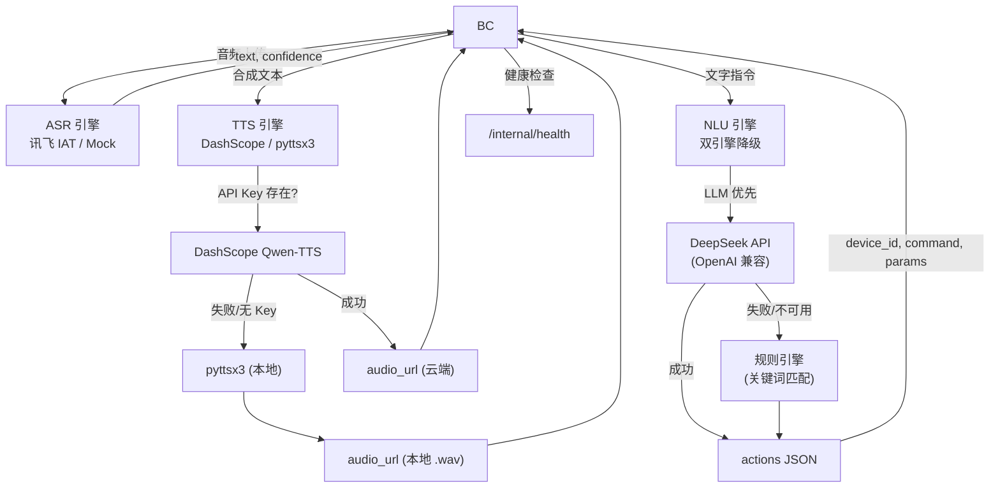

# AI Service Layer

## Introduction

Handles Speech-to-Text (ASR), Natural Language Understanding (NLU), and Text-to-Speech (TTS) pipelines for the smart home system. All endpoints are **internal-only**, consumed by `backend-core` and not exposed to browsers.

Implements the API contract defined in [`docs/FRONTEND_API_REQUIREMENTS.md`](../docs/FRONTEND_API_REQUIREMENTS.md), covering:

- **§8.1** ASR Transcription (`POST /internal/v1/asr/transcriptions`)
- **§8.2** NLU Interpretation (`POST /internal/v1/nlu/interpret`)
- **§8.3** TTS Speech Synthesis (`POST /internal/v1/tts/speech`)
- **§11.2** Internal Health Check (`GET /internal/health`)

## Pipeline Flow



### Module Details

| Module | Primary Engine | Fallback | Status |
|--------|---------------|----------|--------|
| **ASR** | iFlytek IAT API (WebSocket) | Mock (deterministic) | ✅ iFlytek active |
| **NLU** | DeepSeek LLM (via OpenAI-compatible API) | Rule-based keyword matching | ✅ LLM active |
| **TTS** | DashScope Qwen-TTS (cloud) | pyttsx3 + espeak-ng (local) | ✅ Active |

## Tech Stack

- **Language**: Python 3.10+
- **Framework**: FastAPI
- **ASR**: iFlytek IAT API (WebSocket) → Mock fallback
- **NLU**: DeepSeek API (OpenAI-compatible) → Rule-based fallback
- **TTS**: DashScope Qwen-TTS (cloud) → pyttsx3 + espeak-ng (local fallback)

## Directory Structure

```
ai-service/
├── src/
│   ├── main.py              # FastAPI application entry point
│   ├── asr/
│   │   ├── __init__.py
│   │   ├── routes.py         # ASR endpoints (iFlytek + mock fallback)
│   │   └── iflytek_engine.py # iFlytek IAT WebSocket ASR engine
│   ├── nlu/
│   │   ├── __init__.py
│   │   ├── routes.py         # NLU endpoints (LLM + rule fallback)
│   │   └── llm_engine.py     # DeepSeek LLM integration
│   └── tts/
│       ├── __init__.py
│       ├── routes.py         # TTS speech synthesis (DashScope + pyttsx3)
│       ├── generated_audio/  # Local TTS output directory
│       └── README.md         # TTS module documentation
├── scripts/
│   ├── e2e_test.py           # End-to-end pipeline test
│   └── test_asr_real.py      # Real audio ASR test (round-trip / file upload)
├── tests/
│   ├── test_asr.py           # ASR unit tests (17)
│   ├── test_nlu.py           # NLU unit tests (8)
│   ├── test_tts.py           # TTS unit tests (11)
│   └── test_connectivity.py  # Cross-module connectivity tests (8)
├── requirements.txt
├── pytest.ini
├── .env                      # API keys (not committed)
├── README.md
└── README_zh.md
```

## API Endpoints

### Internal (spec-compliant, `§8`)

| Method | Path | Description |
|--------|------|-------------|
| `POST` | `/internal/v1/asr/transcriptions` | Upload audio, get transcription |
| `POST` | `/internal/v1/nlu/interpret` | Parse natural language into device actions |
| `POST` | `/internal/v1/tts/speech` | Synthesize text to speech |
| `GET`  | `/internal/health` | Health check with model readiness status |

### Legacy (backward-compatible)

| Method | Path | Description |
|--------|------|-------------|
| `POST` | `/ai/asr/transcriptions` | ASR (legacy) |
| `POST` | `/ai/asr/transcribe` | ASR (deprecated) |
| `POST` | `/ai/nlu/parse` | NLU (legacy) |
| `POST` | `/ai/tts/synthesize` | TTS (legacy) |
| `GET`  | `/ai/health` | Health check (legacy) |

## ASR: iFlytek + Mock Fallback Architecture

The ASR module uses a **dual-engine degradation strategy**:

```
Audio upload → POST /internal/v1/asr/transcriptions
                    │
            ┌───────┴───────┐
            ▼               ▼
     iFlytek IAT API    Mock Engine
     (WebSocket)        (Deterministic)
            │               │
            ├─ success ─────┤
            ▼               ▼
     { text, confidence, engine: "iflytek"|"mock" }
```

**iFlytek Engine** (`iflytek_engine.py`):
1. Converts audio to 16kHz 16bit mono PCM
2. Establishes WebSocket connection to `wss://iat-api.xfyun.cn/v2/iat` with HMAC-SHA256 auth
3. Sends audio in 1280-byte frames per the IAT v2 protocol
4. Collects word-level results with confidence scores
5. Returns merged transcript

**Mock Engine** (in `routes.py`):
- Deterministic: same audio always produces same output (seeded hash)
- Used when iFlytek credentials are missing or `ASR_FORCE_MOCK=true`

### Real ASR Testing

```bash
# Round-trip test: TTS generates audio → ASR transcribes → compare
python scripts/test_asr_real.py --mode roundtrip

# Upload a real audio file
python scripts/test_asr_real.py --mode file --audio /path/to/recording.wav

# Print curl commands for manual testing
python scripts/test_asr_real.py --mode manual
```

## NLU: LLM + Rule Fallback Architecture

The NLU module uses a **dual-engine degradation strategy**:

```
User text → POST /internal/v1/nlu/interpret
                │
        ┌───────┴───────┐
        ▼               ▼
   LLM Engine       Rule Engine
   (DeepSeek)       (Keywords)
        │               │
        ├─ success ─────┤
        │               │
        ▼               ▼
   Validate actions (device_id, command, params)
        │
        ▼
   { understood, reply, actions }
```

**LLM Engine** (`llm_engine.py`):
1. Builds a system prompt with the complete device list, their capabilities, and available scenes
2. Calls DeepSeek API (`api.deepseek.com/v1/chat/completions`) with OpenAI-compatible format
3. Extracts and validates the JSON response
4. Validates every `device_id`, `command`, and `params` against the actual device registry
5. Any hallucinated device or command is silently dropped

**Rule Engine** (in `routes.py`):
- Keyword-based device matching with room filtering
- Numeric parameter extraction
- Falls back automatically when LLM is unavailable or fails

## Running

```bash
# 1. Install dependencies
pip install -r requirements.txt

# 2. Configure API keys (optional, see Configuration below)
cp .env.example .env   # or create .env manually

# 3. Start server
uvicorn src.main:app --reload --port 8001

# 4. Run unit tests (48 tests)
pytest tests/ -v

# 5. Run end-to-end pipeline test (requires running server)
python scripts/e2e_test.py
```

## End-to-End Test

`scripts/e2e_test.py` validates the complete pipeline against a running server:

```
1. Health Check         → GET  /internal/health
2. ASR Transcription    → POST /internal/v1/asr/transcriptions
3. NLU: Single device   → "打开客厅灯" → turn_on light-living-001
4. NLU: Temperature     → "把空调调到26度" → set_temperature(26)
5. NLU: Multi-action    → "打开电视并把客厅灯调到50%"
6. NLU: Scene trigger   → "开启观影模式" → scene:movie
7. NLU: Ambiguous       → "弄一下那个东西" → understood=false
8. TTS: Speech synthesis → POST /internal/v1/tts/speech
```

## Configuration

| Environment Variable | Required | Default | Description |
|----------------------|----------|---------|-------------|
| `IFLYTEK_APP_ID` | No | — | iFlytek application ID for ASR. If not set, ASR falls back to mock engine. |
| `IFLYTEK_API_KEY` | No | — | iFlytek API key for ASR WebSocket authentication. |
| `IFLYTEK_API_SECRET` | No | — | iFlytek API secret for ASR HMAC-SHA256 signing. |
| `LLM_API_KEY` | No | — | DeepSeek API key for NLU LLM engine. If not set, NLU falls back to rule engine. |
| `DASHSCOPE_API_KEY` | No | — | Alibaba Cloud DashScope API key for TTS cloud synthesis. If not set, TTS falls back to local pyttsx3. |
| `DEEPSEEK_BASE_URL` | No | `https://api.deepseek.com/v1` | DeepSeek API base URL (OpenAI-compatible). |
| `NLU_MODEL` | No | `deepseek-chat` | Model name for NLU LLM calls. |
| `ASR_FORCE_MOCK` | No | — | Set to `true` to force mock ASR engine (used in unit tests). |

---

[中文版文档入口](./README_zh.md)

