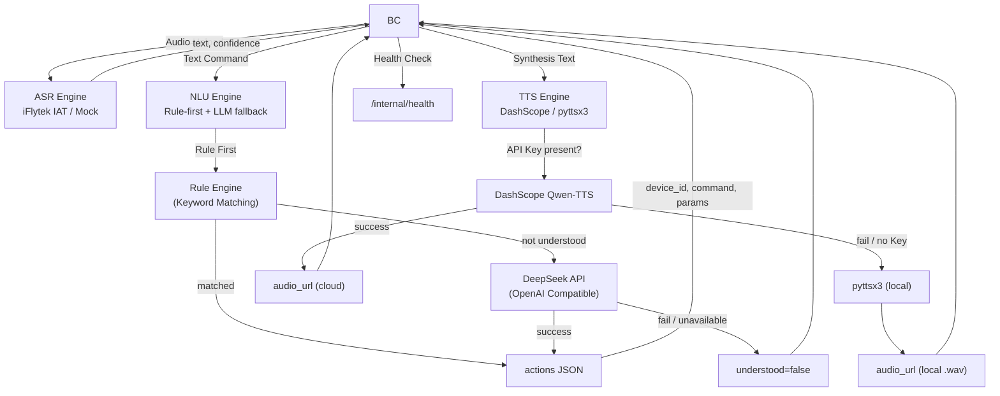

# AI Service Layer

## Introduction

Handles Speech-to-Text (ASR), Natural Language Understanding (NLU), and Text-to-Speech (TTS) pipelines for the smart home system. All endpoints are **internal-only**, consumed by `backend-core` and not exposed to browsers.

Implements the API contract defined in [`docs/FRONTEND_API_REQUIREMENTS.md`](../docs/FRONTEND_API_REQUIREMENTS.md), covering:

- **§8.1** ASR Transcription (`POST /internal/v1/asr/transcriptions`)
- **§8.2** NLU Interpretation (`POST /internal/v1/nlu/interpret`)
- **§8.3** TTS Speech Synthesis (`POST /internal/v1/tts/speech`)
- **§11.2** Internal Health Check (`GET /internal/health`)

## Pipeline Flow



### Module Engine Status

| Module | Primary Engine | Fallback | Notes |
|--------|---------------|----------|-------|
| **ASR** | iFlytek IAT API (WebSocket) | Mock (deterministic) | ✅ iFlytek active; non-WAV formats pass validation but are not decoded |
| **NLU** | Rule-based keyword matching (priority) | DeepSeek LLM (fallback) | ✅ Active; rule-first strategy for latency & reliability |
| **TTS** | DashScope Qwen-TTS (cloud) | pyttsx3 (local, WAV only) | ✅ Active; local fallback only outputs WAV format |

## Tech Stack

- **Language**: Python 3.10+
- **Framework**: FastAPI
- **ASR**: iFlytek IAT API (WebSocket) → Mock fallback
- **NLU**: Rule engine (keyword matching, priority) → DeepSeek LLM (fallback)
- **TTS**: DashScope Qwen-TTS (cloud) → pyttsx3 (local fallback, WAV only)

## Directory Structure

```
ai-service/
├── src/
│   ├── main.py              # FastAPI application entry point
│   ├── asr/
│   │   ├── __init__.py
│   │   ├── routes.py         # ASR endpoints (iFlytek + mock fallback)
│   │   ├── iflytek_engine.py # iFlytek IAT WebSocket ASR engine
│   │   └── README.md         # ASR module documentation
│   ├── nlu/
│   │   ├── __init__.py
│   │   ├── routes.py         # NLU endpoints (rule-first + LLM fallback)
│   │   ├── llm_engine.py     # DeepSeek LLM integration
│   │   └── README.md         # NLU module documentation
│   └── tts/
│       ├── __init__.py
│       ├── routes.py         # TTS speech synthesis (DashScope + pyttsx3)
│       ├── generated_audio/  # Local TTS output directory
│       └── README.md         # TTS module documentation
├── scripts/
│   ├── e2e_test.py           # End-to-end pipeline test
│   └── test_asr_real.py      # Real audio ASR test (round-trip / file upload)
├── tests/
│   ├── test_asr.py           # ASR unit tests (17)
│   ├── test_nlu.py           # NLU unit tests (8)
│   ├── test_tts.py           # TTS unit tests (11)
│   └── test_connectivity.py  # Cross-module connectivity tests (8)
├── requirements.txt
├── pytest.ini
├── .env                      # API keys (not committed)
├── README.md
└── README_zh.md
```

## API Endpoints

### Internal (spec-compliant, `§8`)

| Method | Path | Description |
|--------|------|-------------|
| `POST` | `/internal/v1/asr/transcriptions` | Upload audio, get transcription |
| `POST` | `/internal/v1/nlu/interpret` | Parse natural language into device actions |
| `POST` | `/internal/v1/tts/speech` | Synthesize text to speech |
| `GET`  | `/internal/health` | Health check with model readiness status |
| `GET`  | `/internal/v1/asr/health` | ASR module health check |
| `GET`  | `/internal/v1/nlu/health` | NLU module health check |
| `GET`  | `/internal/v1/tts/health` | TTS module health check |
| `GET`  | `/internal/v1/tts/audio/{filename}` | Serve locally generated TTS audio files |

### Legacy (backward-compatible)

| Method | Path | Description |
|--------|------|-------------|
| `POST` | `/ai/asr/transcriptions` | ASR (legacy) |
| `POST` | `/ai/asr/transcribe` | ASR (deprecated) |
| `POST` | `/ai/nlu/parse` | NLU (legacy) |
| `POST` | `/ai/tts/synthesize` | TTS (legacy) |
| `GET`  | `/ai/health` | Health check (legacy) |
| `GET`  | `/ai/tts/audio/{filename}` | Serve local TTS audio (legacy) |

---

## ASR — Speech-to-Text Module

The ASR module transcribes user-uploaded audio into text for downstream NLU processing. It does **not** perform semantic understanding, control devices, or access databases.

### Engine Strategy

| Priority | Engine | Description | Status |
|----------|--------|-------------|--------|
| 1 (Primary) | **iFlytek IAT API** | Cloud speech recognition, WebSocket protocol, 16kHz 16bit mono PCM | ✅ Active |
| 2 (Fallback) | **Mock Engine** | Deterministic mock transcription for dev/test | ✅ Available |

**Engine selection logic**:
```
if iFlytek API credentials configured AND ASR_FORCE_MOCK not set:
    → Use iFlytek IAT engine
elif iFlytek transcription fails (network/timeout/server error):
    → Auto-degrade to Mock engine
else:
    → Use Mock engine directly
```

- Set `ASR_FORCE_MOCK=true` to force Mock engine (for testing).
- iFlytek credentials via `.env`: `IFLYTEK_APP_ID`, `IFLYTEK_API_KEY`, `IFLYTEK_API_SECRET`.

### Audio Normalization Pipeline (iFlytek Engine)

```
Input WAV (any sample rate / channels / bit depth)
    │
    ├─ 1. _parse_wav_info()   → Parse WAV header, extract raw parameters
    ├─ 2. _resample_pcm()     → Resample to 16kHz (linear interpolation)
    ├─ 3. _convert_stereo_to_mono() → Stereo → Mono (L+R average)
    ├─ 4. Bit depth conversion → 8/24/32-bit → 16-bit
    │
    ▼
Output: 16kHz 16-bit mono PCM (iFlytek IAT standard format)
```

> **⚠️ Current Limitation**: Non-WAV formats (WebM, OGG) pass MIME type validation but are **not decoded**. They are assumed to be 16kHz 16bit mono PCM and passed directly to the engine. WebM/OGG with Opus encoding requires additional decoding (not yet implemented). It is recommended that the frontend records in WAV format.

### Request Format

```http
POST /internal/v1/asr/transcriptions
Content-Type: multipart/form-data
```

| Field | Type | Required | Default | Description |
|-------|------|----------|---------|-------------|
| `audio` | file | **Yes** | — | Audio file (see supported formats below) |
| `language` | string | No | `"zh-CN"` | Audio language identifier |
| `request_id` | string | No | auto UUID | Request tracing ID for cross-service debugging |

**Supported MIME types**:

| MIME Type | Notes |
|-----------|-------|
| `audio/wav` | WAV (PCM), recommended |
| `audio/wave` | WAV alias |
| `audio/x-wav` | WAV alias |
| `audio/webm` | WebM container (not decoded) |
| `audio/webm;codecs=opus` | WebM + Opus (not decoded) |
| `audio/ogg` | OGG container (not decoded) |
| `audio/ogg;codecs=opus` | OGG + Opus (not decoded) |

### Success Response

```json
{
  "text": "帮我把空调调到26度",
  "language": "zh-CN",
  "confidence": 0.92,
  "duration_ms": 1499,
  "request_id": "483e6533-2467-4ae0-b0a9-571575b308af",
  "engine": "iflytek",
  "processing_ms": 1499
}
```

| Field | Type | Description |
|-------|------|-------------|
| `text` | string | Transcribed text |
| `language` | string | Recognized language |
| `confidence` | float (0~1) | Confidence score; Mock engine ≈ 0.85~1.0 |
| `duration_ms` | int | Audio duration in milliseconds |
| `request_id` | string | Request tracing ID |
| `engine` | string | Actual engine used: `"iflytek"` or `"mock"` |
| `processing_ms` | int | Processing time in milliseconds |

### Error Responses

All errors follow the unified format:

```json
{
  "error": {
    "code": "ERROR_CODE",
    "message": "Human-readable description",
    "details": {},
    "request_id": "uuid"
  }
}
```

| HTTP Status | Error Code | Condition |
|-------------|------------|-----------|
| `415` | `UNSUPPORTED_AUDIO_FORMAT` | MIME type not in the whitelist |
| `413` | `AUDIO_TOO_LARGE` | File exceeds 10 MB |
| `422` | `SPEECH_NOT_DETECTED` | File is too small (< 100 bytes) or audio too long (> 30 s) |

### File Structure

```text
asr/
├── __init__.py         # Exports FastAPI router
├── routes.py           # ASR routes, request validation, Mock engine, error responses
├── iflytek_engine.py   # iFlytek IAT WebSocket engine, audio normalization
└── README.md           # Module documentation
```

#### Key Functions in `iflytek_engine.py`

| Function | Description |
|----------|-------------|
| `engine_available()` | Check if iFlytek credentials are configured |
| `transcribe()` | Async entry: normalize audio → WebSocket transcription |
| `_normalize_audio()` | Audio normalization pipeline |
| `_parse_wav_info()` | Parse WAV header for sample_rate / channels / bits_per_sample / PCM data |
| `_resample_pcm()` | Pure Python linear interpolation resampling (any → 16kHz) |
| `_convert_stereo_to_mono()` | Stereo to mono (L+R average) |
| `_transcribe_websocket()` | WebSocket connect to iFlytek IAT API, send frames, collect results |
| `_build_auth_url()` | Build HMAC-SHA256 signed auth URL |

### Real ASR Testing

```bash
# Round-trip test: TTS generates audio → ASR transcribes → compare
python scripts/test_asr_real.py --mode roundtrip

# Upload a real audio file
python scripts/test_asr_real.py --mode file --audio /path/to/recording.wav

# Print curl commands for manual testing
python scripts/test_asr_real.py --mode manual
```

---

## NLU — Natural Language Understanding Module

The NLU module parses natural language commands into executable device action plans. It does **not** directly control devices, access databases, or invoke the device simulator.

### Engine Strategy (Rule-First, LLM-Fallback)

| Priority | Engine | Description | Status |
|----------|--------|-------------|--------|
| 1 (Primary) | **Rule Engine** | Keyword-based device matching + room filtering + numeric extraction | ✅ Active |
| 2 (Fallback) | **DeepSeek LLM** | OpenAI-compatible API call with device context prompt | ✅ Active |

**Strategy**: The rule engine handles common smart-home commands with low latency and no external API dependency. The LLM is only invoked when the rule engine cannot understand the input — this ensures reliability for everyday commands while providing flexibility for complex or novel expressions.

```
if rule engine matches (understood=true AND actions non-empty):
    → Return rule result immediately
elif LLM is available:
    → Try LLM interpretation
    → On success: return LLM result
    → On failure: return rule engine's "not understood" result
else:
    → Return rule engine's "not understood" result
```

### Request Format

`POST /internal/v1/nlu/interpret`

```json
{
  "text": "打开客厅灯并把空调调到22度",
  "conversation": [],
  "devices": [
    {
      "id": "light-living-001",
      "type": "light",
      "name": "客厅主灯",
      "room": "客厅",
      "online": true,
      "commands": [
        { "name": "turn_on", "params": {} },
        { "name": "set_brightness", "params": { "brightness": { "type": "integer", "min": 0, "max": 100 } } }
      ]
    },
    {
      "id": "ac-living-001",
      "type": "air_conditioner",
      "name": "客厅空调",
      "room": "客厅",
      "online": true,
      "commands": [
        { "name": "turn_on", "params": {} },
        { "name": "set_temperature", "params": { "temperature": { "type": "integer", "min": 16, "max": 30 } } }
      ]
    }
  ],
  "scenes": [
    { "id": "movie", "name": "观影" }
  ]
}
```

| Field | Type | Description |
|-------|------|-------------|
| `text` | string | User's natural language command |
| `conversation` | array | Conversation history (used by LLM fallback) |
| `devices` | array | Available device context; NLU may only reference devices listed here |
| `scenes` | array | Available scene context; NLU may only reference scenes listed here |

### Success Response (device control)

```json
{
  "understood": true,
  "reply": "好的，正在处理客厅主灯、客厅空调。",
  "actions": [
    {
      "kind": "device_command",
      "device_id": "light-living-001",
      "command": "turn_on",
      "params": {}
    },
    {
      "kind": "device_command",
      "device_id": "ac-living-001",
      "command": "set_temperature",
      "params": { "temperature": 22 }
    }
  ]
}
```

### Success Response (scene trigger)

```json
{
  "understood": true,
  "reply": "好的，正在执行「观影」场景。",
  "actions": [
    { "kind": "scene", "scene_id": "movie" }
  ]
}
```

### Not Understood Response

```json
{
  "understood": false,
  "reply": "我还不确定你想控制哪个设备，请告诉我设备名称或房间。",
  "actions": []
}
```

| Field | Type | Description |
|-------|------|-------------|
| `understood` | bool | Whether the intent was understood |
| `reply` | string | Short reply for the user (plan description or clarification request) |
| `actions` | array | Action plan list; executed by `backend-core` |

### Rule Engine Capabilities

The rule engine supports:

- **Device matching**: exact name match → room + type match → type keyword match
- **Room filtering**: when room keyword is detected (客厅/卧室/书房/厨房/阳台/主卧), only devices in that room are matched
- **Compound commands**: split by `，` `、` `并` `和` for multi-device control
- **"All devices" matching**: "所有灯" / "全部灯" matches all devices of that type
- **Numeric extraction**: `26度`, `百分之五十`, `一半`, `三档`
- **Scene triggering**: scene name matching
- **Command resolution**: maps to device's declared commands (`turn_on`, `turn_off`, `set_brightness`, `set_temperature`, `set_speed`, `set_open_percent`, `set_volume`, `set_channel`)
- **Parameter clamping**: values are clamped to device's declared min/max

### LLM Engine (`llm_engine.py`)

- Builds system prompt with complete device list, capabilities, and scenes
- Calls DeepSeek API (`api.deepseek.com/v1/chat/completions`) with OpenAI-compatible format
- Extracts and validates JSON response
- Validates every `device_id`, `command`, and `params` against the device registry
- Hallucinated devices/commands are silently dropped
- Returns `None` on failure, letting `routes.py` fall back to the rule engine result

### File Structure

```text
nlu/
├── __init__.py       # Exports FastAPI router
├── routes.py         # NLU routes, Pydantic models, rule engine, interpret endpoint
├── llm_engine.py     # DeepSeek/OpenAI-compatible LLM call & output validation
└── README.md         # Module documentation
```

---

## TTS — Text-to-Speech Module

The TTS module synthesizes text into speech audio. It uses a **dual-engine degradation strategy**:

1. **Cloud Engine** — Alibaba Cloud Bailian Qwen-TTS (DashScope SDK)
2. **Local Fallback** — pyttsx3 (offline synthesis, **WAV only**)

> **⚠️ Current Limitation**: When the cloud DashScope engine is unavailable (no API key, network error, SDK not installed, or service failure), the system falls back to local `pyttsx3` synthesis. **pyttsx3 currently only supports WAV output format.** If the request specifies `mp3` (or any non-wav format), a warning is logged and the output is still a WAV file.

### Request Format

```http
POST /internal/v1/tts/speech
Content-Type: application/json
```

```json
{
  "text": "卧室氛围灯已调到 35%。",
  "voice": "default",
  "format": "mp3"
}
```

| Field | Type | Required | Default | Description |
|-------|------|----------|---------|-------------|
| `text` | string | Yes | — | Text to synthesize |
| `voice` | string | No | `"default"` | Voice name (DashScope only; ignored by local fallback) |
| `format` | string | No | `"mp3"` | Audio format: `mp3` / `wav` / `ogg` / `webm` |

### Success Response

#### Cloud DashScope Success

```json
{
  "status": "success",
  "audio_url": "https://dashscope.aliyuncs.com/...",
  "content_type": "audio/mpeg",
  "request_id": "a1b2c3d4-..."
}
```

#### Local Fallback Success (pyttsx3, WAV only)

```json
{
  "status": "success",
  "audio_url": "/internal/v1/tts/audio/a1b2c3d4.wav",
  "content_type": "audio/wav",
  "expires_at": "2026-06-18T12:30:00+08:00",
  "request_id": null
}
```

| Field | Type | Always Present | Description |
|-------|------|----------------|-------------|
| `status` | string | Yes | Always `"success"` |
| `audio_url` | string | Yes | Audio URL (absolute cloud URL or local relative path) |
| `content_type` | string | Yes | Audio MIME type (`audio/mpeg` / `audio/wav`) |
| `expires_at` | string | Local only | ISO 8601 expiry time (CST), default 30 min |
| `request_id` | string | No | Cloud-returned request ID; `null` for local fallback |

#### MIME Type Mapping

| Request `format` | Response `content_type` |
|------------------|------------------------|
| `mp3` | `audio/mpeg` |
| `wav` | `audio/wav` |
| `ogg` | `audio/ogg` |
| `webm` | `audio/webm` |

### Error Response

```json
{
  "detail": "语音合成失败（云端与本地均不可用）: ..."
}
```

| HTTP Status | Scenario |
|-------------|----------|
| `500` | Both cloud and local engines unavailable |

### Workflow

```
┌──────────────┐    POST /internal/v1/tts/speech    ┌──────────────────────┐
│ backend-core │ ──────────────────────────────────> │  TTS Module          │
│              │                                     │                      │
│              │ <────────────────────────────────── │  1. Check API Key    │
│              │     audio_url / content_type        │     ↓                │
└──────────────┘                                     │  2. Has Key?         │
                                                     │     ├── Yes → DashScope
       ┌────────────────────────────────┐            │     └── No  → pyttsx3
       │ Browser / Frontend plays audio │            │     ↓                |
       │ via static file or cloud URL   │            │  3. Return response  │
       └───────────────┬────────────────┘            └──────────────────────┘
                       │
                       ▼
              ┌─────────────────┐
              │ Play Audio      │
              └─────────────────┘
```

### Local Fallback Configuration

| Setting | Value |
|---------|-------|
| Library | `pyttsx3` |
| Output format | **WAV only** (regardless of requested format) |
| Speech rate | 150 |
| Execution | `ThreadPoolExecutor` (max 1 worker), non-blocking |

### Audio File Lifecycle

| Item | Value |
|------|-------|
| Storage directory | `src/tts/generated_audio/` |
| Expiry time | 30 minutes (`AUDIO_MAX_AGE_SECONDS = 1800`) |
| Cleanup interval | Every 10 minutes |
| Supported formats | `.wav` (local), `.mp3` (cloud) |

A background coroutine (`cleanup_audio_background`) runs at startup and every 10 minutes to delete expired files.

### File Structure

```text
tts/
├── __init__.py          # Exports FastAPI router
├── routes.py            # TTS routes, DashScope + pyttsx3 synthesis, audio cleanup
├── generated_audio/     # Local TTS output directory (auto-cleaned)
└── README.md            # Module documentation
```

### Dependencies

- `fastapi` — Web framework
- `pyttsx3` — Local TTS engine (fallback)
- `dashscope` — Alibaba Cloud Bailian SDK (optional, cloud engine)
- `python-dotenv` — Environment variable loading

---

## End-to-End Test

`scripts/e2e_test.py` validates the complete pipeline against a running server:

```
1. Health Check         → GET  /internal/health
2. ASR Transcription    → POST /internal/v1/asr/transcriptions
3. NLU: Single device   → "打开客厅灯" → turn_on light-living-001
4. NLU: Temperature     → "把空调调到26度" → set_temperature(26)
5. NLU: Multi-action    → "打开电视并把客厅灯调到50%"
6. NLU: Scene trigger   → "开启观影模式" → scene:movie
7. NLU: Ambiguous       → "弄一下那个东西" → understood=false
8. TTS: Speech synthesis → POST /internal/v1/tts/speech
```

## Configuration

| Environment Variable | Required | Default | Description |
|----------------------|----------|---------|-------------|
| `IFLYTEK_APP_ID` | No | — | iFlytek application ID for ASR |
| `IFLYTEK_API_KEY` | No | — | iFlytek API key for ASR WebSocket auth |
| `IFLYTEK_API_SECRET` | No | — | iFlytek API secret for ASR HMAC-SHA256 signing |
| `LLM_API_KEY` | No | — | DeepSeek API key for NLU LLM engine |
| `DASHSCOPE_API_KEY` | No | — | Alibaba Cloud DashScope API key for TTS cloud synthesis |
| `DEEPSEEK_BASE_URL` | No | `https://api.deepseek.com/v1` | DeepSeek API base URL (OpenAI-compatible) |
| `NLU_MODEL` | No | `deepseek-chat` | Model name for NLU LLM calls |
| `ASR_FORCE_MOCK` | No | — | Set to `true` to force mock ASR engine (for testing) |

## Running

```bash
# 1. Install dependencies
pip install -r requirements.txt

# 2. Configure API keys (optional; modules fall back gracefully)
cp .env.example .env   # or create .env manually

# 3. Start server
uvicorn src.main:app --reload --port 8001

# 4. Run unit tests (48 tests)
pytest tests/ -v

# 5. Run end-to-end pipeline test (requires running server)
python scripts/e2e_test.py
```

---

[中文版文档入口](./README_zh.md)


