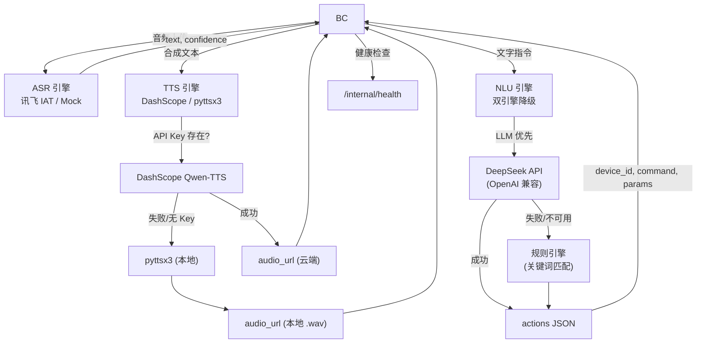

# AI 服务层

## 简介

处理智能家居系统的语音转文字 (ASR)、自然语言理解 (NLU) 和语音合成 (TTS) 流水线。所有接口均为**内部接口**，由 `backend-core` 调用，不直接对浏览器开放。

实现了 [`docs/FRONTEND_API_REQUIREMENTS.md`](../docs/FRONTEND_API_REQUIREMENTS.md) 中定义的 API 契约：

- **§8.1** ASR 语音转写 (`POST /internal/v1/asr/transcriptions`)
- **§8.2** NLU 意图解析 (`POST /internal/v1/nlu/interpret`)
- **§8.3** TTS 语音合成 (`POST /internal/v1/tts/speech`)
- **§11.2** 内部健康检查 (`GET /internal/health`)

## 流水线架构



### 模块引擎状态

| 模块 | 主引擎 | 降级引擎 | 状态 |
|------|--------|----------|------|
| **ASR** | 讯飞 IAT API（WebSocket） | Mock（确定性） | ✅ 讯飞已激活 |
| **NLU** | DeepSeek LLM（OpenAI 兼容接口） | 规则关键词匹配 | ✅ LLM 已激活 |
| **TTS** | DashScope Qwen-TTS（云端） | pyttsx3 + espeak-ng（本地） | ✅ 已激活 |

## 技术栈

- **语言**: Python 3.10+
- **框架**: FastAPI
- **ASR**: 讯飞 IAT API（WebSocket）→ Mock 降级
- **NLU**: DeepSeek API（OpenAI 兼容）→ 规则降级
- **TTS**: DashScope Qwen-TTS（云端）→ pyttsx3 + espeak-ng（本地降级）

## 目录结构

```
ai-service/
├── src/
│   ├── main.py              # FastAPI 应用入口
│   ├── asr/
│   │   ├── __init__.py
│   │   ├── routes.py         # ASR 端点（讯飞 + Mock 降级）
│   │   └── iflytek_engine.py # 讯飞 IAT WebSocket ASR 引擎
│   ├── nlu/
│   │   ├── __init__.py
│   │   ├── routes.py         # NLU 端点（LLM + 规则降级）
│   │   └── llm_engine.py     # DeepSeek LLM 集成
│   └── tts/
│       ├── __init__.py
│       ├── routes.py         # TTS 语音合成（DashScope + pyttsx3）
│       ├── generated_audio/  # 本地 TTS 输出目录
│       └── README.md         # TTS 模块文档
├── scripts/
│   ├── e2e_test.py           # 端到端流水线测试
│   └── test_asr_real.py      # 真实音频 ASR 测试（往返 / 文件上传）
├── tests/
│   ├── test_asr.py           # ASR 单元测试 (17)
│   ├── test_nlu.py           # NLU 单元测试 (8)
│   ├── test_tts.py           # TTS 单元测试 (11)
│   └── test_connectivity.py  # 跨模块连通性测试 (8)
├── requirements.txt
├── pytest.ini
├── .env                      # API 密钥（不提交）
├── README.md
└── README_zh.md
```

## API 接口

### 内部接口（符合规范 §8）

| 方法 | 路径 | 说明 |
|------|------|------|
| `POST` | `/internal/v1/asr/transcriptions` | 上传音频，返回转写文本 |
| `POST` | `/internal/v1/nlu/interpret` | 自然语言解析为设备动作 |
| `POST` | `/internal/v1/tts/speech` | 文本合成为语音 |
| `GET`  | `/internal/health` | 健康检查（含模型就绪状态） |

### 旧版兼容接口

| 方法 | 路径 | 说明 |
|------|------|------|
| `POST` | `/ai/asr/transcriptions` | ASR 转写（旧版） |
| `POST` | `/ai/asr/transcribe` | ASR 转写（已废弃） |
| `POST` | `/ai/nlu/parse` | NLU 解析（旧版） |
| `POST` | `/ai/tts/synthesize` | TTS 合成（旧版） |
| `GET`  | `/ai/health` | 健康检查（旧版） |

## ASR：讯飞 + Mock 双引擎降级

ASR 模块采用**双引擎降级策略**：

```
音频上传 → POST /internal/v1/asr/transcriptions
                    │
            ┌───────┴───────┐
            ▼               ▼
     讯飞 IAT API       Mock 引擎
     (WebSocket)        (确定性)
            │               │
            ├─ 成功 ────────┤
            ▼               ▼
     { text, confidence, engine: "iflytek"|"mock" }
```

**讯飞引擎**（`iflytek_engine.py`）：
1. 将音频转换为 16kHz 16bit 单声道 PCM
2. 通过 WebSocket 连接 `wss://iat-api.xfyun.cn/v2/iat`，使用 HMAC-SHA256 鉴权
3. 按 IAT v2 协议每 1280 字节一帧发送音频
4. 收集逐词结果及置信度，合并为最终转写文本

**Mock 引擎**（`routes.py`）：
- 确定性输出：相同音频始终返回相同结果（基于哈希种子）
- 讯飞凭证缺失或 `ASR_FORCE_MOCK=true` 时自动启用

### 真实 ASR 测试

```bash
# 往返测试：TTS 合成音频 → ASR 转写 → 对比原文
python scripts/test_asr_real.py --mode roundtrip

# 上传真实录音文件
python scripts/test_asr_real.py --mode file --audio /path/to/recording.wav

# 打印 curl 命令供手动测试
python scripts/test_asr_real.py --mode manual
```

## NLU：LLM + 规则双引擎降级

NLU 模块采用**双引擎降级策略**：

```
用户文本 → POST /internal/v1/nlu/interpret
                │
        ┌───────┴───────┐
        ▼               ▼
   LLM 引擎          规则引擎
   (DeepSeek)        (关键词)
        │               │
        ├─ 成功 ────────┤
        │               │
        ▼               ▼
   校验动作（device_id, command, params）
        │
        ▼
   { understood, reply, actions }
```

**LLM 引擎**（`llm_engine.py`）：
1. 构建包含完整设备列表、能力和场景的系统提示词
2. 调用 DeepSeek API（`api.deepseek.com/v1/chat/completions`，OpenAI 兼容格式）
3. 从响应中提取并校验 JSON
4. 校验每个 `device_id`、`command`、`params` 是否在设备注册表中存在
5. LLM 幻觉生成的设备或命令会被静默丢弃

**规则引擎**（`routes.py`）：
- 基于关键词的设备匹配（含房间过滤）
- 数值参数提取
- LLM 不可用或失败时自动接管

## 运行

```bash
# 1. 安装依赖
pip install -r requirements.txt

# 2. 配置 API 密钥（可选，见下方配置表）
cp .env.example .env   # 或手动创建 .env

# 3. 启动服务
uvicorn src.main:app --reload --port 8001

# 4. 运行单元测试（48 项）
pytest tests/ -v

# 5. 运行端到端流水线测试（需先启动服务）
python scripts/e2e_test.py
```

## 端到端测试

`scripts/e2e_test.py` 对运行中的服务验证完整流水线：

```
1. 健康检查      → GET  /internal/health
2. ASR 转写      → POST /internal/v1/asr/transcriptions
3. NLU: 单设备   → "打开客厅灯" → turn_on light-living-001
4. NLU: 温度调节 → "把空调调到26度" → set_temperature(26)
5. NLU: 复合指令 → "打开电视并把客厅灯调到50%"
6. NLU: 场景触发 → "开启观影模式" → scene:movie
7. NLU: 模糊指令 → "弄一下那个东西" → understood=false
8. TTS: 语音合成 → POST /internal/v1/tts/speech
```

## 配置

| 环境变量 | 必需 | 默认值 | 说明 |
|----------|------|--------|------|
| `IFLYTEK_APP_ID` | 否 | — | 讯飞应用 ID，用于 ASR 语音转写。未设置时降级到 Mock 引擎。 |
| `IFLYTEK_API_KEY` | 否 | — | 讯飞 API Key，用于 ASR WebSocket 鉴权。 |
| `IFLYTEK_API_SECRET` | 否 | — | 讯飞 API Secret，用于 ASR HMAC-SHA256 签名。 |
| `LLM_API_KEY` | 否 | — | DeepSeek API Key，用于 NLU LLM 引擎。未设置时降级到规则引擎。 |
| `DASHSCOPE_API_KEY` | 否 | — | 阿里云百炼 DashScope API Key，用于 TTS 云端合成。未设置时降级到本地 pyttsx3。 |
| `DEEPSEEK_BASE_URL` | 否 | `https://api.deepseek.com/v1` | DeepSeek API 地址（OpenAI 兼容）。 |
| `NLU_MODEL` | 否 | `deepseek-chat` | NLU LLM 调用使用的模型名称。 |
| `ASR_FORCE_MOCK` | 否 | — | 设为 `true` 强制使用 Mock ASR 引擎（单元测试用）。 |

---

[English README](./README.md)

