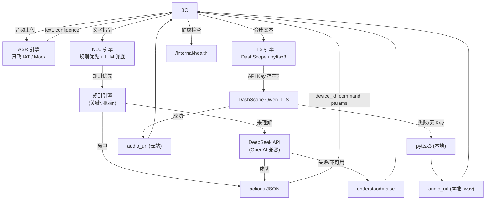
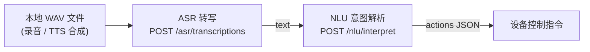

# AI 服务层

## 简介

处理智能家居系统的语音转文字 (ASR)、自然语言理解 (NLU) 和语音合成 (TTS) 流水线。所有接口均为**内部接口**，由 `backend-core` 调用，不直接对浏览器开放。

实现了 [`docs/FRONTEND_API_REQUIREMENTS.md`](../docs/FRONTEND_API_REQUIREMENTS.md) 中定义的 API 契约：

- **§8.1** ASR 语音转写 (`POST /internal/v1/asr/transcriptions`)
- **§8.2** NLU 意图解析 (`POST /internal/v1/nlu/interpret`)
- **§8.3** TTS 语音合成 (`POST /internal/v1/tts/speech`)
- **§11.2** 内部健康检查 (`GET /internal/health`)

## 流水线架构



### 模块引擎状态

| 模块 | 主引擎 | 降级引擎 | 备注 |
|------|--------|----------|------|
| **ASR** | 讯飞 IAT API（WebSocket） | Mock（确定性） | ✅ 讯飞已激活；非 WAV 格式可通过校验但不会被解码 |
| **NLU** | 规则关键词匹配（优先） | DeepSeek LLM（兜底） | ✅ 已激活；规则优先策略，低延迟高可靠 |
| **TTS** | DashScope Qwen-TTS（云端） | pyttsx3（本地，仅 WAV） | ✅ 已激活；本地降级仅输出 WAV 格式 |

## 技术栈

- **语言**: Python 3.10+
- **框架**: FastAPI
- **ASR**: 讯飞 IAT API（WebSocket）→ Mock 降级
- **NLU**: 规则引擎（关键词匹配，优先）→ DeepSeek LLM（兜底）
- **TTS**: DashScope Qwen-TTS（云端）→ pyttsx3（本地降级，仅 WAV）

## 目录结构

```
ai-service/
├── src/
│   ├── main.py              # FastAPI 应用入口
│   ├── asr/
│   │   ├── __init__.py
│   │   ├── routes.py         # ASR 端点（讯飞 + Mock 降级）
│   │   ├── iflytek_engine.py # 讯飞 IAT WebSocket ASR 引擎
│   │   └── README.md         # ASR 模块文档
│   ├── nlu/
│   │   ├── __init__.py
│   │   ├── routes.py         # NLU 端点（规则优先 + LLM 兜底）
│   │   ├── llm_engine.py     # DeepSeek LLM 集成
│   │   └── README.md         # NLU 模块文档
│   └── tts/
│       ├── __init__.py
│       ├── routes.py         # TTS 语音合成（DashScope + pyttsx3）
│       ├── generated_audio/  # 本地 TTS 输出目录
│       └── README.md         # TTS 模块文档
├── scripts/
│   ├── e2e_test.py           # 端到端流水线测试
│   └── test_asr_real.py      # 真实音频 ASR 测试（往返 / 文件上传）
├── tests/
│   ├── test_asr.py           # ASR 单元测试 (17)
│   ├── test_nlu.py           # NLU 单元测试 (8)
│   ├── test_tts.py           # TTS 单元测试 (11)
│   └── test_connectivity.py  # 跨模块连通性测试 (8)
├── requirements.txt
├── pytest.ini
├── .env                      # API 密钥（不提交）
├── README.md
└── README_zh.md
```

## API 接口

### 内部接口（符合规范 §8）

| 方法 | 路径 | 说明 |
|------|------|------|
| `POST` | `/internal/v1/asr/transcriptions` | 上传音频，返回转写文本 |
| `POST` | `/internal/v1/nlu/interpret` | 自然语言解析为设备动作 |
| `POST` | `/internal/v1/tts/speech` | 文本合成为语音 |
| `GET`  | `/internal/health` | 健康检查（含模型就绪状态） |
| `GET`  | `/internal/v1/asr/health` | ASR 模块健康检查 |
| `GET`  | `/internal/v1/nlu/health` | NLU 模块健康检查 |
| `GET`  | `/internal/v1/tts/health` | TTS 模块健康检查 |
| `GET`  | `/internal/v1/tts/audio/{filename}` | 获取本地生成的 TTS 音频文件 |

### 旧版兼容接口

| 方法 | 路径 | 说明 |
|------|------|------|
| `POST` | `/ai/asr/transcriptions` | ASR 转写（旧版） |
| `POST` | `/ai/asr/transcribe` | ASR 转写（已废弃） |
| `POST` | `/ai/nlu/parse` | NLU 解析（旧版） |
| `POST` | `/ai/tts/synthesize` | TTS 合成（旧版） |
| `GET`  | `/ai/health` | 健康检查（旧版） |
| `GET`  | `/ai/tts/audio/{filename}` | 获取本地 TTS 音频（旧版） |

---

## ASR — 语音识别模块

ASR 模块负责将用户上传的语音音频转写为文本，供下游 NLU 模块进行语义理解。本模块**不做**语义理解、不控制设备、不访问数据库。

### 引擎策略

| 优先级 | 引擎 | 说明 | 状态 |
|--------|------|------|------|
| 1（主） | **讯飞 IAT API** | 云端语音听写，WebSocket 协议，16kHz 16bit mono PCM | ✅ 已接入 |
| 2（降级） | **Mock 引擎** | 确定性模拟转写，用于开发测试 | ✅ 可用 |

**引擎选择逻辑**：
```
if 讯飞 API Key 已配置 AND 未设置 ASR_FORCE_MOCK:
    → 使用讯飞 IAT 引擎
elif 讯飞转写失败（网络/超时/服务端错误）:
    → 自动降级到 Mock 引擎
else:
    → 直接使用 Mock 引擎
```

- 设置 `ASR_FORCE_MOCK=true` 可强制使用 Mock 引擎（测试用）。
- 讯飞凭证通过 `.env` 注入：`IFLYTEK_APP_ID`、`IFLYTEK_API_KEY`、`IFLYTEK_API_SECRET`。

### 音频标准化流水线（讯飞引擎）

```
输入 WAV（任意采样率/声道/位深）
    │
    ├─ 1. _parse_wav_info()   → 解析 WAV 头，提取原始参数
    ├─ 2. _resample_pcm()     → 重采样至 16kHz（线性插值）
    ├─ 3. _convert_stereo_to_mono() → 立体声 → 单声道（L+R 平均）
    ├─ 4. 位深转换             → 8/24/32-bit → 16-bit
    │
    ▼
输出: 16kHz 16-bit mono PCM（讯飞 IAT 标准格式）
```

> **⚠️ 当前限制**：非 WAV 格式（WebM、OGG）可以通过 MIME 类型校验，但**不会被解码**。系统会假定其为 16kHz 16bit mono PCM 并直接传给引擎。WebM/OGG 中的 Opus 编码需要额外解码，当前版本暂未实现，建议前端统一录制 WAV 格式。

### 请求格式

```http
POST /internal/v1/asr/transcriptions
Content-Type: multipart/form-data
```

| 字段 | 类型 | 必需 | 默认值 | 说明 |
|------|------|------|--------|------|
| `audio` | file | **是** | — | 音频文件（支持格式见下表） |
| `language` | string | 否 | `"zh-CN"` | 音频语言标识 |
| `request_id` | string | 否 | 自动生成 UUID | 请求追踪 ID，用于跨服务排查 |

**支持的 MIME 类型**：

| MIME 类型 | 备注 |
|-----------|------|
| `audio/wav` | WAV 格式（PCM），推荐 |
| `audio/wave` | WAV 别名 |
| `audio/x-wav` | WAV 别名 |
| `audio/webm` | WebM 容器（不解码） |
| `audio/webm;codecs=opus` | WebM + Opus（不解码） |
| `audio/ogg` | OGG 容器（不解码） |
| `audio/ogg;codecs=opus` | OGG + Opus（不解码） |

### 成功响应

```json
{
  "text": "帮我把空调调到26度",
  "language": "zh-CN",
  "confidence": 0.92,
  "duration_ms": 1499,
  "request_id": "483e6533-2467-4ae0-b0a9-571575b308af",
  "engine": "iflytek",
  "processing_ms": 1499
}
```

| 字段 | 类型 | 说明 |
|------|------|------|
| `text` | string | 转写后的文本 |
| `language` | string | 识别语言 |
| `confidence` | float (0~1) | 置信度，Mock 引擎固定 ~0.85~1.0 |
| `duration_ms` | int | 音频时长（毫秒） |
| `request_id` | string | 请求追踪 ID |
| `engine` | string | 实际使用的引擎：`"iflytek"` 或 `"mock"` |
| `processing_ms` | int | 实际处理耗时（毫秒） |

### 错误响应

所有错误遵循统一格式：

```json
{
  "error": {
    "code": "ERROR_CODE",
    "message": "人类可读描述",
    "details": {},
    "request_id": "uuid"
  }
}
```

| HTTP 状态码 | 错误码 | 触发条件 |
|-------------|--------|----------|
| `415` | `UNSUPPORTED_AUDIO_FORMAT` | MIME 类型不在白名单中 |
| `413` | `AUDIO_TOO_LARGE` | 文件超过 10 MB |
| `422` | `SPEECH_NOT_DETECTED` | 文件过小（< 100 字节）或音频过长（> 30 秒） |

### 文件结构

```text
asr/
├── __init__.py         # 导出 FastAPI router
├── routes.py           # ASR 路由、请求校验、Mock 引擎、错误响应
├── iflytek_engine.py   # 讯飞 IAT WebSocket 引擎、音频标准化
└── README.md           # 模块说明文档
```

#### `iflytek_engine.py` 核心函数

| 函数 | 说明 |
|------|------|
| `engine_available()` | 检查讯飞 API 凭证是否已配置 |
| `transcribe()` | 异步主入口：标准化音频 → WebSocket 转写 |
| `_normalize_audio()` | 音频标准化流水线 |
| `_parse_wav_info()` | 解析 WAV 头，提取 sample_rate / channels / bits_per_sample / PCM 数据 |
| `_resample_pcm()` | 纯 Python 线性插值重采样（任意采样率 → 16kHz） |
| `_convert_stereo_to_mono()` | 立体声转单声道（L+R 平均） |
| `_transcribe_websocket()` | WebSocket 连接讯飞 IAT API，发送音频帧并收集转写结果 |
| `_build_auth_url()` | 构建 HMAC-SHA256 签名鉴权 URL |

### 真实 ASR 测试

```bash
# 往返测试：TTS 合成音频 → ASR 转写 → 对比原文
python scripts/test_asr_real.py --mode roundtrip

# 上传真实录音文件
python scripts/test_asr_real.py --mode file --audio /path/to/recording.wav

# 打印 curl 命令供手动测试
python scripts/test_asr_real.py --mode manual
```

---

## NLU — 自然语言理解模块

NLU 模块负责将用户的自然语言指令解析为后端可执行的动作计划。本模块**不做**设备控制、不访问数据库、不调用设备模拟器。

### 引擎策略（规则优先，LLM 兜底）

| 优先级 | 引擎 | 说明 | 状态 |
|--------|------|------|------|
| 1（主） | **规则引擎** | 关键词匹配 + 房间过滤 + 数值提取 | ✅ 已激活 |
| 2（兜底） | **DeepSeek LLM** | OpenAI 兼容接口，带设备上下文提示词 | ✅ 已激活 |

**策略说明**：规则引擎优先处理常见智能家居指令，低延迟且不依赖外部 API。LLM 仅在规则无法理解时被调用——既保证常用指令的可靠性，又能灵活应对复杂或新奇的表达方式。

```
if 规则引擎命中（understood=true 且 actions 非空）:
    → 直接返回规则结果
elif LLM 可用:
    → 尝试 LLM 解析
    → 成功：返回 LLM 结果
    → 失败：返回规则引擎的"未理解"结果
else:
    → 返回规则引擎的"未理解"结果
```

### 请求格式

`POST /internal/v1/nlu/interpret`

```json
{
  "text": "打开客厅灯并把空调调到22度",
  "conversation": [],
  "devices": [
    {
      "id": "light-living-001",
      "type": "light",
      "name": "客厅主灯",
      "room": "客厅",
      "online": true,
      "commands": [
        { "name": "turn_on", "params": {} },
        { "name": "set_brightness", "params": { "brightness": { "type": "integer", "min": 0, "max": 100 } } }
      ]
    },
    {
      "id": "ac-living-001",
      "type": "air_conditioner",
      "name": "客厅空调",
      "room": "客厅",
      "online": true,
      "commands": [
        { "name": "turn_on", "params": {} },
        { "name": "set_temperature", "params": { "temperature": { "type": "integer", "min": 16, "max": 30 } } }
      ]
    }
  ],
  "scenes": [
    { "id": "movie", "name": "观影" }
  ]
}
```

| 字段 | 类型 | 说明 |
|------|------|------|
| `text` | string | 用户输入的自然语言指令 |
| `conversation` | array | 历史对话，主要传给 LLM 兜底使用 |
| `devices` | array | 当前可用设备上下文，NLU 只能使用这里存在的设备 |
| `scenes` | array | 当前可用场景上下文，NLU 只能使用这里存在的场景 |

### 成功响应（设备控制）

```json
{
  "understood": true,
  "reply": "好的，正在处理客厅主灯、客厅空调。",
  "actions": [
    {
      "kind": "device_command",
      "device_id": "light-living-001",
      "command": "turn_on",
      "params": {}
    },
    {
      "kind": "device_command",
      "device_id": "ac-living-001",
      "command": "set_temperature",
      "params": { "temperature": 22 }
    }
  ]
}
```

### 成功响应（场景触发）

```json
{
  "understood": true,
  "reply": "好的，正在执行「观影」场景。",
  "actions": [
    { "kind": "scene", "scene_id": "movie" }
  ]
}
```

### 未理解响应

```json
{
  "understood": false,
  "reply": "我还不确定你想控制哪个设备，请告诉我设备名称或房间。",
  "actions": []
}
```

| 字段 | 类型 | 说明 |
|------|------|------|
| `understood` | bool | 是否理解用户意图 |
| `reply` | string | 给用户的简短回复（计划描述或需要补充的信息） |
| `actions` | array | 动作计划列表，后续由 `backend-core` 统一执行 |

### 规则引擎能力

规则引擎支持以下功能：

- **设备匹配**：精确名称匹配 → 房间+类型匹配 → 类型关键词匹配
- **房间过滤**：检测到房间关键词（客厅/卧室/书房/厨房/阳台/主卧）时只匹配该房间设备
- **复合指令**：按 `，` `、` `并` `和` 分割多设备控制指令
- **批量匹配**："所有灯" / "全部灯" 匹配该类型所有设备
- **数值提取**：`26度`、`百分之五十`、`一半`、`三档`
- **场景触发**：场景名称匹配
- **命令解析**：映射到设备声明的命令（`turn_on`、`turn_off`、`set_brightness`、`set_temperature`、`set_speed`、`set_open_percent`、`set_volume`、`set_channel`）
- **参数限幅**：数值按设备声明的 min/max 进行限幅

### LLM 引擎（`llm_engine.py`）

- 构建包含完整设备列表、能力和场景的系统提示词
- 调用 DeepSeek API（`api.deepseek.com/v1/chat/completions`，OpenAI 兼容格式）
- 从响应中提取并校验 JSON
- 校验每个 `device_id`、`command`、`params` 是否在设备注册表中存在
- LLM 幻觉生成的设备或命令会被静默丢弃
- 失败时返回 `None`，由 `routes.py` 回退到规则引擎结果

### 文件结构

```text
nlu/
├── __init__.py       # 导出 FastAPI router
├── routes.py         # NLU 路由、Pydantic 模型、规则引擎、interpret 端点
├── llm_engine.py     # DeepSeek/OpenAI 兼容 LLM 调用与输出校验
└── README.md         # 模块说明文档
```

---

## TTS — 语音合成模块

TTS 模块负责将文本合成为语音。采用**双引擎降级策略**：

1. **云端引擎** — 阿里云百炼 Qwen-TTS（DashScope SDK）
2. **本地降级** — pyttsx3（离线合成，**仅支持 WAV 格式**）

> **⚠️ 当前限制**：当云端 DashScope 引擎不可用时（无 API Key、网络异常、SDK 未安装或服务失败），系统降级使用本地 `pyttsx3` 合成。**pyttsx3 目前仅支持 WAV 输出格式。** 如果请求指定 `mp3`（或其他非 wav 格式），系统会记录警告日志，但实际仍输出 WAV 文件。

### 请求格式

```http
POST /internal/v1/tts/speech
Content-Type: application/json
```

```json
{
  "text": "卧室氛围灯已调到 35%。",
  "voice": "default",
  "format": "mp3"
}
```

| 字段 | 类型 | 必需 | 默认值 | 说明 |
|------|------|------|--------|------|
| `text` | string | 是 | — | 需要合成语音的文本 |
| `voice` | string | 否 | `"default"` | 音色名称（DashScope 支持；本地降级忽略此参数） |
| `format` | string | 否 | `"mp3"` | 音频格式：`mp3` / `wav` / `ogg` / `webm` |

### 成功响应

#### 云端 DashScope 成功

```json
{
  "status": "success",
  "audio_url": "https://dashscope.aliyuncs.com/...",
  "content_type": "audio/mpeg",
  "request_id": "a1b2c3d4-..."
}
```

#### 本地降级成功（pyttsx3，仅 WAV）

```json
{
  "status": "success",
  "audio_url": "/internal/v1/tts/audio/a1b2c3d4.wav",
  "content_type": "audio/wav",
  "expires_at": "2026-06-18T12:30:00+08:00",
  "request_id": null
}
```

| 字段 | 类型 | 始终返回 | 说明 |
|------|------|----------|------|
| `status` | string | 是 | 固定为 `"success"` |
| `audio_url` | string | 是 | 音频文件的 URL（云端的绝对 URL 或本地的相对路径） |
| `content_type` | string | 是 | 音频的 MIME 类型（`audio/mpeg` / `audio/wav`） |
| `expires_at` | string | 仅本地 | ISO 8601 格式的过期时间（CST 时区），默认 30 分钟 |
| `request_id` | string | 否 | 云端返回的请求 ID；本地降级时为 `null` |

#### MIME 类型映射

| 请求 `format` 值 | 响应 `content_type` 值 |
|------------------|----------------------|
| `mp3` | `audio/mpeg` |
| `wav` | `audio/wav` |
| `ogg` | `audio/ogg` |
| `webm` | `audio/webm` |

### 错误响应

```json
{
  "detail": "语音合成失败（云端与本地均不可用）: ..."
}
```

| HTTP 状态码 | 场景 |
|-------------|------|
| `500` | 云端与本地均不可用（网络异常、SDK 缺失、本地引擎崩溃等） |

### 工作流程

```
┌──────────────┐    POST /internal/v1/tts/speech    ┌──────────────────────┐
│ backend-core │ ──────────────────────────────────> │  TTS 模块            │
│              │                                     │                      │
│              │ <────────────────────────────────── │  1. 检查 API Key     │
│              │     audio_url / content_type        │     ↓                │
└──────────────┘                                     │  2. 有 Key？         │
                                                     │     ├── 是 → DashScope
       ┌────────────────────────────────┐            │     └── 否 → pyttsx3
       │ 浏览器 / 前端请求 Audio URL    │            │     ↓                |
       │ 直接访问静态文件或云端地址      │            │  3. 返回响应         │
       └───────────────┬────────────────┘            └──────────────────────┘
                       │
                       ▼
              ┌─────────────────┐
              │ 播放音频        │
              └─────────────────┘
```

### 本地降级配置

| 配置项 | 值 |
|--------|-----|
| 库 | `pyttsx3` |
| 输出格式 | **仅 WAV**（无论请求何种格式） |
| 语音速率 | 150 |
| 执行方式 | `ThreadPoolExecutor`（最多 1 个工作线程），不阻塞主协程 |

### 音频文件生命周期

| 项目 | 值 |
|------|-----|
| 存储目录 | `src/tts/generated_audio/` |
| 有效期限 | 30 分钟（`AUDIO_MAX_AGE_SECONDS = 1800`） |
| 清理间隔 | 每 10 分钟清理一次 |
| 支持格式 | `.wav`（本地）、`.mp3`（云端） |

后台协程 `cleanup_audio_background` 在应用启动时自动执行一次清理，之后每 10 分钟循环清理。

### 文件结构

```text
tts/
├── __init__.py          # 导出 FastAPI router
├── routes.py            # TTS 路由、DashScope + pyttsx3 合成、音频清理
├── generated_audio/     # 本地 TTS 输出目录（自动清理）
└── README.md            # 模块说明文档
```

### 依赖

- `fastapi` — Web 框架
- `pyttsx3` — 本地语音合成引擎（降级用）
- `dashscope` — 阿里云百炼 SDK（可选，云端引擎用）
- `python-dotenv` — 环境变量加载

---

## 端到端测试

`scripts/e2e_test.py` 可对运行中的服务验证完整流水线：

```
1. 健康检查         → GET  /internal/health
2. ASR 转写         → POST /internal/v1/asr/transcriptions
3. NLU：单设备控制  → "打开客厅灯" → turn_on light-living-001
4. NLU：温度调节    → "把空调调到26度" → set_temperature(26)
5. NLU：多动作      → "打开电视并把客厅灯调到50%"
6. NLU：场景触发    → "开启观影模式" → scene:movie
7. NLU：模糊意图    → "弄一下那个东西" → understood=false
8. TTS：语音合成    → POST /internal/v1/tts/speech
```

## 配置

| 环境变量 | 必需 | 默认值 | 说明 |
|----------|------|--------|------|
| `IFLYTEK_APP_ID` | 否 | — | 讯飞应用 ID，用于 ASR |
| `IFLYTEK_API_KEY` | 否 | — | 讯飞 API Key，用于 ASR WebSocket 鉴权 |
| `IFLYTEK_API_SECRET` | 否 | — | 讯飞 API Secret，用于 ASR HMAC-SHA256 签名 |
| `LLM_API_KEY` | 否 | — | DeepSeek API Key，用于 NLU LLM 引擎 |
| `DASHSCOPE_API_KEY` | 否 | — | 阿里云百炼 API Key，用于 TTS 云端合成 |
| `DEEPSEEK_BASE_URL` | 否 | `https://api.deepseek.com/v1` | DeepSeek API 基础 URL（OpenAI 兼容） |
| `NLU_MODEL` | 否 | `deepseek-chat` | NLU LLM 调用使用的模型名称 |
| `ASR_FORCE_MOCK` | 否 | — | 设为 `true` 强制使用 Mock ASR 引擎（测试用） |

## 运行

```bash
# 1. 安装依赖
pip install -r requirements.txt

# 2. 配置 API 密钥（可选，各模块均可优雅降级）
cp .env.example .env   # 或手动创建 .env

# 3. 启动服务
uvicorn src.main:app --reload --port 8001

# 4. 运行单元测试（48 项）
pytest tests/ -v

# 5. 运行端到端流水线测试（需先启动服务）
python scripts/e2e_test.py
```

---

[English Documentation](./README.md)


## 端到端测试

`scripts/e2e_test.py` 对运行中的服务验证完整流水线：

```
1. 健康检查      → GET  /internal/health
2. ASR 转写      → POST /internal/v1/asr/transcriptions
3. NLU: 单设备   → "打开客厅灯" → turn_on light-living-001
4. NLU: 温度调节 → "把空调调到26度" → set_temperature(26)
5. NLU: 复合指令 → "打开电视并把客厅灯调到50%"
6. NLU: 场景触发 → "开启观影模式" → scene:movie
7. NLU: 模糊指令 → "弄一下那个东西" → understood=false
8. TTS: 语音合成 → POST /internal/v1/tts/speech
```

## 本地音频流水线测试

测试本地音频文件经过完整 **ASR → NLU** 流水线的端到端效果。

### 流水线概览



### 方式一：curl 分步测试

```bash
# 前提：AI Service 已启动在 8001 端口
# uvicorn src.main:app --port 8001

# Step 1: 上传音频 → 获取转写文本
curl -s -X POST http://127.0.0.1:8001/internal/v1/asr/transcriptions \
  -F "audio=@./test_code/output.wav;type=audio/wav" \
  | tee /tmp/asr_result.json

# 提取转写文本
TEXT=$(cat /tmp/asr_result.json | python -c "import sys,json; print(json.load(sys.stdin)['text'])")
echo "ASR 转写: $TEXT"

# Step 2: 将转写文本送入 NLU → 获取动作指令
curl -s -X POST http://127.0.0.1:8001/internal/v1/nlu/interpret \
  -H "Content-Type: application/json" \
  -d "{
    \"text\": \"$TEXT\",
    \"devices\": [
      {\"id\":\"ac-living-001\",\"type\":\"air_conditioner\",\"name\":\"中央空调\",\"room\":\"客厅\",\"online\":true,
       \"commands\":[{\"name\":\"turn_on\",\"params\":{}},{\"name\":\"turn_off\",\"params\":{}},{\"name\":\"set_temperature\",\"params\":{\"temperature\":{\"type\":\"integer\",\"min\":16,\"max\":30}}}]},
      {\"id\":\"light-living-001\",\"type\":\"light\",\"name\":\"客厅主灯\",\"room\":\"客厅\",\"online\":true,
       \"commands\":[{\"name\":\"turn_on\",\"params\":{}},{\"name\":\"turn_off\",\"params\":{}},{\"name\":\"set_brightness\",\"params\":{\"brightness\":{\"type\":\"integer\",\"min\":0,\"max\":100}}}]},
      {\"id\":\"tv-living-001\",\"type\":\"tv\",\"name\":\"智能电视\",\"room\":\"客厅\",\"online\":true,
       \"commands\":[{\"name\":\"turn_on\",\"params\":{}},{\"name\":\"turn_off\",\"params\":{}}]}
    ],
    \"scenes\": [
      {\"id\":\"home\",\"name\":\"回家\"},
      {\"id\":\"movie\",\"name\":\"观影\"},
      {\"id\":\"sleep\",\"name\":\"睡眠\"}
    ]
  }" | python -m json.tool
```

> **Windows 用户注意**：PowerShell 不支持 `tee`，`$()` 语法也不同。建议直接使用下方的 Python 脚本方式。

### 方式二：Python 脚本一键测试

将以下脚本保存为 `test_pipeline.py`，修改 `AUDIO_FILE` 为你的音频文件路径：

```python
#!/usr/bin/env python3
"""本地音频 → ASR → NLU 流水线测试"""
import json, sys, urllib.request, urllib.error

BASE = "http://127.0.0.1:8001"
AUDIO_FILE = "./test_code/output.wav"

# 测试设备列表（需与 backend-core 中的设备注册表一致）
DEVICES = [
    {"id":"ac-living-001","type":"air_conditioner","name":"中央空调","room":"客厅","online":True,
     "commands":[{"name":"turn_on","params":{}},{"name":"turn_off","params":{}},
                 {"name":"set_temperature","params":{"temperature":{"type":"integer","min":16,"max":30}}}]},
    {"id":"light-living-001","type":"light","name":"客厅主灯","room":"客厅","online":True,
     "commands":[{"name":"turn_on","params":{}},{"name":"turn_off","params":{}},
                 {"name":"set_brightness","params":{"brightness":{"type":"integer","min":0,"max":100}}}]},
    {"id":"tv-living-001","type":"tv","name":"智能电视","room":"客厅","online":True,
     "commands":[{"name":"turn_on","params":{}},{"name":"turn_off","params":{}}]},
]
SCENES = [{"id":"home","name":"回家"},{"id":"movie","name":"观影"},{"id":"sleep","name":"睡眠"}]

def post_json(path, data):
    req = urllib.request.Request(f"{BASE}{path}",
        data=json.dumps(data).encode(), headers={"Content-Type":"application/json"}, method="POST")
    with urllib.request.urlopen(req, timeout=30) as r:
        return json.loads(r.read())

def post_audio(path, audio_bytes, content_type="audio/wav"):
    boundary = "----PipelineTest"
    body = (f"--{boundary}\r\nContent-Disposition: form-data; name=\"audio\"; filename=\"test.wav\"\r\n"
            f"Content-Type: {content_type}\r\n\r\n").encode() + audio_bytes + f"\r\n--{boundary}--\r\n".encode()
    req = urllib.request.Request(f"{BASE}{path}", data=body,
        headers={"Content-Type": f"multipart/form-data; boundary={boundary}"}, method="POST")
    with urllib.request.urlopen(req, timeout=60) as r:
        return json.loads(r.read())

# Step 1: ASR 转写
with open(AUDIO_FILE, "rb") as f:
    audio = f.read()

asr = post_audio("/internal/v1/asr/transcriptions", audio)
text = asr["text"]
print(f"[ASR] 转写文本: \"{text}\"  (引擎: {asr.get('engine')}, 置信度: {asr.get('confidence')})")

# Step 2: NLU 意图解析
nlu = post_json("/internal/v1/nlu/interpret", {
    "text": text,
    "devices": DEVICES,
    "scenes": SCENES,
})
print(f"[NLU] 理解: {'是' if nlu['understood'] else '否'} | 回复: \"{nlu['reply']}\"")
for action in nlu.get("actions", []):
    if action.get("kind") == "device_command":
        print(f"  → 设备: {action['device_id']}, 命令: {action['command']}, 参数: {action.get('params', {})}")
    elif action.get("kind") == "scene":
        print(f"  → 场景: {action['scene_id']}")

print(f"\n✅ 流水线完成: 音频 → \"{text}\" → {len(nlu['actions'])} 个动作")
```

### 方式三：TTS 往返测试

```bash
# 一键执行：TTS 合成中文语音 → ASR 转写 → 文本对比
python scripts/test_asr_real.py --mode roundtrip
```

此脚本自动完成：pyttsx3 合成已知文本 → 上传 ASR → 比较转写结果，无需手动准备音频文件。

### 流水线测试速查

| 测试目的 | 命令 | 需要服务 |
|----------|------|----------|
| 单模块单元测试 | `pytest tests/ -v` | ❌ |
| 端到端流水线（Mock 音频） | `python scripts/e2e_test.py` | ✅ |
| 真实音频 ASR 测试 | `python scripts/test_asr_real.py --mode file --audio ./test.wav` | ✅ |
| TTS → ASR 往返测试 | `python scripts/test_asr_real.py --mode roundtrip` | ✅ |
| 完整 ASR → NLU 流水线 | 使用上方 Python 脚本或 curl 分步 | ✅ |

## 配置

| 环境变量 | 必需 | 默认值 | 说明 |
|----------|------|--------|------|
| `IFLYTEK_APP_ID` | 否 | — | 讯飞应用 ID，用于 ASR 语音转写。未设置时降级到 Mock 引擎。 |
| `IFLYTEK_API_KEY` | 否 | — | 讯飞 API Key，用于 ASR WebSocket 鉴权。 |
| `IFLYTEK_API_SECRET` | 否 | — | 讯飞 API Secret，用于 ASR HMAC-SHA256 签名。 |
| `LLM_API_KEY` | 否 | — | DeepSeek API Key，用于 NLU LLM 引擎。未设置时降级到规则引擎。 |
| `DASHSCOPE_API_KEY` | 否 | — | 阿里云百炼 DashScope API Key，用于 TTS 云端合成。未设置时降级到本地 pyttsx3。 |
| `DEEPSEEK_BASE_URL` | 否 | `https://api.deepseek.com/v1` | DeepSeek API 地址（OpenAI 兼容）。 |
| `NLU_MODEL` | 否 | `deepseek-chat` | NLU LLM 调用使用的模型名称。 |
| `ASR_FORCE_MOCK` | 否 | — | 设为 `true` 强制使用 Mock ASR 引擎（单元测试用）。 |

---

[English README](./README.md)

