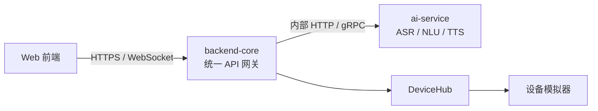

# Web 前端所需后端与 AI API 需求

> 状态：讨论确认版
>
> 面向模块：`web-console`、`backend-core`、`ai-service`、`device-simulator`
>
> 基线日期：2026-06-10
>
> API 版本：`v1`

## 1. 文档目的

本文档从全屋智能 Web 控制台的用户流程出发，定义前端需要后端与 AI 服务提供的接口、数据模型、错误语义和验收标准。

当前 Web Demo 覆盖：

- 全屋设备总览；
- 空调、两盏灯、电视、冰箱、风扇的状态展示；
- 单设备开关和详细参数控制；
- 回家、观影、睡眠、离家场景；
- 文字智能助手；
- 语音录制、识别和智能控制反馈；
- 在线数量、运行数量、环境和能耗概览。

本文档描述的是服务契约，不要求本次同时实现全部接口。接口按 `P0`、`P1`、`P2` 标注优先级。

## 2. 当前项目现状

### 2.1 已有后端能力

`backend-core` 已提供以下 DeviceHub 接口：

| 方法 | 路径 | 当前用途 |
| --- | --- | --- |
| `GET` | `/health` | 后端健康检查与已连接设备数量 |
| `GET` | `/api/v1/devices` | 查询已注册设备 |
| `GET` | `/api/v1/devices/{device_id}/state` | 查询单设备状态 |
| `GET` | `/api/v1/devices/{device_id}/commands/count` | 查询设备支持的命令 |
| `GET` | `/api/v1/devices/{device_id}/commands/{command_name}` | 查询命令参数描述 |
| `POST` | `/api/v1/devices/{device_id}/command` | 执行设备命令 |

设备模拟器目前实现：

- 空调：开关、温度；
- 灯光：开关、亮度、颜色；
- 电视：开关、频道、音量。

### 2.2 当前接口与前端需求的差距

1. 设备列表不包含完整状态、房间、用户可读名称和能力范围。
2. 前端需要先获取列表，再逐设备获取状态和命令，存在 N+1 请求。
3. 接口失败时仍可能返回 HTTP 200，前端无法可靠区分设备不存在、离线、参数错误和执行失败。
4. 当前接口直接暴露底层动态命令，前端必须理解 C++ 字段和命令映射。
5. 缺少冰箱、风扇和第二盏灯实例。
6. 缺少场景和批量执行能力。
7. 缺少设备状态变化、上下线变化的实时推送。
8. AI 服务目前没有可调用接口。
9. 缺少语音音频上传、ASR 转写、NLU 解析和统一执行链路。
10. 缺少前端仪表盘所需的环境和能耗聚合数据。

## 3. 总体设计原则

### 3.1 服务边界



1. Web 前端只访问 `backend-core`。
2. 浏览器不得直接调用外部大模型接口，不得保存模型 API Key。
3. `ai-service` 只负责转写、理解和生成受约束的动作计划。
4. `backend-core` 负责设备解析、权限检查、参数校验、命令执行和结果聚合。
5. AI 输出不得绕过后端验证直接控制设备。
6. 前端以服务端返回的最终设备状态为准，不以本地乐观状态作为最终事实。

### 3.2 API 风格

- 外部接口前缀：`/api/v1`；
- 路径使用小写和中划线；
- 请求与响应使用 JSON，音频上传除外；
- 时间使用 ISO 8601，并带时区；
- 字段名统一使用 `snake_case`；
- 数值使用 JSON number，不使用数字字符串；
- 所有命令支持 `request_id`，便于幂等与链路追踪；
- 前端可在请求头传递 `X-Request-ID`，后端在响应中返回同一值；
- 成功响应返回执行后的权威状态；
- 业务失败使用合适的 HTTP 状态码和统一错误体。

### 3.3 统一错误格式

```json
{
  "error": {
    "code": "DEVICE_OFFLINE",
    "message": "客厅主灯当前离线",
    "details": {
      "device_id": "light-living-001"
    },
    "request_id": "req-01JXYZ"
  }
}
```

建议错误码：

| HTTP | 错误码 | 含义 |
| --- | --- | --- |
| `400` | `INVALID_REQUEST` | 请求体格式错误 |
| `400` | `INVALID_PARAMETER` | 参数类型或范围错误 |
| `404` | `DEVICE_NOT_FOUND` | 设备不存在 |
| `404` | `SCENE_NOT_FOUND` | 场景不存在 |
| `409` | `COMMAND_NOT_SUPPORTED` | 设备不支持该命令 |
| `409` | `DEVICE_STATE_CONFLICT` | 当前状态不允许执行，例如关机时调温 |
| `422` | `ASSISTANT_NOT_UNDERSTOOD` | AI 无法形成有效动作 |
| `503` | `DEVICE_OFFLINE` | 设备离线 |
| `503` | `AI_SERVICE_UNAVAILABLE` | AI 服务不可用 |
| `504` | `DEVICE_TIMEOUT` | 设备响应超时 |
| `504` | `AI_TIMEOUT` | AI 推理超时 |

## 4. 统一设备模型

### 4.1 设备对象

`P0`

```json
{
  "id": "light-living-001",
  "type": "light",
  "name": "客厅主灯",
  "room": {
    "id": "living-room",
    "name": "客厅"
  },
  "online": true,
  "active": true,
  "state": {
    "power": true,
    "brightness": 72,
    "color_temperature": 4200
  },
  "capabilities": {
    "power": {
      "type": "boolean"
    },
    "brightness": {
      "type": "integer",
      "min": 0,
      "max": 100,
      "step": 1,
      "unit": "%"
    },
    "color_temperature": {
      "type": "integer",
      "min": 2700,
      "max": 6500,
      "step": 100,
      "unit": "K"
    }
  },
  "energy": {
    "today_kwh": 0.3
  },
  "updated_at": "2026-06-10T10:00:00+08:00"
}
```

字段要求：

| 字段 | 必需 | 说明 |
| --- | --- | --- |
| `id` | 是 | 全局唯一且稳定，不因重启变化 |
| `type` | 是 | 标准设备类型 |
| `name` | 是 | 用户可读名称 |
| `room` | 是 | 房间 ID 和名称 |
| `online` | 是 | 设备连接状态 |
| `active` | 是 | 是否正在运行，由后端按设备类型计算 |
| `state` | 是 | 当前权威状态 |
| `capabilities` | 是 | 前端生成控件和校验范围所需能力 |
| `energy` | 否 | 能耗数据尚未实现时可省略 |
| `updated_at` | 是 | 状态最后更新时间 |

### 4.2 标准设备类型

`P0`

| 前端类型 | `type` | 最低状态字段 | 最低命令 |
| --- | --- | --- | --- |
| 空调 | `air_conditioner` | `power`, `target_temperature`, `mode`, `fan_speed` | `turn_on`, `turn_off`, `set_temperature`, `set_mode`, `set_fan_speed` |
| 灯光 | `light` | `power`, `brightness`, `color_temperature` | `turn_on`, `turn_off`, `set_brightness`, `set_color_temperature` |
| 电视 | `tv` | `power`, `volume`, `source`, `channel` | `turn_on`, `turn_off`, `set_volume`, `set_source`, `set_channel` |
| 冰箱 | `refrigerator` | `power`, `fridge_temperature`, `freezer_temperature`, `mode`, `freshness` | `turn_on`, `turn_off`, `set_fridge_temperature`, `set_freezer_temperature`, `set_mode`, `set_freshness` |
| 风扇 | `fan` | `power`, `speed`, `oscillation`, `timer_minutes` | `turn_on`, `turn_off`, `set_speed`, `set_oscillation`, `set_timer` |

### 4.3 设备实例要求

`P0`

至少提供以下六个实例：

| 建议 ID | 类型 | 名称 | 房间 |
| --- | --- | --- | --- |
| `ac-living-001` | `air_conditioner` | 中央空调 | 客厅 |
| `light-living-001` | `light` | 客厅主灯 | 客厅 |
| `light-bedroom-001` | `light` | 卧室氛围灯 | 主卧 |
| `tv-living-001` | `tv` | 智能电视 | 客厅 |
| `fridge-kitchen-001` | `refrigerator` | 智能冰箱 | 厨房 |
| `fan-bedroom-001` | `fan` | 循环风扇 | 主卧 |

两个灯具必须是两个独立设备 ID，能够分别控制和查询。

## 5. 设备接口

### 5.1 查询设备列表

`P0`

```http
GET /api/v1/devices?include=state,capabilities,energy
```

响应：

```json
{
  "devices": [
    {
      "id": "ac-living-001",
      "type": "air_conditioner",
      "name": "中央空调",
      "room": {
        "id": "living-room",
        "name": "客厅"
      },
      "online": true,
      "active": true,
      "state": {
        "power": true,
        "target_temperature": 24,
        "mode": "auto",
        "fan_speed": "medium"
      },
      "capabilities": {
        "target_temperature": {
          "type": "integer",
          "min": 16,
          "max": 30,
          "step": 1,
          "unit": "°C"
        },
        "mode": {
          "type": "enum",
          "values": ["cool", "auto", "dry", "fan"]
        },
        "fan_speed": {
          "type": "enum",
          "values": ["low", "medium", "high"]
        }
      },
      "updated_at": "2026-06-10T10:00:00+08:00"
    }
  ],
  "summary": {
    "total": 6,
    "online": 6,
    "active": 4
  }
}
```

要求：

- 默认返回状态和能力，避免逐设备补充请求；
- 单设备状态查询失败不能使整个列表失败；
- 离线设备仍应出现在列表中；
- `summary` 与列表数据一致；
- 推荐服务端支持 `ETag` 或 `updated_since`，作为后续优化。

### 5.2 查询单个设备

`P0`

```http
GET /api/v1/devices/{device_id}
```

返回完整设备对象。该接口用于打开设备详情、页面刷新和命令失败后的状态恢复。

### 5.3 执行单设备命令

`P0`

推荐新路径：

```http
POST /api/v1/devices/{device_id}/commands
Content-Type: application/json
```

请求：

```json
{
  "command": "set_brightness",
  "params": {
    "brightness": 50
  },
  "request_id": "req-01JXYZ"
}
```

成功响应：

```json
{
  "success": true,
  "message": "客厅主灯亮度已调整为 50%",
  "device_id": "light-living-001",
  "command": "set_brightness",
  "state": {
    "power": true,
    "brightness": 50,
    "color_temperature": 4200
  },
  "executed_at": "2026-06-10T10:00:01+08:00",
  "request_id": "req-01JXYZ"
}
```

要求：

- 后端验证命令是否属于该设备；
- 后端验证参数类型、枚举值和范围；
- 后端返回执行后的完整设备状态；
- 同一 `request_id` 重试时不得重复产生不可逆副作用；
- 设备离线、超时或拒绝命令时使用统一错误响应；
- 前端可以在等待响应时显示进行中状态，但以响应中的 `state` 为最终结果。

兼容策略：

- 现有 `POST /api/v1/devices/{device_id}/command` 可在 `v1` 内保留；
- 新旧路径应复用同一业务逻辑；
- 新前端统一使用复数 `/commands`；
- 稳定后再考虑废弃旧路径。

### 5.4 批量设备命令

`P1`

```http
POST /api/v1/device-commands/batch
```

请求：

```json
{
  "request_id": "req-batch-001",
  "commands": [
    {
      "device_id": "light-living-001",
      "command": "turn_on",
      "params": {}
    },
    {
      "device_id": "light-bedroom-001",
      "command": "turn_off",
      "params": {}
    }
  ]
}
```

响应：

```json
{
  "success": false,
  "summary": {
    "total": 2,
    "succeeded": 1,
    "failed": 1
  },
  "results": [
    {
      "device_id": "light-living-001",
      "status": "succeeded",
      "state": {
        "power": true,
        "brightness": 72
      }
    },
    {
      "device_id": "light-bedroom-001",
      "status": "failed",
      "error": {
        "code": "DEVICE_OFFLINE",
        "message": "卧室氛围灯当前离线"
      }
    }
  ]
}
```

批量接口必须明确返回部分失败结果，不得只返回笼统成功或失败。

## 6. 场景接口

场景必须由后端保存和执行。前端只展示场景并发起执行，不在浏览器内维护正式场景逻辑。

### 6.1 查询场景

`P0`

```http
GET /api/v1/scenes
```

响应：

```json
{
  "scenes": [
    {
      "id": "home",
      "name": "回家",
      "description": "开启客厅灯与空调",
      "icon": "home",
      "action_count": 3
    },
    {
      "id": "movie",
      "name": "观影",
      "description": "打开电视并调暗客厅灯",
      "icon": "movie",
      "action_count": 4
    },
    {
      "id": "sleep",
      "name": "睡眠",
      "description": "关闭非必要设备并开启夜灯",
      "icon": "moon",
      "action_count": 6
    },
    {
      "id": "away",
      "name": "离家",
      "description": "关闭除冰箱外的设备",
      "icon": "shield",
      "action_count": 5
    }
  ]
}
```

### 6.2 执行场景

`P0`

```http
POST /api/v1/scenes/{scene_id}/execute
```

请求：

```json
{
  "request_id": "req-scene-001"
}
```

响应：

```json
{
  "success": true,
  "scene": {
    "id": "movie",
    "name": "观影"
  },
  "summary": {
    "total": 4,
    "succeeded": 4,
    "failed": 0
  },
  "results": [
    {
      "device_id": "tv-living-001",
      "command": "turn_on",
      "status": "succeeded",
      "state": {
        "power": true,
        "volume": 28,
        "source": "media"
      }
    }
  ],
  "executed_at": "2026-06-10T10:02:00+08:00"
}
```

要求：

- 返回每个动作的执行结果；
- 场景部分失败时 HTTP 可返回 `200`，但顶层 `success` 必须为 `false`；
- 前端依据 `results` 更新设备状态并提示失败项；
- 场景执行同样支持 `request_id`；
- 冰箱在离家和睡眠场景中默认保持运行。

### 6.3 场景管理

`P2`

后续可增加：

- `POST /api/v1/scenes`
- `PATCH /api/v1/scenes/{scene_id}`
- `DELETE /api/v1/scenes/{scene_id}`

当前 Demo 只要求预置场景的查询和执行。

## 7. 智能助手外部接口

### 7.1 文字消息

`P0`

```http
POST /api/v1/assistant/messages
Content-Type: application/json
```

请求：

```json
{
  "conversation_id": "conv-001",
  "text": "把客厅灯调到 50%",
  "execute": true,
  "request_id": "req-ai-001"
}
```

说明：

- 首次请求可不传 `conversation_id`；
- `execute=true` 表示后端验证动作后立即执行；
- `execute=false` 用于只解析、不执行的调试或确认场景；
- 后端自行获取设备和场景上下文，前端不应提交完整设备能力清单。

成功响应：

```json
{
  "conversation_id": "conv-001",
  "transcript": "把客厅灯调到 50%",
  "reply": "已将客厅主灯亮度调到 50%。",
  "understood": true,
  "actions": [
    {
      "device_id": "light-living-001",
      "command": "set_brightness",
      "params": {
        "brightness": 50
      },
      "status": "succeeded",
      "state": {
        "power": true,
        "brightness": 50,
        "color_temperature": 4200
      }
    }
  ],
  "request_id": "req-ai-001"
}
```

无法理解时：

```json
{
  "conversation_id": "conv-001",
  "transcript": "弄一下那个东西",
  "reply": "我还不确定你想控制哪个设备，请告诉我设备名称或房间。",
  "understood": false,
  "actions": [],
  "request_id": "req-ai-002"
}
```

要求：

- 无动作不是服务器错误，可返回 HTTP `200` 和 `understood=false`；
- AI 生成的设备 ID、命令和参数必须由后端二次校验；
- 回复应基于实际执行结果，而不是仅基于模型计划；
- 多设备指令返回多个动作及各自状态；
- 对危险或高风险设备可要求二次确认，本期设备不要求；
- AI 服务不可用时，后端可以回退到规则解析，并通过 `engine` 字段标识。

可选字段：

```json
{
  "engine": "llm",
  "latency_ms": {
    "nlu": 320,
    "execution": 48,
    "total": 368
  }
}
```

### 7.2 语音消息

`P0`

```http
POST /api/v1/assistant/voice
Content-Type: multipart/form-data
```

表单字段：

| 字段 | 类型 | 必需 | 说明 |
| --- | --- | --- | --- |
| `audio` | file | 是 | 浏览器录制的音频 |
| `conversation_id` | string | 否 | 会话 ID |
| `execute` | boolean | 否 | 默认 `true` |
| `request_id` | string | 否 | 请求追踪 ID |
| `language` | string | 否 | 默认 `zh-CN` |

最低支持格式：

- `audio/webm;codecs=opus`
- `audio/ogg;codecs=opus`
- `audio/wav`

建议限制：

- 最大文件大小：10 MB；
- 最大时长：30 秒；
- 超出限制返回 `413 AUDIO_TOO_LARGE`；
- 无有效语音返回 `422 SPEECH_NOT_DETECTED`。

响应与文字消息一致，并增加 ASR 信息：

```json
{
  "conversation_id": "conv-002",
  "transcript": "把卧室氛围灯调到百分之三十五",
  "reply": "卧室氛围灯已调到 35%。",
  "understood": true,
  "actions": [
    {
      "device_id": "light-bedroom-001",
      "command": "set_brightness",
      "params": {
        "brightness": 35
      },
      "status": "succeeded",
      "state": {
        "power": true,
        "brightness": 35,
        "color_temperature": 3000
      }
    }
  ],
  "asr": {
    "language": "zh-CN",
    "confidence": 0.94,
    "duration_ms": 2830
  }
}
```

### 7.3 对话历史

`P2`

如果产品需要跨页面保留助手记录，可增加：

```http
GET /api/v1/assistant/conversations/{conversation_id}/messages
DELETE /api/v1/assistant/conversations/{conversation_id}
```

当前 Demo 可以只在浏览器内保留当次页面消息。

### 7.4 TTS 回复

`P1`

可在助手响应中提供：

```json
{
  "speech": {
    "url": "/api/v1/audio/tts-01JXYZ.mp3",
    "content_type": "audio/mpeg",
    "expires_at": "2026-06-10T10:10:00+08:00"
  }
}
```

本期可先只返回文字，不阻塞设备控制主流程。

## 8. AI 服务内部接口

以下接口只允许 `backend-core` 调用，不对浏览器公开。

### 8.1 ASR 转写

`P0`

```http
POST /internal/v1/asr/transcriptions
Content-Type: multipart/form-data
```

响应：

```json
{
  "text": "打开客厅灯",
  "language": "zh-CN",
  "confidence": 0.96,
  "duration_ms": 1640
}
```

### 8.2 NLU 意图解析

`P0`

```http
POST /internal/v1/nlu/interpret
Content-Type: application/json
```

请求：

```json
{
  "text": "打开客厅灯并把空调调到 22 度",
  "conversation": [],
  "devices": [
    {
      "id": "light-living-001",
      "type": "light",
      "name": "客厅主灯",
      "room": "客厅",
      "online": true,
      "commands": [
        {
          "name": "turn_on",
          "params": {}
        },
        {
          "name": "set_brightness",
          "params": {
            "brightness": {
              "type": "integer",
              "min": 0,
              "max": 100
            }
          }
        }
      ]
    }
  ],
  "scenes": [
    {
      "id": "movie",
      "name": "观影"
    }
  ]
}
```

响应：

```json
{
  "understood": true,
  "reply": "好的，正在打开客厅灯并调整空调。",
  "actions": [
    {
      "kind": "device_command",
      "device_id": "light-living-001",
      "command": "turn_on",
      "params": {}
    },
    {
      "kind": "device_command",
      "device_id": "ac-living-001",
      "command": "set_temperature",
      "params": {
        "temperature": 22
      }
    }
  ]
}
```

场景动作：

```json
{
  "kind": "scene",
  "scene_id": "movie"
}
```

AI 输出约束：

1. 只能使用请求上下文中存在的设备 ID。
2. 只能使用设备声明的命令。
3. 参数必须符合声明的类型。
4. 不得自行生成底层 TCP 消息。
5. 不得声称命令已经成功，只能描述计划。
6. 设备执行后的最终回复由后端根据结果生成或修正。
7. 无法判断目标时返回 `understood=false` 和空动作。

### 8.3 TTS 合成

`P1`

```http
POST /internal/v1/tts/speech
Content-Type: application/json
```

请求：

```json
{
  "text": "卧室氛围灯已调到 35%。",
  "voice": "default",
  "format": "mp3"
}
```

响应可以直接返回音频流，或返回短期有效的文件引用。

## 9. 实时事件接口

`P1`

推荐：

```text
WebSocket /api/v1/events
```

连接建立后服务端推送事件：

### 9.1 设备状态变化

```json
{
  "type": "device.state_changed",
  "event_id": "evt-001",
  "occurred_at": "2026-06-10T10:03:00+08:00",
  "data": {
    "device_id": "light-living-001",
    "state": {
      "power": true,
      "brightness": 50,
      "color_temperature": 4200
    },
    "source": "assistant"
  }
}
```

### 9.2 设备上下线

```json
{
  "type": "device.connectivity_changed",
  "event_id": "evt-002",
  "occurred_at": "2026-06-10T10:03:10+08:00",
  "data": {
    "device_id": "fan-bedroom-001",
    "online": false
  }
}
```

### 9.3 场景执行完成

```json
{
  "type": "scene.execution_completed",
  "event_id": "evt-003",
  "occurred_at": "2026-06-10T10:04:00+08:00",
  "data": {
    "scene_id": "movie",
    "success": true,
    "request_id": "req-scene-001"
  }
}
```

要求：

- 断线后前端重新获取 `GET /devices` 完成状态校准；
- 服务端至少发送设备状态与连接状态事件；
- WebSocket 不可用时，前端可每 10 秒轮询设备列表作为降级方案。

## 10. 仪表盘聚合接口

`P1`

```http
GET /api/v1/dashboard
```

响应：

```json
{
  "home": {
    "name": "我的家",
    "location": "上海"
  },
  "environment": {
    "indoor_temperature": 24,
    "humidity": 52,
    "outdoor_temperature": 26,
    "weather": "sunny",
    "air_quality": "good"
  },
  "devices": {
    "total": 6,
    "online": 6,
    "active": 4
  },
  "energy": {
    "today_kwh": 4.8,
    "change_percent": -12,
    "month_saved_kwh": 18.6,
    "hourly": [
      {
        "time": "2026-06-10T06:00:00+08:00",
        "kwh": 0.3
      }
    ]
  },
  "updated_at": "2026-06-10T10:05:00+08:00"
}
```

如果环境和能耗尚未接入真实数据，后端应显式返回：

```json
{
  "source": "simulated"
}
```

不得让前端把模拟数据误认为真实测量值。

## 11. 健康检查

### 11.1 后端健康检查

`P0`

保留：

```http
GET /health
```

建议响应扩展为：

```json
{
  "status": "ok",
  "version": "2.0.0",
  "services": {
    "device_hub": "ok",
    "ai_service": "ok"
  },
  "devices": {
    "registered": 6,
    "online": 6
  }
}
```

### 11.2 AI 服务健康检查

`P0`

内部接口：

```http
GET /internal/health
```

响应：

```json
{
  "status": "ok",
  "models": {
    "asr": "ready",
    "nlu": "ready",
    "tts": "not_loaded"
  }
}
```

## 12. 安全与部署要求

`P0`

1. 模型密钥和外部模型地址只保存在服务端环境变量中。
2. 前端不得把模型密钥写入 LocalStorage、构建产物或请求体。
3. 后端配置允许的 CORS 来源，例如本地开发的 `http://localhost:4173`。
4. 上传音频必须校验 MIME、大小和时长。
5. 日志不得记录原始音频、模型密钥或完整敏感会话内容。
6. 内部 AI 接口不应直接暴露到公网。
7. 所有外部响应包含 `request_id`，便于跨服务排查。

`P2`

- 用户认证与家庭权限；
- 高风险设备二次确认；
- 会话历史加密与保留期限；
- 接口限流。

## 13. 性能与可用性要求

| 项目 | 目标 |
| --- | --- |
| 设备列表 P95 | 小于 500 ms，不含设备首次注册 |
| 单设备命令 P95 | 小于 800 ms |
| 文字助手端到端 P95 | 小于 3 s |
| 语音助手端到端 P95 | 小于 5 s，10 秒以内音频 |
| 设备命令超时 | 3 s |
| AI 请求超时 | 15 s |
| WebSocket 重连 | 指数退避，最大 30 s |

前端交互要求：

- 命令超过 300 ms 时显示进行中状态；
- 超时后恢复服务端最后已知状态；
- 单设备失败不阻塞其他设备展示；
- 场景或 AI 多动作部分失败时明确展示失败设备。

## 14. 现有接口迁移建议

### 14.1 保留 DeviceHub 通用性

现有设备自动注册和动态命令机制可以继续作为内部设备层。推荐在其上增加面向产品前端的规范化适配层：

```text
Web Device API
    ↓ 标准设备模型与校验
Device Service
    ↓ 命令映射
DeviceHub
    ↓ TCP JSON
C++ Device Simulator
```

### 14.2 推荐改造顺序

1. 扩展设备注册信息：稳定 ID、名称、房间、完整能力和参数范围。
2. 让设备列表接口聚合当前状态与能力。
3. 增加统一异常和 HTTP 状态码。
4. 增加风扇、冰箱和第二盏灯实例。
5. 增加场景服务与执行结果聚合。
6. 接入 AI 内部接口和文字助手。
7. 接入语音上传与 ASR。
8. 增加 WebSocket 状态推送。
9. 增加环境、能耗和 TTS。

## 15. 交付优先级

### P0：前端真实联调必需

- 标准设备模型；
- 六个设备实例；
- 聚合设备列表；
- 单设备详情；
- 单设备命令；
- 四个预置场景及执行接口；
- 文字助手接口；
- 音频上传和语音助手接口；
- AI 内部 ASR 和 NLU 接口；
- 统一错误格式；
- 健康检查；
- CORS 与服务端模型密钥管理。

### P1：完整体验

- 批量命令；
- WebSocket 实时事件；
- 仪表盘环境与能耗；
- TTS 回复；
- 性能指标与链路耗时。

### P2：后续产品化

- 自定义场景；
- 对话历史；
- 用户认证和家庭权限；
- 设备配对；
- 高风险动作确认；
- 限流与审计。

## 16. P0 联调验收用例

1. `GET /api/v1/devices` 一次返回六个设备及其完整状态。
2. 两盏灯具有不同设备 ID，可以独立开关和调节亮度。
3. 空调可开关并设置 `16-30°C` 的温度、模式和风速。
4. 灯可开关并设置 `0-100%` 亮度和 `2700-6500K` 色温。
5. 电视可开关并设置音量、信号源和频道。
6. 冰箱可设置冷藏温度、冷冻温度、模式和智能保鲜。
7. 风扇可设置档位、摇头和定时。
8. 参数越界返回 `400 INVALID_PARAMETER`，设备状态不改变。
9. 离线设备返回 `503 DEVICE_OFFLINE`。
10. 执行观影场景后，电视打开且客厅灯亮度变为预设值。
11. 场景部分失败时，响应列出成功和失败设备。
12. 文字“把客厅灯调到 50%”能返回并执行正确动作。
13. 文字“打开所有灯”能对两盏灯分别执行。
14. 模糊指令不执行设备动作，并要求用户补充信息。
15. 上传有效中文语音后返回转写文本、助手回复和执行结果。
16. AI 生成非法设备 ID、命令或参数时被后端拒绝。
17. AI 服务不可用时返回明确错误，设备手动控制仍可使用。
18. 所有命令响应包含执行后的权威状态和 `request_id`。

## 17. 需要后端与 AI 成员确认的事项

在实现前请共同确认：

1. 设备标准字段和命令名称是否采用本文档命名；
2. 现有单数 `/command` 是否与复数 `/commands` 并行保留；
3. 场景数据使用内存、配置文件还是数据库保存；
4. AI 服务内部通信使用 FastAPI HTTP 还是 gRPC；
5. ASR 首期采用本地 Whisper、FunASR 还是外部服务；
6. NLU 首期采用规则解析、LLM，或规则加 LLM 回退；
7. 语音接口首期是否返回 TTS；
8. 环境与能耗数据首期使用模拟源还是暂不提供；
9. WebSocket 是否纳入当前 Sprint；
10. 每个团队成员负责的接口、设备模拟器和联调时间。
