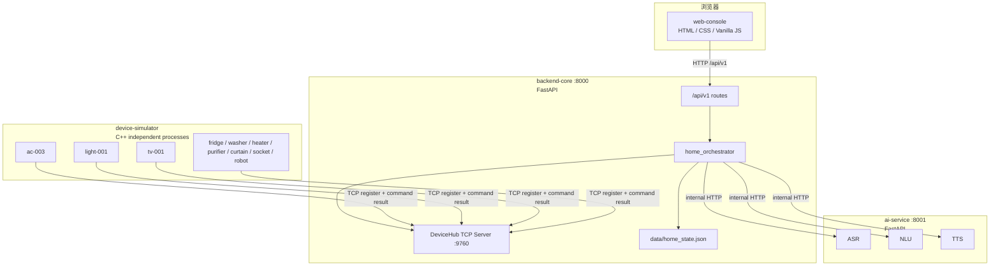
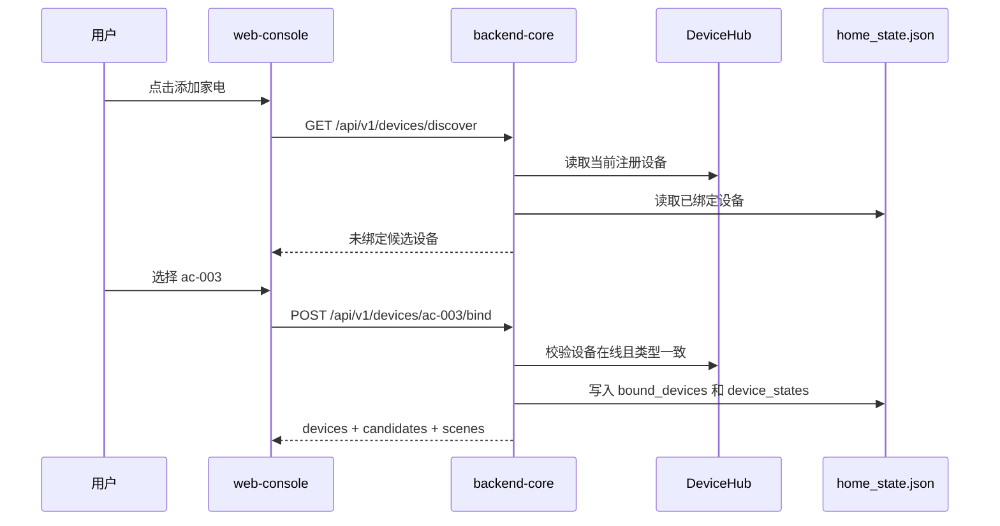
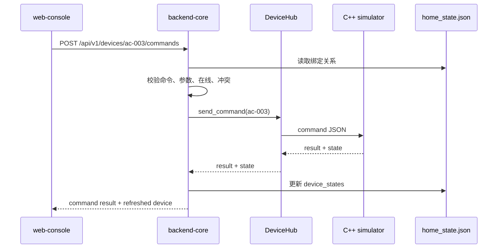
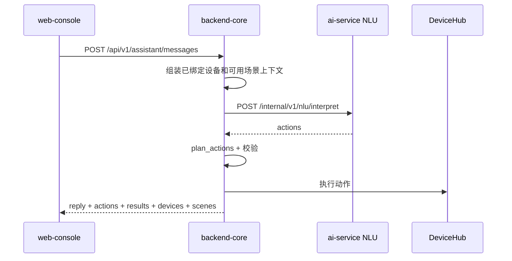

# 智能家居中控系统软件设计文档

## 1. 设计目标

本系统设计目标是形成一个可演示、可联调、可扩展的智能家居闭环：

1. `web-console` 只通过 `/api/v1` 调用 `backend-core`。
2. `backend-core` 统一负责家庭状态、设备绑定、场景执行和 AI 服务代理。
3. `ai-service` 只负责 ASR、NLU、TTS，不直接控制设备。
4. `device-simulator` 以独立 C++ 进程模拟真实家电，通过 TCP 注册到 DeviceHub。
5. 家庭数据采用轻量本地状态文件保存，满足课程演示和刷新恢复需求。

## 2. 总体架构



## 3. 目录与模块

```text
smart-home-system/
├── backend-core/
│   ├── app/main.py
│   ├── app/api/v1/
│   │   ├── dashboard.py
│   │   ├── devices.py
│   │   ├── scenes.py
│   │   ├── assistant.py
│   │   ├── audio.py
│   │   └── commands.py
│   ├── app/core/device_simulator.py
│   ├── app/services/home_orchestrator.py
│   └── app/schemas/device.py
├── ai-service/
│   ├── src/main.py
│   ├── src/asr/
│   ├── src/nlu/
│   └── src/tts/
├── device-simulator/
│   ├── src/main.cpp
│   ├── include/core/
│   └── include/devices/
└── web-console/
    ├── index.html
    ├── app.js
    └── styles.css
```

## 4. 后端核心设计

### 4.1 FastAPI 应用入口

`backend-core/app/main.py` 负责创建 FastAPI 应用，挂载 `/api/v1` 路由，并在 lifespan 中启动 DeviceHub TCP 服务。浏览器、前端静态资源和外部测试都以 `backend-core` 作为统一入口。

### 4.2 路由设计

| 路由文件 | 前缀 | 职责 |
| --- | --- | --- |
| `dashboard.py` | `/api/v1/dashboard` | 汇总设备、候选设备、场景和统计信息 |
| `devices.py` | `/api/v1/devices` | 设备列表、发现、绑定、编辑、移除、控制 |
| `scenes.py` | `/api/v1/scenes` | 场景列表、创建、自然语言创建、执行、删除 |
| `assistant.py` | `/api/v1/assistant` | 文本助手和语音助手入口 |
| `audio.py` | `/api/v1/audio` | TTS 音频代理 |
| `commands.py` | `/api/v1/commands` | 兼容命令入口 |

### 4.3 HomeOrchestrator

`home_orchestrator.py` 是主业务编排层，职责包括：

| 职责 | 主要函数 |
| --- | --- |
| 状态读取和保存 | `_load_state()`，`_save_state()` |
| 设备发现 | `discover_devices()` |
| 绑定设备 | `bind_device()` |
| 编辑设备 | `update_bound_device()` |
| 移除设备 | `remove_device()` |
| 设备详情 | `get_device()`，`list_devices()` |
| 设备控制 | `execute_device_command()`，`execute_batch()` |
| 场景管理 | `list_scenes()`，`create_scene()`，`delete_scene()`，`execute_scene()` |
| 自然语言场景 | `create_scene_from_text()` |
| AI 代理 | `call_nlu()`，`transcribe_audio()`，`synthesize_reply_speech()` |

该层保证前端、AI 和模拟器不会互相绕过主后端。AI 只返回动作计划，最终设备匹配、参数校验、离线判断和冲突判断都在主后端完成。

## 5. DeviceHub 与模拟器通信

### 5.1 DeviceHub

`backend-core/app/core/device_simulator.py` 中的 DeviceHub 是 TCP 设备管理中心，监听 `9760` 端口，维护当前在线设备连接和注册信息。

核心职责：

1. 接收 C++ 模拟器 TCP 连接。
2. 读取设备注册 JSON。
3. 保存 `device_id`、设备类型、命令能力和状态字段。
4. 向设备发送命令 JSON。
5. 接收设备执行结果和状态。
6. 连接断开后，从在线连接表中移除设备。

### 5.2 TCP JSON 行协议

设备注册：

```json
{
  "type": "register",
  "device": {
    "id": "ac-003",
    "type": "air_conditioner",
    "commands": [],
    "state_fields": {}
  }
}
```

命令请求：

```json
{
  "command": "set_temperature",
  "params": { "temperature": 26 }
}
```

命令响应：

```json
{
  "success": true,
  "message": "ok",
  "state": {
    "device_id": "ac-003",
    "device_type": "air_conditioner",
    "is_on": true,
    "temperature": 26
  }
}
```

## 6. 家电模拟器设计

### 6.1 启动入口

`device-simulator/src/main.cpp` 支持通过命令行选择设备类型和编号：

```bash
./build/simulator --device ac --id ac-003
./build/simulator --device light --id light-001
./build/simulator --device purifier --id purifier-001
```

如果不传 `--id`，模拟器使用该类型默认编号。

### 6.2 设备类型映射

| `--device` | 注册类型 | 默认编号 |
| --- | --- | --- |
| `ac` | `air_conditioner` | `ac-001` |
| `light` | `light` | `light-001` |
| `tv` | `tv` | `tv-001` |
| `fridge` | `fridge` | `fridge-001` |
| `washer` | `washer` | `washer-001` |
| `heater` | `water_heater` | `heater-001` |
| `purifier` | `air_purifier` | `purifier-001` |
| `curtain` | `curtain` | `curtain-001` |
| `socket` | `socket` | `socket-001` |
| `robot` | `robot_vacuum` | `robot-001` |

### 6.3 设备适配结构

| 组件 | 职责 |
| --- | --- |
| `HubClient` | 连接 DeviceHub，发送注册信息，接收命令 |
| `CommandRegistry` | 保存命令名到处理函数的映射 |
| `AirConditionerAdapter` / `LightAdapter` / `TVAdapter` | 把具体设备方法注册成命令 |
| `GenericDevice` / `GenericDeviceAdapter` | 支持冰箱、洗衣机、热水器、净化器、窗帘、插座、扫地机器人等通用状态设备 |

## 7. 数据模型设计

### 7.1 设备元数据

设备类型能力集中定义在 `home_orchestrator.DEVICE_TYPE_META` 中。每种设备包含：

| 字段 | 说明 |
| --- | --- |
| `label` | 类型显示名 |
| `icon` | 前端图标 ID |
| `defaults` | 默认状态 |
| `commands` | 支持命令和参数约束 |
| `energy` | 展示用能耗 |
| `color` / `soft` / `glow` | 前端卡片样式 |

### 7.2 家庭状态文件

`backend-core/data/home_state.json` 使用以下结构：

```json
{
  "bound_devices": {
    "ac-003": {
      "id": "ac-003",
      "type": "air_conditioner",
      "name": "客厅空调",
      "room": "客厅",
      "original_name": "ac-003"
    }
  },
  "device_states": {
    "ac-003": {
      "device_id": "ac-003",
      "device_type": "air_conditioner",
      "is_on": true,
      "temperature": 26
    }
  },
  "user_scenes": {
    "user-a1b2c3d4": {
      "id": "user-a1b2c3d4",
      "name": "睡觉模式",
      "description": "关闭电视，卧室空调调到 27 度",
      "commands": [],
      "builtin": false
    }
  }
}
```

### 7.3 前端设备视图模型

`GET /api/v1/dashboard` 返回的设备对象面向前端展示，包含 `id`、`type`、`name`、`room`、`original_name`、`online`、`conflict`、`power`、`reading`、`state`、`capabilities`、`energy` 等字段。

前端只渲染已绑定设备；候选设备只在添加家电弹窗内渲染。

## 8. API 设计

### 8.1 Dashboard

| 方法 | 路径 | 说明 |
| --- | --- | --- |
| `GET` | `/api/v1/dashboard` | 返回已绑定设备、候选设备、场景和统计信息 |

### 8.2 Devices

| 方法 | 路径 | 说明 |
| --- | --- | --- |
| `GET` | `/api/v1/devices` | 返回已绑定设备 |
| `GET` | `/api/v1/devices/discover` | 返回当前可添加候选设备 |
| `GET` | `/api/v1/devices/raw` | 返回 DeviceHub 原始注册设备 |
| `GET` | `/api/v1/devices/{device_id}` | 返回设备详情 |
| `POST` | `/api/v1/devices/{device_id}/bind` | 绑定候选设备 |
| `PATCH` | `/api/v1/devices/{device_id}` | 更新显示名称和房间 |
| `DELETE` | `/api/v1/devices/{device_id}` | 移除已绑定设备 |
| `POST` | `/api/v1/devices/{device_id}/commands` | 执行产品层设备命令 |
| `POST` | `/api/v1/devices/{device_id}/command` | 兼容原始命令转发 |

### 8.3 Scenes

| 方法 | 路径 | 说明 |
| --- | --- | --- |
| `GET` | `/api/v1/scenes` | 返回预设场景和用户场景 |
| `POST` | `/api/v1/scenes` | 创建规则场景 |
| `POST` | `/api/v1/scenes/natural` | 用自然语言创建场景 |
| `POST` | `/api/v1/scenes/{scene_id}/execute` | 执行场景 |
| `DELETE` | `/api/v1/scenes/{scene_id}` | 删除用户场景 |

### 8.4 Assistant

| 方法 | 路径 | 说明 |
| --- | --- | --- |
| `POST` | `/api/v1/assistant/messages` | 文本助手，调用 NLU 并执行动作 |
| `POST` | `/api/v1/assistant/voice` | 语音助手，先 ASR 再 NLU 并执行动作 |
| `GET` | `/api/v1/audio/tts/{filename}` | 代理 TTS 音频文件 |

## 9. AI 服务设计

### 9.1 ASR

ASR 模块接收音频文件，返回转写文本。后端语音入口将浏览器上传的 WAV 传给 `ai-service` 内部接口，再把转写结果交给文本助手流程。

### 9.2 NLU

NLU 请求包含：

```json
{
  "text": "关闭客厅的空调",
  "conversation": [],
  "devices": [
    {
      "id": "ac-003",
      "type": "air_conditioner",
      "name": "空调",
      "room": "客厅",
      "online": true,
      "commands": [
        { "name": "turn_off", "params": {} }
      ]
    }
  ],
  "scenes": [
    { "id": "home", "name": "回家模式" }
  ]
}
```

NLU 响应包含：

```json
{
  "understood": true,
  "reply": "好的，正在处理空调。",
  "actions": [
    {
      "kind": "device_command",
      "device_id": "ac-003",
      "command": "turn_off",
      "params": {}
    }
  ]
}
```

当前 NLU 采用规则优先、LLM 兜底策略。规则层支持：

1. 设备名称匹配。
2. 房间加设备类型匹配。
3. 开关、温度、亮度、音量、频道、开合百分比等参数提取。
4. 多动作句子拆分。
5. “全部”“同时”“两台”等批量词处理。
6. 场景名称匹配。

### 9.3 TTS

TTS 模块接收助手回复文本，返回音频 URL。后端会把内部音频路径转换成 `/api/v1/audio/tts/{filename}`，前端只从主后端读取音频。

## 10. 场景系统设计

### 10.1 预设场景

预设场景定义在 `BUILTIN_SCENES`，包括：

| 场景 | 说明 |
| --- | --- |
| 回家模式 | 打开客厅灯和空调，设置舒适温度 |
| 观影模式 | 打开电视，调暗灯光，保持空调舒适温度 |
| 离家模式 | 关闭演示相关设备 |

预设场景不可删除。只有当依赖设备已绑定且无类型冲突时，前端才允许执行。

### 10.2 用户场景

用户场景保存在 `home_state.json` 的 `user_scenes` 中。创建入口有两种：

1. 规则创建：前端选择设备、命令和参数，调用 `POST /api/v1/scenes`。
2. 自然语言创建：前端提交文本，调用 `POST /api/v1/scenes/natural`，后端通过 NLU 生成动作。

### 10.3 场景动作校验

`_validate_scene_commands()` 负责校验：

1. 设备必须已经绑定。
2. 设备 ID 与类型不能冲突。
3. 命令必须在设备能力中声明。
4. 参数必须存在且符合类型和范围。

### 10.4 动作执行顺序

`plan_actions()` 对同一设备的动作排序：

1. `turn_on`
2. 参数设置命令
3. `turn_off`

这样可以避免先设置关机设备参数再开机导致结果不符合直觉。

## 11. 前端设计

### 11.1 状态管理

`web-console/app.js` 使用轻量全局状态：

| 变量 | 说明 |
| --- | --- |
| `devices` | 已绑定设备，以设备 ID 为 key |
| `scenes` | 当前可见场景 |
| `candidates` | 添加家电弹窗中的候选设备 |
| `sceneRules` | 正在编辑的规则场景动作 |
| `activeDeviceId` | 当前打开详情抽屉的设备 |

前端每次操作成功后根据后端返回的 `devices`、`candidates`、`scenes` 刷新页面，不在浏览器中自行推断最终状态。

### 11.2 页面结构

| 区域 | 作用 |
| --- | --- |
| 设备网格 | 展示已绑定设备卡片 |
| 添加家电弹窗 | 检索和绑定候选设备 |
| 设备详情抽屉 | 控制、编辑名称和房间、移除设备 |
| 场景列表 | 展示预设场景和用户场景 |
| 创建场景弹窗 | 规则创建和自然语言创建 |
| 助手面板 | 文本指令、语音录制、回复与 TTS 播放 |
| Toast 区域 | 展示失败原因和操作反馈 |

### 11.3 离线与冲突交互

前端根据后端返回的 `online` 和 `conflict` 渲染标签：

1. 离线设备显示“离线”，控制按钮禁用。
2. 冲突设备显示“冲突”，抽屉展示缓存类型和当前连接类型。
3. 离线设备仍允许编辑显示名称、房间和移除。
4. 控制失败后自动重新拉取 Dashboard，避免页面状态过期。

## 12. 关键流程

### 12.1 设备发现与绑定



### 12.2 设备控制



### 12.3 自然语言控制



## 13. 错误处理设计

| 场景 | 后端行为 | 前端行为 |
| --- | --- | --- |
| 设备未绑定 | 返回 404 或场景校验失败 | toast 展示错误 |
| 设备离线 | 命令返回 `success=false` | 显示离线标签，禁用控制 |
| ID 类型冲突 | 命令返回冲突信息，场景不可用 | 显示冲突标签和说明 |
| 参数缺失或越界 | 后端返回 400，必要时裁剪到合法范围 | 展示错误或更新结果 |
| AI NLU 不可用 | 后端返回 503 | 助手消息展示失败原因 |
| AI 未理解 | `understood=false` 且无动作 | 提示用户补充设备名称或房间 |
| TTS 不可用 | 后端记录警告，不阻断文本结果 | 只展示文本回复 |

## 14. 配置与部署

### 14.1 端口

| 服务 | 端口 | 说明 |
| --- | --- | --- |
| `backend-core` | 8000 | 前端和 API 统一入口 |
| `ai-service` | 8001 | 内部 AI 接口 |
| `DeviceHub` | 9760 | C++ 模拟器 TCP 连接 |
| `web-console` 静态服务 | 4173 或由后端同源托管 | 开发访问 |

### 14.2 启动顺序

1. 启动 `ai-service`。
2. 启动 `backend-core`，同时启动 DeviceHub。
3. 编译并启动一个或多个 `device-simulator` 进程。
4. 打开 `web-console`。

### 14.3 关键配置

| 配置 | 位置 | 说明 |
| --- | --- | --- |
| `AI_SERVICE_BASE_URL` | `backend-core` 环境变量 | 主后端调用 AI 服务的地址 |
| AI 模型密钥 | `ai-service/.env` | ASR、LLM、TTS 供应商配置 |
| `home_state.json` | `backend-core/data/` | 家庭绑定和用户场景状态 |

## 15. 测试设计

| 测试项 | 命令或方式 |
| --- | --- |
| 前端语法 | `cd smart-home-system/web-console && node --check app.js` |
| 主后端测试 | `cd smart-home-system/backend-core && pytest tests -v` |
| AI 服务测试 | `cd smart-home-system/ai-service && pytest tests -v` |
| 模拟器编译 | `cd smart-home-system/device-simulator && cmake -B build && cmake --build build` |
| 健康检查 | `GET /health`，`GET /internal/health` |
| 设备发现 | 启动模拟器后请求 `GET /api/v1/devices/discover` |
| 场景执行 | 请求 `POST /api/v1/scenes/{id}/execute` |
| NLU 验证 | 请求 `POST /internal/v1/nlu/interpret` |

## 16. 扩展点

| 扩展方向 | 当前设计支撑 |
| --- | --- |
| 新增设备类型 | 补充 `DEVICE_TYPE_META` 和 C++ 模拟器类型 |
| 替换持久化层 | 将 `_load_state()` 和 `_save_state()` 替换为数据库访问 |
| 实时状态推送 | 在 DeviceHub 状态变化处增加事件发布 |
| 多用户家庭 | 在状态模型中增加用户和家庭维度 |
| 更强 AI 场景编辑 | 扩展 NLU action schema 和前端规则编辑器 |
| 移动端接入 | 复用 `/api/v1` 和 AI 内部代理边界 |
