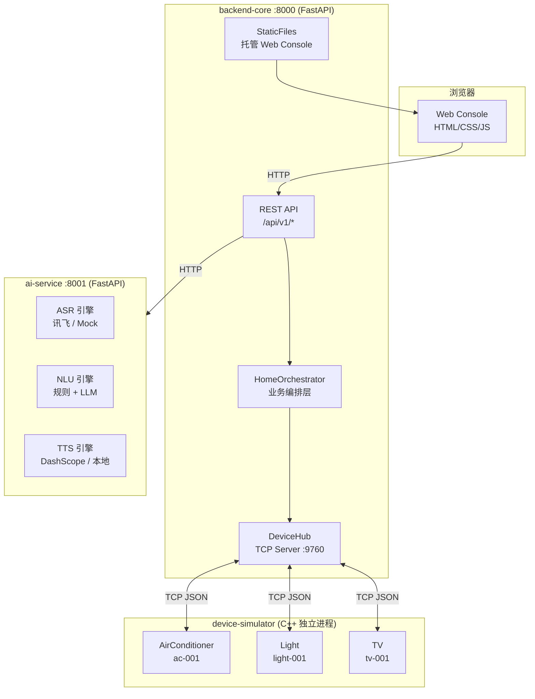
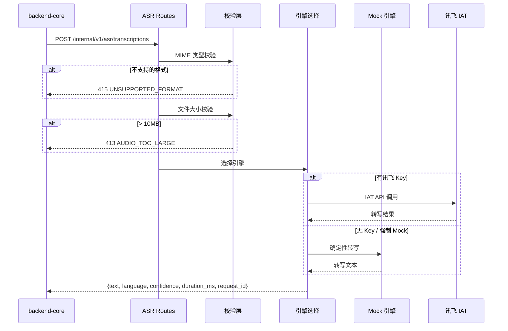
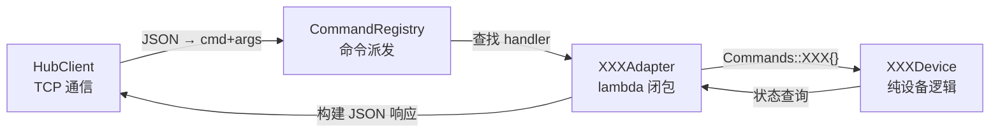
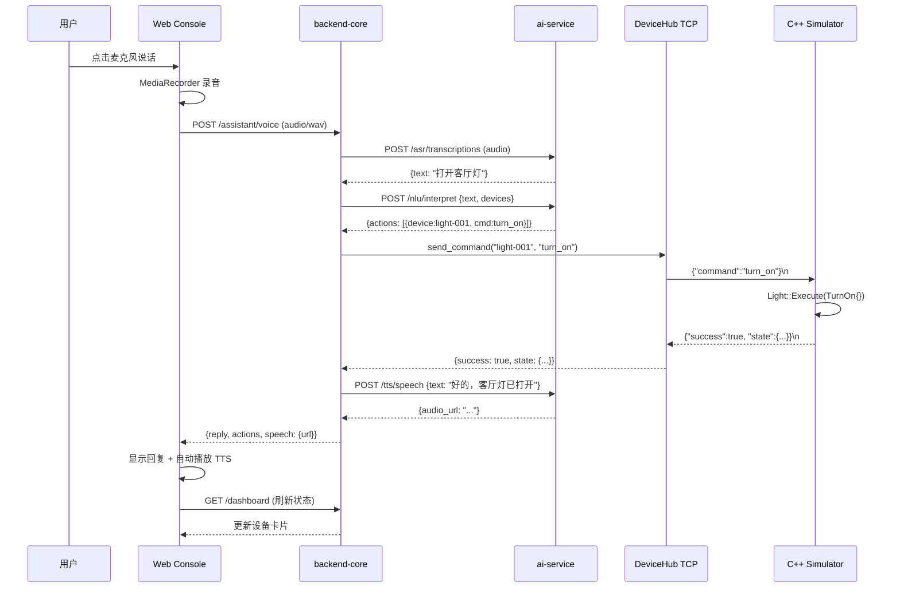

# 智能家居中控系统 — 软件设计文档

> **项目名称**：栖居 · 全屋智能中控系统 (Smart Home Control System)  
> **版本**：v2.0.0  
> **日期**：2026-07-09  
> **文档状态**：终稿  

---

## 1. 引言

### 1.1 编写目的

本文档描述智能家居中控系统的软件架构设计，包括系统分层、模块划分、接口协议、数据结构、通信机制以及关键技术决策，为开发人员提供设计与实现参考。

### 1.2 设计目标

- **模块化**：各子服务独立开发、独立部署、独立测试
- **可扩展**：新设备类型通过注册机制接入，无需修改核心代码
- **前后端同源**：浏览器仅访问 backend-core 一个端口，简化部署
- **自动发现**：设备进程启动即注册，API 动态生成

---

## 2. 系统架构

### 2.1 架构总览



### 2.2 分层架构

| 层次 | 模块 | 技术栈 | 职责 |
|------|------|--------|------|
| **表现层** | web-console | HTML5 + CSS3 + Vanilla JS | 用户交互界面、录音、设备状态展示 |
| **业务编排层** | backend-core | FastAPI + asyncio | REST API、设备编排、场景联动、AI 服务代理 |
| **AI 服务层** | ai-service | FastAPI + PyTorch/Whisper | 语音识别(ASR)、意图解析(NLU)、语音合成(TTS) |
| **设备抽象层** | device-simulator | C++20 + POSIX Socket | 设备仿真、TCP 通信、命令注册与派发 |

### 2.3 文件结构总览

```
smart-home-system/
├── backend-core/                    # FastAPI 后端
│   ├── app/
│   │   ├── main.py                  # ★ 入口 + lifespan 启动 DeviceHub
│   │   ├── api/v1/
│   │   │   ├── __init__.py          # 路由汇总
│   │   │   ├── devices.py           # 设备 API（通用 3 端点）
│   │   │   ├── dashboard.py         # Dashboard 总览
│   │   │   ├── scenes.py            # 场景联动
│   │   │   ├── assistant.py         # 智能助手（文本 + 语音）
│   │   │   └── audio.py             # TTS 音频代理
│   │   ├── core/
│   │   │   └── device_simulator.py  # ★ DeviceHub TCP 服务器
│   │   ├── schemas/
│   │   │   └── device.py            # Pydantic 请求/响应模型
│   │   └── services/
│   │       └── home_orchestrator.py # ★ 核心业务编排
│   └── tests/                       # pytest 测试
│
├── ai-service/                      # AI 推理服务
│   ├── src/
│   │   ├── main.py                  # FastAPI 入口
│   │   ├── asr/
│   │   │   ├── routes.py            # ASR 转写端点
│   │   │   └── iflytek_engine.py    # 讯飞 IAT 引擎
│   │   ├── nlu/
│   │   │   ├── routes.py            # NLU 解析端点
│   │   │   └── llm_engine.py        # LLM 引擎（通义千问）
│   │   └── tts/
│   │       └── routes.py            # TTS 合成端点
│   └── tests/                       # pytest 测试
│
├── device-simulator/                # C++ 设备仿真器
│   ├── include/
│   │   ├── core/
│   │   │   ├── HubClient.h          # ★ TCP 客户端（自动注册）
│   │   │   ├── CommandRegistry.h    # ★ 命令注册表
│   │   │   ├── Protocol.h           # JSON 协议层
│   │   │   └── Logger.h             # 日志系统
│   │   └── devices/
│   │       ├── AirConditioner.h     # 空调设备逻辑
│   │       ├── AirConditionerAdapter.h  # 空调适配器
│   │       ├── Light.h              # 灯光设备逻辑
│   │       ├── LightAdapter.h       # 灯光适配器
│   │       ├── TV.h                 # 电视设备逻辑
│   │       └── TVAdapter.h          # 电视适配器
│   └── src/
│       └── main.cpp                 # ★ 入口（--device 参数启动）
│
├── web-console/                     # Web 前端控制台
│   ├── index.html                   # 主页面 + SVG 图标
│   ├── app.js                       # 前端逻辑
│   └── styles.css                   # 样式表
│
└── deployment/
    └── docker/
        └── docker-compose.yml       # Docker 编排
```

---

## 3. 核心模块设计

### 3.1 backend-core — 后端核心

#### 3.1.1 DeviceHub（TCP 设备管理中心）

**设计思想**：充当 TCP 服务器的角色，接收 C++ 设备进程的 TCP 连接。设备连接后发送注册 JSON，Hub 记录后保持长连接，后续 REST API 通过该连接转发命令。

**核心类**：

| 类 | 职责 |
|----|------|
| `DeviceConnection` | 单个设备的 TCP 连接封装，包含 `asyncio.StreamReader/Writer` 和读写锁 |
| `DeviceHub` | 全局单例，管理所有设备连接和注册信息 |

**关键方法**：

```python
class DeviceHub:
    def list_devices(self) -> list          # 列出已注册设备
    async def send_command(device_id, cmd)  # 向设备发送命令并等待响应
    async def get_state(device_id)          # 查询设备当前状态
    async def start()                       # 启动 TCP 服务器 (0.0.0.0:9760)
```

**并发安全**：`DeviceConnection` 使用 `asyncio.Lock` 保证同一连接上的"写命令 → 读响应"操作原子化，防止并发请求交叉写入。

#### 3.1.2 HomeOrchestrator（业务编排层）

**设计思想**：作为 REST API 与底层 DeviceHub 之间的编排层，统一处理设备模型封装、场景联动、AI 服务调用。

**核心功能**：

| 功能 | 方法 | 说明 |
|------|------|------|
| 设备列表 | `list_devices()` | 从 `DEVICE_CATALOG` + 实时状态构建统一设备模型 |
| 设备详情 | `get_device(device_id)` | 合并静态元数据与实时 TCP 状态 |
| 命令执行 | `execute_device_command()` | 参数校验 → 类型转换 → TCP 下发 |
| 场景执行 | `execute_scene(scene_id)` | 批量设备命令执行 |
| AI 调用 | `call_nlu(text)` | 代理调用 ai-service NLU 接口 |
| TTS 代理 | `synthesize_reply_speech()` | 代理调用 ai-service TTS 并重写 URL |

**设备目录设计** (`DEVICE_CATALOG`)：

```python
DEVICE_CATALOG = {
    "ac-001": {
        "id": "ac-001",
        "type": "air_conditioner",
        "name": "中央空调",
        "room": "客厅",
        "icon": "icon-ac",
        "energy": "1.2 kWh",
        "defaults": {"is_on": False, "temperature": 24},
        "commands": {
            "set_temperature": {
                "params": {"temperature": {"type": "integer", "min": 16, "max": 30}}
            },
            ...
        }
    },
    ...
}
```

**参数校验**（`_coerce_params`）：根据目录中的参数 schema 对用户输入进行类型转换、范围限制和允许值校验。

#### 3.1.3 REST API 端点

| 方法 | 路径 | 请求体 | 说明 |
|------|------|--------|------|
| `GET` | `/health` | — | 系统健康检查 |
| `GET` | `/api/v1/dashboard` | — | Dashboard 总览（设备+场景+能耗） |
| `GET` | `/api/v1/devices` | — | 设备列表（产品模型） |
| `GET` | `/api/v1/devices/{id}` | — | 单设备详情 |
| `GET` | `/api/v1/devices/{id}/state` | — | 设备原始状态 |
| `POST` | `/api/v1/devices/{id}/commands` | `{command, params}` | 产品层命令执行 |
| `POST` | `/api/v1/devices/{id}/command` | `{command, params}` | 原始命令（调试用） |
| `GET` | `/api/v1/scenes` | — | 场景列表 |
| `POST` | `/api/v1/scenes/{id}/execute` | — | 执行场景 |
| `POST` | `/api/v1/assistant/messages` | `{text, conversation}` | 智能助手文本指令 |
| `POST` | `/api/v1/assistant/voice` | `multipart (audio)` | 智能助手语音指令 |

---

### 3.2 ai-service — AI 服务层

#### 3.2.1 ASR 模块（语音识别）

**端点**：`POST /internal/v1/asr/transcriptions`

**引擎策略**：
1. **云端引擎**：讯飞语音听写 IAT API（需配置 `XF_APP_ID`、`XF_API_KEY`、`XF_API_SECRET`）
2. **本地降级**：Mock 引擎，返回确定性预定义转写文本（强制模式：`ASR_FORCE_MOCK=true`）

**请求处理流程**：



**输入校验**：
- MIME 类型严格匹配：`audio/webm`, `audio/ogg`, `audio/wav`（含 codecs 变体）
- 文件大小 ≤ 10 MB
- 音频时长 ≤ 30 秒

#### 3.2.2 NLU 模块（意图解析）

**端点**：`POST /internal/v1/nlu/interpret`

**双引擎策略**：

| 引擎 | 优先级 | 适用场景 | 说明 |
|------|--------|---------|------|
| 规则引擎 | 高 | 课程演示常见指令 | 基于正则关键词匹配，确定性高、速度快 |
| LLM 引擎 | 低 | 复杂自然表达 | 调用通义千问 API，处理规则无法覆盖的表达 |

**规则引擎设计**：

```python
# 关键词映射
TURN_ON_WORDS  = ("打开", "开启", "启动", "开灯", "开")
TURN_OFF_WORDS = ("关闭", "关掉", "关上", "停止", "关")

DEVICE_TYPE_KEYWORDS = {
    "light": ("灯", "灯光", "主灯", "氛围灯"),
    "air_conditioner": ("空调",),
    "tv": ("电视",),
}

# 正则模式
# 参数提取：数字+度、数字+%、百分之+数字
```

**请求/响应模型**：

```python
# 请求
class InterpretRequest:
    text: str                              # 用户输入
    devices: list[DeviceInfo]              # 可用设备列表
    scenes: list[SceneInfo]                # 可用场景列表

# 响应
class InterpretResponse:
    understood: bool                       # 是否成功理解
    reply: str                             # 自然语言回复
    actions: list[DeviceAction | SceneAction]  # 执行动作列表
```

**规则匹配覆盖表**：

| 用户输入示例 | 规则匹配结果 |
|-------------|-------------|
| `打开客厅灯` | `{device:light-001, command:turn_on}` |
| `把空调调到26度` | `{device:ac-001, command:set_temperature, params:{temperature:26}}` |
| `打开客厅灯并把空调调到22度` | 2 个动作（多动作拆分） |
| `开启观影模式` | `{kind:scene, scene_id:movie}` |
| `卧室窗帘开一半` | `{device:curtain-xxx, command:set_open_percent, params:{percent:50}}` |

#### 3.2.3 TTS 模块（语音合成）

**端点**：`POST /internal/v1/tts/speech`

**引擎策略**：
1. **云端引擎**：阿里 DashScope qwen-tts（需配置 `DASHSCOPE_API_KEY`）
2. **本地降级**：pyttsx3 离线引擎

**音频管理**：
- 生成音频保存在 `generated_audio/` 目录
- 通过 StaticFiles 挂载为静态资源
- 后台协程每 10 分钟清理超过 30 分钟的过期音频

---

### 3.3 device-simulator — C++ 设备仿真器

#### 3.3.1 设计哲学

采用**关注点分离**原则，将设备逻辑、命令适配、网络通信三层解耦：



#### 3.3.2 核心组件

| 组件 | 文件 | 职责 |
|------|------|------|
| `HubClient` | `HubClient.h` | TCP 客户端：连接后端 Hub、发送注册 JSON、收发命令 |
| `CommandRegistry` | `CommandRegistry.h` | 命令注册表：存储命令定义和处理器映射 |
| `Protocol` | `Protocol.h` | JSON 协议层：解析 stdin 行，派发命令（早期管道模式使用） |
| `Logger` | `Logger.h` | 轻量日志系统 |

#### 3.3.3 设备模型

**设备基类模式**（以空调为例）：

```cpp
// 纯设备逻辑 — 不涉及任何协议/JSON/IO
class AirConditioner {
    bool is_on_ = false;
    int temperature_ = 24;
public:
    void Execute(Commands::TurnOn);
    void Execute(Commands::TurnOff);
    void Execute(Commands::SetTemperature);
    bool IsOn() const;
    int GetTemperature() const;
};

// 适配器 — 负责注册命令到 CommandRegistry
class AirConditionerAdapter {
    static void Register(CommandRegistry&, AirConditioner&);
};
```

**命令结构体**（类型安全派发）：

```cpp
namespace Commands {
    struct TurnOn {};
    struct TurnOff {};
    struct SetTemperature { int temperature; };
    struct SetBrightness { int brightness; };
    struct SetColor { std::string color; };
    struct SetChannel { int channel; };
    struct SetVolume { int volume; };
}
```

#### 3.3.4 启动流程

```bash
# 每个设备类型启动一个独立进程
./build/simulator --device ac      # → air_conditioner, ac-001
./build/simulator --device light   # → light, light-001
./build/simulator --device tv      # → tv, tv-001
```

**启动流程**：
1. `main()` 解析 `--device` 参数
2. 模板函数 `RunDevice<Device, Adapter>()` 创建设备实例和注册表
3. `HubClient::Run()` 建立 TCP 连接到 `127.0.0.1:9760`
4. 发送 `BuildRegistrationJson()` 自动注册
5. 进入 `while(RecvLine) → HandleCommand → SendLine` 循环

#### 3.3.5 注册 JSON 格式

```json
{
  "type": "register",
  "device": {
    "id": "ac-001",
    "type": "air_conditioner",
    "commands": [
      {"name": "turn_on", "description": "打开空调", "params": []},
      {"name": "set_temperature", "description": "设置温度 16-30°C",
       "params": [{"name": "temperature", "type": "int"}]}
    ],
    "state_fields": {"is_on": "bool", "temperature": "int"}
  }
}
```

---

### 3.4 web-console — Web 前端控制台

#### 3.4.1 设计原则

- **零框架依赖**：纯 HTML/CSS/JS，无需 node_modules
- **同源部署**：API 使用相对路径，与 backend-core 同一端口
- **渐进增强**：核心功能不依赖任何外部 CDN

#### 3.4.2 组件结构

| 组件 | 描述 |
|------|------|
| `deviceGrid` | 设备卡片网格（空调/灯/电视） |
| `deviceDrawer` | 设备详情抽屉面板（命令发送） |
| `chatPanel` | 智能助手对话面板（文本+语音） |
| `sceneChips` | 场景快捷按钮 |
| `dashboard` | 仪表盘（在线统计、能耗曲线） |

#### 3.4.3 关键交互流程

**语音指令流程**：
```
用户点击麦克风 → MediaRecorder.start()
    → ondataavailable 收集 chunks
    → 停止录音 → new Blob(chunks, 'audio/webm')
    → FormData.append('audio', blob)
    → POST /api/v1/assistant/voice
    → 收到响应 → addMessage(reply)
    → attachSpeechPlayback() 播放 TTS
```

**TTS 播放**：
```javascript
function getSpeechAudio(button, speech) {
    // 懒加载 Audio 对象，支持播放/暂停/重试
    const audio = new Audio(speech.url);
    audio.addEventListener('ended', () => resetButton());
    audio.addEventListener('error', () => setFailed());
    return audio;
}
```

#### 3.4.4 错误处理

- API 请求失败时显示 Toast 通知
- 后端不可达时渲染离线状态卡片
- TTS 播放失败时按钮变为"重试"状态
- 自动播放被浏览器阻止时提示手动点击

---

## 4. 通信协议

### 4.1 Backend ↔ Device TCP 协议

```
请求:  {"command":"<cmd>","<param>":"<value>",...}\n
响应:  {"success":bool,"message":"...","state":{...}}\n
注册:  {"type":"register","device":{...}}\n
```

- 每行一条 JSON，以 `\n` 分隔
- 命令参数扁平化在顶层（非嵌套 params）
- 状态信息嵌套在 `state` 字段

### 4.2 Backend ↔ AI Service HTTP 协议

| 接口 | 方法 | 路径 | Content-Type |
|------|------|------|-------------|
| ASR 转写 | POST | `/internal/v1/asr/transcriptions` | multipart/form-data |
| NLU 解析 | POST | `/internal/v1/nlu/interpret` | application/json |
| TTS 合成 | POST | `/internal/v1/tts/speech` | application/json |
| 健康检查 | GET | `/internal/health` | — |

### 4.3 统一错误响应格式

```json
{
  "error": {
    "code": "AUDIO_TOO_LARGE",
    "message": "音频文件大小超过 10 MB 限制",
    "details": {"max_bytes": 10485760, "actual_bytes": 11534336},
    "request_id": "uuid-xxx"
  }
}
```

---

## 5. 关键技术决策

### 5.1 为什么使用 TCP 而非 MQTT？

| 维度 | TCP 直连 | MQTT |
|------|---------|------|
| 部署复杂度 | 零依赖 | 需额外 Broker |
| 课程演示 | 简单直观 | 需解释 pub/sub |
| 后续升级 | 仅替换 HubClient | 架构不变 |

**决策**：课程演示阶段使用 TCP，后续仅需替换 `HubClient` 即可升级为 MQTT/WiFi。

### 5.2 为什么使用规则引擎 + LLM 双引擎？

| 引擎 | 优点 | 缺点 |
|------|------|------|
| 规则引擎 | 确定性高、速度快、零成本 | 覆盖范围有限 |
| LLM | 灵活、可理解复杂表达 | 需 API Key、延迟高、成本 |

**决策**：规则引擎优先，LLM 兜底。无 Key 时完全依赖规则引擎，保证演示不中断。

### 5.3 为什么前后端同源部署？

- 避免 CORS 跨域问题
- 无需配置反向代理
- FRP 穿透仅需暴露一个端口
- File:// 协议直接打开亦可用

### 5.4 为什么设备状态存储在内存？

- 课程演示无需持久化
- 降低部署复杂度（无需 Redis/PostgreSQL）
- 设备进程即状态源，重启即恢复默认

---

## 6. 数据流

### 6.1 端到端语音控制数据流



---

## 7. 部署架构

### 7.1 服务端口分配

| 服务 | 端口 | 对外 |
|------|------|------|
| backend-core (含 Web Console) | 8000 | ✅ |
| DeviceHub TCP | 9760 | ❌ (仅内网) |
| ai-service | 8001 | ❌ (仅内网) |

### 7.2 启动顺序

1. **ai-service** → 端口 8001
2. **backend-core** → 端口 8000（自动启动 DeviceHub :9760）
3. **device-simulator** → 三个独立进程，各连 :9760
4. **浏览器** → http://localhost:8000

### 7.3 Docker 支持

```yaml
# docker-compose.yml 结构
services:
  backend-core:    # FastAPI :8000 + DeviceHub :9760
  ai-service:      # FastAPI :8001
  # device-simulator 需要宿主机编译运行（C++）
```

---

## 8. 设计模式总结

| 模式 | 应用场景 |
|------|---------|
| **Adapter 模式** | `AirConditionerAdapter` 将设备逻辑适配到 `CommandRegistry` |
| **Command 模式** | `Commands::TurnOn{}` 命令对象，类型安全派发 |
| **Registry 模式** | `CommandRegistry` 动态注册/查找命令处理器 |
| **Template Method** | `RunDevice<Device, Adapter>()` 模板函数，泛化设备启动流程 |
| **Singleton** | `DeviceHub` 全局唯一实例管理所有连接 |
| **Strategy 模式** | ASR/NLU/TTS 双引擎（云端/本地），运行时选择 |
| **Observer** | `DeviceHub._handle_client` 异步监听 TCP 消息并分发 |
