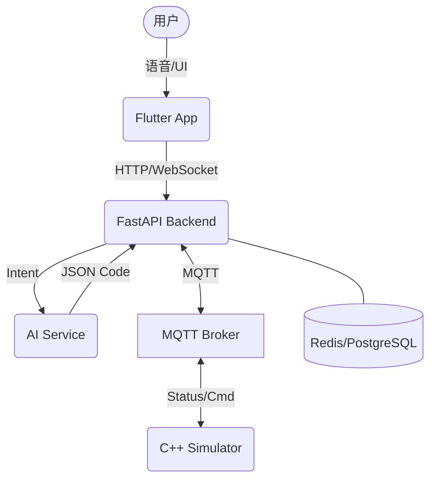
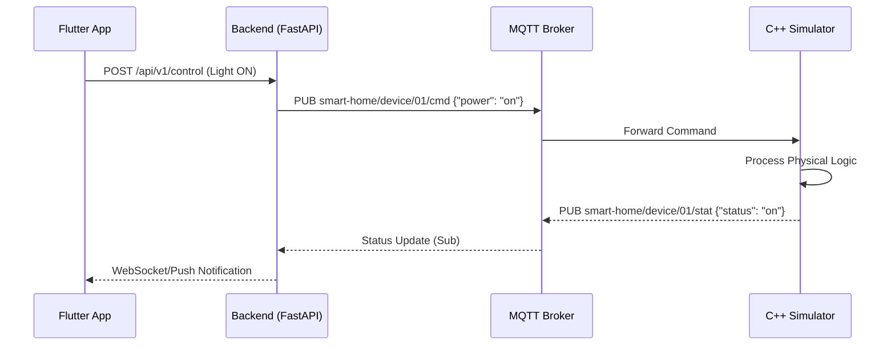

# Sprint 1 阶段计划文档 (已调整 - 简化版)

**周期**：2026年5月20日 - 2026年5月27日（1周）
**核心目标**：攻克 FastAPI 后端基础架构，完成全项目的目录分层设计与空框架（Skeleton）搭建。

---

## 1. 主要目标 (Main Goals)

1.  **FastAPI 实装**：完成 `backend-core` 的基础路由搭建，实现一个简单的 `GET /health` 接口和基础的数据库连接逻辑。
2.  **架构占位 (Skeleton)**：建立 `ai-service`、`app-mobile`、`device-simulator` 的文件夹结构，并放置最简单的程序入口（如打印 "Hello World"），暂不实现具体业务逻辑。
3.  **环境统一**：确保 7 位同学都能在本地跑通 `pip install` 或简单的 `cmake` 流程，环境不再是障碍。
4.  **接口草案**：在 Swagger 文档中列出未来需要的 API 列表（即便现在返回的是假数据）。

---

## 2. 系统 UML 文档 (UML Design)
*(注：本阶段仅作为长远规划参考，Sprint 1 仅需实现 API 节点的连通)*

### 2.1 整体架构图 (System Architecture)

### 2.2 MQTT 通信序列图 (Communication Sequence)

---

## 3. 团队分工 (Team Allocation - 7人)

| 姓名 | 角色 | 本次 Sprint 核心任务 (重点：Backend 实装 + 其他模块 Skeleton) |
| :--- | :--- | :--- |
| **队员A** | **Scrum Master** | 更新并对齐 Rule.md，检查全员本地开发环境是否搭建成功。 |
| **队员B** | **AI 骨架设计** | 创建 `ai-service` 文件夹，配置 `requirements.txt` 和一个空的 FastAPI 入口。 |
| **队员C** | **后端开发 (主攻)** | 编写 `backend-core` 的主程序 `main.py`，实现基础路由分发。 |
| **队员D** | **后端开发 (辅助)** | 配置 Dockerfile 基础镜像，尝试启动一个空的 PostgreSQL 容器。 |
| **队员E** | **前端骨架设计** | 初始化 Flutter 项目，确保能运行起空白的“新项目首页”。 |
| **队员F** | **C++ 骨架设计** | 创建 `device-simulator` 目录，编写最简单的 `CMakeLists.txt` 和 main.cpp。 |
| **队员G** | **协议草案编写** | 在文档中罗列出未来 API 的输入输出字段，作为后端开发的参考。 |

---

## 4. 交付物 (Deliverables)

*   [ ] **Backend 接口**：本地可访问的 `http://localhost:8000/docs`（Swagger）。
*   [ ] **全模块骨架**：README 中提到的各个子仓库文件夹均已建立且包含基础文件。
*   [ ] **开发文档**：一份简单的“如何运行我的模块”的操作指南。

---

## 6. 技术名词注解 (Terms Glossary)

为了帮助大二同学快速上手，这里对本项目中出现的核心技术和库进行通俗解释：

### 6.1 通信与中间件
*   **MQTT (Message Queuing Telemetry Transport)**：
    *   **概念**：一种极轻量级的“发布/订阅”消息协议，专门为物联网（IoT）设计。
    *   **通俗理解**：像一个“公告板”。设备往某个 Topic（话题，如 `home/light`）贴纸条（发布），后端订阅这个话题后就能看到纸条。它是智能家居设备之间交流的“公共语言”。
*   **MQTT Broker (Mosquitto)**：
    *   **概念**：MQTT 的服务器中心。
    *   **通俗理解**：负责接收所有纸条并分发给订阅者的“邮局”。
*   **WebSocket**：
    *   **通俗理解**：一种让服务器能“主动”推数据给 App 的技术。通常网页是你不点不刷新，而 WebSocket 允许服务器在灯开了之后立马告诉 App“灯亮了”。

### 6.2 Python 库 (后端与 AI)
*   **FastAPI**：
    *   **通俗理解**：一个写 Web 接口的框架。你只需要写简单的 Python 函数，它就能自动变成一个可以通过浏览器或 App 访问的网址（API）。
*   **Paho-MQTT**：
    *   **通俗理解**：Python 操作 MQTT 的“遥控器”。用它来编写代码发送或接收 MQTT 消息。
*   **SQLAlchemy / Tortoise-ORM**：
    *   **通俗理解**：让你不用写复杂的 SQL 语句，而是像操作普通 Python 对象一样去操作数据库里的数据。

### 6.3 C++ 库 (设备模拟)
*   **Eclipse Paho MQTT C++**：
    *   **通俗理解**：C++ 版的 MQTT 客户端库。让你的设备模拟器程序能够连接到 MQTT 邮局。
*   **CMake**：
    *   **通俗理解**：一个自动化“编译器指挥官”。它可以自动找到你电脑里的库，并生成适合当前系统的编译指令（如 Makefile 或 VS 项目文件）。
*   **Google Test (GTest)**：
    *   **通俗理解**：一个专门用来写“考试卷”的代码库。通过它编写测试用例，自动检查你的函数输出是否符合预期。

### 6.4 部署相关
*   **Docker / Docker Compose**：
    *   **通俗理解**：一种“集装箱”技术。它把数据库、邮局、代码等所有依赖打包在一起。你只需要运行一个命令，所有东西都会在它的独立环境里跑起来，不会弄乱你的电脑系统。

---

## 7. 完成定义 (Definition of Done)
1.  所有代码满足 [Rule.md](../Rule.md) 定义的风格规范。
2.  通过静态类型检查及基础单测。
3.  MQTT 消息能够在 Backend 与 Simulator 之间闭环传输。
4.  PR 必须经过至少一人 Review 并签入 `develop`。
